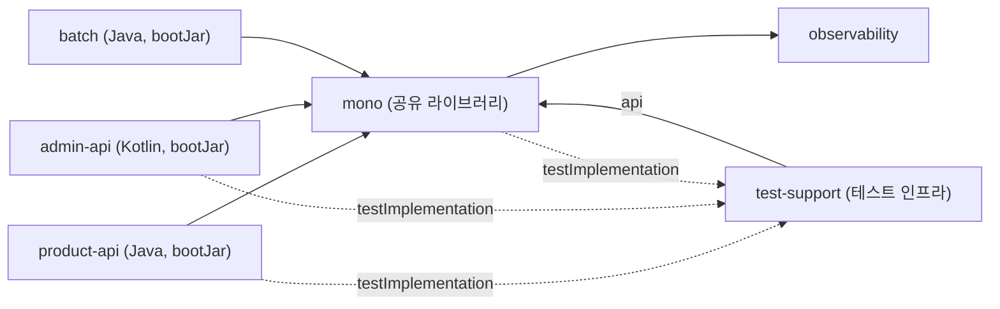

# AGENTS.md

This file provides guidance to Codex CLI when working with code in this repository.

> If a `AGENTS.personal.md` file exists in the same directory, also refer to its contents.
> **Team instructions take priority over personal instructions when they conflict.**

## User Instructions

- Always respond in Korean regardless of question language.
- If the user asks in English and there are grammar errors, provide grammar feedback in the response.
- For complex or ambiguous questions, include a summary of your understanding in the response.
- Keep answers clear and concise (3-5 lines recommended).
- When code examples are needed, show only the relevant scope; use step-by-step presentation when requested.
- When writing code, keep comments to a single brief line.
- When modifying existing code, always follow the project's existing patterns and conventions.
- When multiple files need changes, list the files to be modified upfront.
- For error resolution, present a step-by-step approach.
- When multiple solutions exist, recommend the one most fitting the project context first.

## Project Overview

- **Stack**: Spring Boot 3.4.11, Java 21, MySQL, Redis, QueryDSL
- **Architecture**: DDD-based multi-module structure
- **Core Domains**: alcohols, user, review, rating, support, history, picks, like

## 모듈 구조

> [진행 중] 모듈 기술 부채 정리 작업 진행 중 (2026-06-10 시작). 모듈 구성은 아래가 확정 토폴로지이며(물리 3분할은 트리거 조건부로 강등), 남은 작업은 mono 내부 표준 위반 청소와 ArchUnit 룰 활성화다.
>
> 현재 모듈: `product-api`(Java) / `admin-api`(Kotlin) / `batch` / `mono`(공유 라이브러리) / `observability` / `test-support`(테스트 인프라·픽스처). test-support 분리는 PR #623으로 완료(2026-06-12), 각 모듈은 testImplementation으로 소비한다.
> 레이어 규칙은 아래 "레이어 표준 15"를 따른다.



## 빌드 및 실행

```bash
# 서브모듈 초기화 (최초 클론 후 필수)
git submodule update --init --recursive

./gradlew build                 # 전체 빌드
./gradlew test                  # 기본 테스트 (integration, admin_integration 제외)
./gradlew unit_test             # 단위 테스트 (@Tag("unit"))
./gradlew integration_test      # 통합 테스트 (@Tag("integration"))
./gradlew check_rule_test       # 아키텍처 규칙 테스트 (@Tag("rule"))
./gradlew bootRun               # 애플리케이션 실행

# admin-api 모듈 전용
./gradlew :bottlenote-admin-api:build           # admin-api 빌드
./gradlew :bottlenote-admin-api:test            # admin-api 테스트 실행
./gradlew :bottlenote-admin-api:bootRun         # admin-api 실행
```

### 서브모듈

- **git.environment-variables**: 환경 설정과 DB 마이그레이션 SQL을 담은 비공개 서브모듈
  - `storage/db/migration/*.sql`: Flyway 마이그레이션 원본
  - `storage/mysql/sql/*.sql`: batch 전용 쿼리 리소스
  - 빌드와 통합 테스트 실행 전 서브모듈 초기화 필수

## 배포 및 실행 인프라

- 운영·개발 모두 Kubernetes에서 돌아가고 GitOps로 배포한다. k8s 매니페스트는 이 저장소가 아니라 별도 저장소에 있다.
- **애플리케이션 인스턴스는 다중이다.** 요청 카운팅, 분산 잠금, 중복 억제, 스케줄 단일 실행 같은 것을 JVM 로컬 상태(static 필드, 인메모리 캐시)로 구현하면 안 된다. Redis 등 공유 저장소를 쓴다.
- 앞단 게이트웨이가 클라이언트를 통해 들어온 `X-Forwarded-For`를 제거하고 실제 접속 주소로 다시 채운다. 따라서 앱이 받는 XFF는 신뢰할 수 있다.

### 배포 방법

배포는 모두 GitHub Actions로 수행한다. **로컬에서 이미지 빌드·푸시·매니페스트 수정을 직접 하지 않는다.**

| 대상 | 워크플로 | 트리거 |
|------|---------|--------|
| product-api / admin-api (운영) | `deploy_release_applications.yml` | `backend/vX.Y.Z` 릴리스 published |
| product-api / admin-api (개발) | `deploy_development_applications.yml` | main CI 성공 시 자동, 또는 수동 dispatch |
| batch | `deploy_batch.yml` | 수동 dispatch (`environment`, `version` 입력) |

```bash
# batch 배포 — version은 정확한 X.Y.Z, production은 main에서만 허용
gh workflow run deploy_batch.yml -f environment=production -f version=1.2.3

# 개발 환경 수동 배포
gh workflow run deploy_development_applications.yml
```

## 이슈 관리

이슈의 SSOT는 [bottle-note/workspace](https://github.com/bottle-note/workspace) 레포지토리다. 이슈는 이 레포가 아니라 workspace에 등록하고, 작업 시작 전 관련 이슈를 먼저 확인한다. PR 본문에는 `bottle-note/workspace#N` 형식으로 관련 이슈를 링크한다.

## Skills (Development Workflow)

요청에 맞는 스킬을 선택한다. 각 스킬은 독립적으로 사용할 수 있으며, 아래 공통 실행 원칙을 따른다.

| Command | Purpose | When to Use |
|---------|---------|-------------|
| `/define` | Requirements clarification | Starting a new feature, vague requirements |
| `/plan` | Task breakdown | 계획 요청, 복잡한 변경의 의존 관계 정리 |
| `/implement` | Implementation | 명확한 기능 구현·수정, 필요한 테스트 작성 |
| `/test` | Test creation | Unit, integration, OpenAPI quality tests |
| `/verify` | GitHub Actions verification | 기본은 CI 결과 확인, 로컬 검증은 명시 요청 시 |
| `/debug` | Systematic debugging | 원인 진단, 수정 요청이 있으면 수정·회귀 확인 |
| `/self-review` | Evidence-based review | 리뷰 요청, 허가된 변경의 자체 검토와 커밋 전 검토 |

구현에 필요한 테스트 작성과 자체 검토는 같은 요청 안에서 수행한다. 스킬 전환은 새로운 권한을 부여하지 않으며, 커밋·푸시·PR 및 로컬 전체 검증을 필수 후속 단계로 붙이지 않는다.

**Detailed patterns** for product-api and admin-api implementation are in skill reference files:
- `.agents/skills/implement/references/languages/java-spring.md` — Java/Spring 구현 패턴
- `.agents/skills/implement/references/languages/bottlenote-patterns.md` — 프로젝트 특화 패턴 (InMemory 갱신 체크리스트 등)
- `.agents/skills/test/references/testing/java.md` — Java 테스트 패턴

## 에이전트 설정 미러 규칙

이 저장소는 codex와 Claude Code용 설정을 이중으로 보관한다. **한쪽을 고치면 반드시 다른 쪽도 같이 고친다.**

| 대상 | codex | Claude Code |
|---|---|---|
| 지침 | `AGENTS.md` | `CLAUDE.md` |
| 스킬 | `.agents/skills` 디렉터리 | `.claude/skills` 디렉터리 |

- 두 지침 문서는 런타임 이름, 스킬 디렉터리 경로, personal 지침 파일명, 첫 줄 제목만 다르고 나머지 본문은 완전히 같아야 한다. 이 네 가지 외의 차이는 동기화 누락이다.
- 두 skills 디렉터리의 배포 파일은 바이트 단위로 같아야 한다. `diff -r -x .DS_Store .agents/skills .claude/skills`로 확인하고, 스킬 파일 안에 특정 런타임의 디렉터리 경로를 하드코딩하지 않는다. 각 런타임의 로컬 설정과 OS 메타데이터는 비교 대상이 아니다.
- Skills 표에 적은 슬래시 커맨드는 실제 스킬 디렉터리로 존재해야 한다. 스킬을 제거하면 표에서도 지운다.
- 훅을 다시 도입한다면 머신 고유 절대경로와 런타임 전용 환경변수를 넣지 않는다. 저장소 루트는 `$(git rev-parse --show-toplevel)`로 구한다.

## 코드 작성 규칙

### 아키텍처 패턴

- **계층 구조**: Controller → Facade <-> Service → Repository → Domain
- **도메인별 패키지**: constant, controller, domain, dto, repository, service, facade, exception, event

**설계 배경 — Facade는 도메인 간 완충 지대다.** 여러 도메인이 양방향으로 통신하는 구조(user↔alcohols 등)에서 Service끼리 직접 상호 참조하면 순환 의존과 부채가 쌓인다. 그래서 타 도메인 접근은 상대의 Facade 인터페이스로만 하며, 결합을 좁고 보이는 한 지점으로 모아 관리한다. 배치 상세는 아래 `@FacadeService` 항목, 강제 수단은 ArchUnit(`./gradlew check_rule_test`)이다.

### 레이어 표준 15 (2026-06-10 확정)

모듈 기술 부채 정리의 기준이 되는 표준. ArchUnit `@Tag("rule")` 테스트로 강제하며, 위반 0이 된 룰부터 활성화한다.

1. 도메인 모델 != `@Entity`가 원칙이나, 구현 중복 제거를 위해 도메인 엔티티(JPA 엔티티)를 허용한다. 의도된 트레이드오프다.
2. 레포지토리는 2형으로 분리한다: 순수 자바 인터페이스인 도메인 레포지토리(포트) + 구현 레포지토리(JPA, QueryDSL, Redis).
3. 도메인 레포지토리 시그니처에 Spring Data 타입(`Page`, `Pageable`, `Slice`, `Sort`) 노출 금지. 페이징은 자체 타입(`KeysetPageResponse`, cursor criteria)을 쓴다.
4. 기술 세부사항(QueryDSL, EntityManager, Redis)은 구현 레포지토리 안에 격리하고 포트 밖으로 새지 않는다.
5. 코드는 자기 도메인 패키지에만 둔다. 타 도메인 파일을 자기 패키지에 두지 않는다.
6. 타 도메인 접근은 Facade 경유만 허용한다. 타 도메인의 repository는 물론 service도 직접 참조하지 않는다.
7. Facade는 인터페이스 + 별도 구현체로 구성한다. Service가 Facade를 겸직하지 않는다.
8. Controller는 인터페이스에만 의존한다. 구현체 직접 주입 금지, 도메인 VO 직접 생성 금지.
9. 트랜잭션 경계, 도메인 VO 생성/검증, cross-domain 조합은 Service가 소유한다.
10. 테스트 더블은 Mockito가 아니라 포트와 Facade의 Fake/InMemory 구현을 쓴다.
11. 공통 타입(`KeysetPageResponse`, cursor criteria, 공통 예외 베이스, 공통 어노테이션)은 `global`(공유 커널)에 둔다.
12. global은 어떤 도메인도 모른다. global → 도메인 import 금지.
13. 동기 호출은 Facade, 부수효과 전파(히스토리, 알림 등)는 도메인 이벤트로 한다.
14. 예외는 도메인이 소유한다. 도메인별 예외는 자기 exception 패키지에, 공통 베이스만 global에 둔다.
15. 운영 코드는 테스트 코드를 모른다. 테스트 인프라(컨테이너 설정, persistent factory, fake)는 test-support 모듈이 소유한다.

### 네이밍 컨벤션

- **클래스**: `{도메인명}Controller`, `Default{도메인명}Facade`, `Jpa{도메인명}Repository`, `{도메인명}Exception`
- **메서드**: get/find/search (조회), create/register (생성), update/modify/change (수정), delete/remove (삭제)

### 프로젝트 특화 어노테이션

| 어노테이션 | 위치 | 포함 | 용도 |
|---|---|---|---|
| `@FacadeService` | 구현체 `Default{도메인명}Facade`는 `{domain}.service`, 인터페이스는 `{domain}.facade`(공개 계약) | `@Service` | 도메인 간 완충 계층 구현체. 타 도메인은 Facade 인터페이스만 호출한다 |
| `@DomainRepository` | `{domain}.domain` | 없음 (마커) | Spring/JPA 비의존 도메인 레포지토리 인터페이스 |
| `@JpaRepositoryImpl` | `{domain}.repository` | `@Repository` | 도메인 레포지토리의 JPA 구현체, 영속성 예외 변환 |
| `@DomainEventListener` | `{domain}.event` | `@Component` | 도메인 이벤트 리스너, `ProcessingType`으로 동기/비동기 지정 |
| `@ThirdPartyService` | `app.external` | `@Service` | AWS·외부 API 등 써드파티 연동 계층 |

> 코드 예시: `.agents/skills/implement/references/languages/java-spring.md`

### 예외 처리

- 도메인별 예외: `{도메인명}Exception`, `{도메인명}ExceptionCode`
- 전역 예외 핸들러: `@RestControllerAdvice`
- 통일된 응답: `GlobalResponse`

### 코드 스타일

- Lombok: `@Getter`, `@Builder`, `@RequiredArgsConstructor`
- 불변성: `record` 사용 (DTO), `final` 필드 선호
- 페이징: 현재 공통 구현인 `KeysetPageRequest`, `KeysetPageResponse`, `KeysetPagination`과 대상 API의 계약을 따른다.

## 테스트 작성 규칙

### 테스트 분류 및 네이밍

- `@Tag("unit")`: 단위 테스트, `@Tag("integration")`: 통합 테스트, `@Tag("rule")`: 아키텍처 규칙
- 클래스명: `{기능명}ServiceTest`, 메서드명: `{기능명}할_수_있다`
- `@DisplayName`: 한글로 테스트 목적 명시 (형식: `~할 때 ~한다`)

### 테스트 구조

- Given-When-Then 패턴 사용
- Fixture 클래스를 통한 테스트 데이터 관리
- TestContainers 사용 (실제 DB 환경)
- 테스트 데이터: test-support 모듈의 `{도메인명}TestFactory` / `DataInitializer`로 생성

### 단위 테스트 패턴

- **Fake/Stub 패턴 선호**: Mock 대신 InMemory 구현체 사용
- **네이밍**: `InMemory{도메인명}Repository`, `Fake{서비스명}`
- **위치**: `bottlenote-test-support` 모듈의 `{도메인}.fixture` 패키지 (특정 모듈 전용 헬퍼는 그 모듈 test에 둔다)

### 통합 테스트 패턴

- **베이스 클래스**: `IntegrationTestSupport` 상속
- **API 테스트**: `MockMvcTester` 사용
- **테스트 데이터 생성**: `{도메인명}TestFactory` 사용

> 테스트 인프라·픽스처·테스트 예시는 `/test`의 `references/testing/java.md`를 참조한다.

### 이벤트 기반 아키텍처

- **이벤트 발행**: `ApplicationEventPublisher.publishEvent()`
- **이벤트 수신**: `@TransactionalEventListener` + `@Async` 조합
- **트랜잭션 분리**: `@Transactional(propagation = Propagation.REQUIRES_NEW)`
- **이벤트 클래스**: `{도메인명}{동작}Event` record로 정의

## 데이터베이스 설계

### 스키마 마이그레이션 (Flyway)

스키마는 Flyway가 애플리케이션 기동 시점에 적용한다. `ddl-auto`는 `validate`이며 Hibernate가 스키마를 생성하거나 변경하지 않는다. 엔티티를 바꾸면 마이그레이션도 함께 작성해야 하고, 그러지 않으면 기동 시 validate에서 실패한다.

- 마이그레이션 원본은 `git.environment-variables/storage/db/migration/`에 두고, product-api와 admin-api의 `processResources`가 빌드 시 `classpath:db/migration`으로 복사한다. 저장소 소스 트리에는 `db/migration` 디렉터리가 없다.
- 설정은 `enabled: ${FLYWAY_ENABLED:true}`, `baseline-on-migrate: false`, `locations: classpath:db/migration`이다. 기존 스키마에 임의로 baseline을 잡지 않는다.
- batch 모듈은 `flyway.enabled=false`이며 마이그레이션 주체가 아니다. batch는 `storage/mysql/sql`의 지정된 쿼리 리소스만 패키징한다. `verifyBatchPackagedResources`는 누락·금지 리소스를 검사하는 별도 태스크로, 현재 build·CI에 자동 연결되어 있지 않다. 빌드 성공만으로 해당 검사까지 통과했다고 판단하지 않는다.
- 통합 테스트도 `flyway.enabled=true`로 동작한다. TestContainers 스키마 역시 Flyway가 만들며, 별도 init 스크립트를 쓰지 않는다.
- 새 마이그레이션은 서브모듈 저장소에 추가한 뒤 서브모듈 포인터를 갱신해야 반영된다.

### JPA 엔티티

- `BaseEntity` 상속 (공통 필드)
- 복합 키: `@Embeddable` 사용
- 엔티티 필터링: Hibernate `@Filter` 활용

### 레포지토리 계층 구조

레이어 표준 2·4가 원칙이다: 포트(순수 인터페이스)와 구현을 분리하고, 기술 세부사항은 구현 안에 격리한다.

1. **도메인 레포지토리** (필수): `{도메인명}Repository`, `{domain}.domain` 위치, `@DomainRepository`는 선택. Spring/JPA 비의존 순수 인터페이스이며 Service는 여기에만 의존한다.
2. **JPA 레포지토리** (필수): `Jpa{도메인명}Repository`, `{domain}.repository` 위치, `@JpaRepositoryImpl` 필수. `JpaRepository<T, ID>` 상속 + 도메인 레포지토리 구현. 단순 조회는 메서드 쿼리 또는 `@Query` JPQL로 해결한다.
3. **QueryDSL 레포지토리** (복잡한 쿼리만): `Custom{도메인명}Repository` / `Custom{도메인명}RepositoryImpl` / `{도메인명}QuerySupporter`(`@Component`), 전부 repository 패키지. 동적 조건 조합·다중 조인·복잡한 Projection에만 쓰고, 단순 CRUD나 단일 조건 조회에는 쓰지 않는다.

> 구현 예시: `.agents/skills/implement/references/languages/java-spring.md`

## 보안 및 인증

- JWT 토큰: 액세스 토큰 24시간, 리프레시 토큰 30일
- 토큰 검증: `JwtTokenProvider`, 보안 설정: `SecurityConfig`
- API 보안: `@PreAuthorize` 또는 `@Secured`, CORS: `WebConfig`

## 외부 서비스 연동

- OpenFeign: `@FeignClient`, 설정 분리 `FeignConfig`, 에러 처리 `ErrorDecoder`
- AWS S3: PreSigned URL 생성 (SDK v2 `S3Client`/`S3Presigner`)

## 스킬 실행 원칙

스킬은 요청을 수행하는 개별 도구다. 모든 작업에 define → plan → implement → test → verify 순서를 강제하지 않는다. 사용자의 최신 명시 지시와 대화에서 승인한 범위가 스킬 및 계획 문서보다 우선한다.

### 요청과 권한

- 분석·진단·리뷰는 기본 읽기 전용이다. 발견 사항과 수정안을 보고하며, 파일 수정·자동 포맷·stash로 넘어가지 않는다.
- 수정·구현 요청은 범위가 명확하면 관련 탐색, 필요한 계획, 구현, 테스트 작성, 최소 관련 검사와 자체 검토까지 이어서 수행한다. 스킬을 참고한다는 이유로 단계마다 다시 승인받지 않는다.
- 요구사항 정리나 계획만 요청받았다면 해당 산출물에서 끝낸다. 사용자에게 구현까지 위임받지 않았으면 구현하지 않는다.
- commit, push, merge, PR 생성, history 변경은 각각 사용자의 명시적인 요청이나 승인이 있어야 한다. 구현 승인이나 계획 문서의 자동 생성된 scope를 Git 쓰기 권한으로 해석하지 않는다.
- 배포, 공유 환경 변경, 외부 데이터 전송, 새 비용·권한, 파괴적 작업은 명시적으로 허가된 범위에서만 수행한다. 이전에 허가받은 같은 행동은 반복 확인하지 않는다.
- 사용자가 단계별 진행을 선택하면 해당 경계를 지킨다. 그 외에는 승인된 요청의 완료까지 진행한다. "계속"은 직전 요청과 합의한 범위 안에서 해석하며 새로운 Git·운영 권한을 만들지 않는다.

### 계획과 중단

- 계획은 불확실성, 공개 계약·스키마 영향, 의존 관계와 작업 위험에 따라 작성한다. 파일 수나 코드 줄 수만으로 계획 승인, Task 분할, 컴파일 주기를 강제하지 않는다.
- 장기 작업에는 `plan/{기능}.md`로 목표·수용 기준·진행 상태·검증 근거를 남길 수 있다. 문서가 없는 명확한 수정은 바로 진행할 수 있다. 산출물 이름은 공백과 `YYYY.MM.DD` 날짜를 사용한다.
- 기존 계획의 `Execution Mode`는 사용자가 선택한 진행 방식과 범위를 확인하는 기록이다. 과거 step-by-step 선택은 존중하되 최신 지시가 우선하며, 오래된 문서만으로 새 권한을 추론하지 않는다.
- 코드로 확인 가능한 가정은 조사해서 해결한다. 발견 때문에 성공 기준·공개 계약·데이터 호환성이나 허가 범위가 실질적으로 달라지면 근거와 선택지를 제시하고 해당 작업을 멈춘다.
- 실패 시 같은 명령을 근거 없이 반복하지 않는다. 로그와 재현 조건으로 원인을 좁히고, 새 권한이나 정보가 필요할 때 구체적인 장애 요인을 보고한다.

### 검증 기본값: GitHub Actions

- `/verify`와 일반적인 검증 요청은 GitHub Actions 결과 확인을 기본으로 한다. 로컬 전체 빌드·전체 테스트는 사용자가 명시적으로 요청한 경우에만 실행한다.
- 구현 중 새 동작·수정한 오류·변경한 테스트에 필요한 최소 검사는 허용한다. 이미 통과한 검사를 새 변경이나 실패 근거 없이 반복하거나 전체 검증으로 확대하지 않는다.
- 로컬 검증 요청의 범위와 명령은 `verify` 스킬을 따른다. `compileJava`는 일부 모듈에서 `spotlessApply`를 실행하므로 읽기 전용 확인으로 취급하지 않는다.
- 허가된 push·PR 후에는 대상 커밋과 관련 Actions 실행을 대응시키고 상태·실패 로그를 확인한다. 로컬 commit만으로는 Actions가 시작되지 않으며, 검증을 만들기 위해 push·PR·워크플로 dispatch·재실행을 자동으로 수행하지 않는다.
- CI의 저장소·워크플로·이벤트·대상 SHA·run URL과 결과를 확인한다. PR merge 커밋으로 검사했다면 PR head와의 관계를 명시한다. 다른 SHA의 성공이나 과거 성공을 현재 변경의 근거로 쓰지 않는다.
- 실행 없음, 대기, 진행 중, 실패, 취소, 건너뜀을 성공과 구분한다. 필요한 검사가 빠졌으면 전체 통과로 보고하지 않는다. 로컬 미커밋 변경은 원격 CI가 검증한 내용에 포함되지 않는다.
- 완료 보고에는 변경 결과, 수행한 검증과 증거, 실행하지 않은 검사와 남은 상태를 간결하게 적는다. PR 본문은 체인지로그를 겸하므로 변경 배경·동작·검증을 포함한다.
