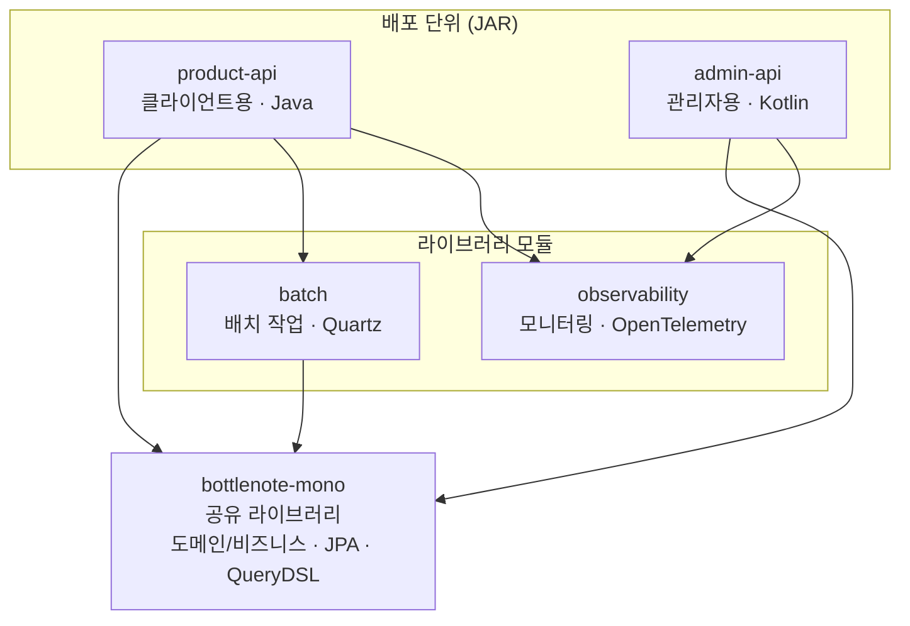

# CLAUDE.md

This file provides guidance to Claude Code (claude.ai/code) when working with code in this repository.

> 해당 지침은 Claude Code가 이 저장소의 코드 작업 시 참고할 수 있도록 작성되었습니다.
> 만약 해당 파일과 동일한 경로에 CLAUDE.personal.md 파일이 존재한다면, 그 파일의 내용 또한 참고하여 작업을 진행하세요.
> **개인 지침이 팀 지침과 충돌할 경우 팀 지침을 우선시하세요.**

## 유저 지침

- 영어로 질문하는 경우 의도를 잘 파악하고 문법적 오류가 있을 경우 응답에 문법에 대한 피드백을 제공하세요.
- 질문 언어와 관련없이 응답 언어는 한국어로 작성하세요.
- 복잡하거나 애매한 질문의 경우 이해한 내용을 요약해서 응답에 포함하세요.
- 질문에 대한 답변은 명확하고 간결하게 작성하세요 (3-5줄 내외 권장).
- 코드 예시가 필요한 경우 전체 코드를 한번에 보여줄지, 단계별로 나누어 설명할지 사용자에게 물어보세요.
- 코드 예시가 필요한 경우, 코드의 목적과 사용법을 간단히 설명하세요.
- 코드를 작성할 경우 주석은 한줄로 간략하게만 작성하세요.
- 기존 코드 수정 시 프로젝트의 기존 패턴과 컨벤션을 반드시 따르세요.
- 여러 파일 수정이 필요한 경우 수정할 파일 목록을 미리 알려주세요.
- 에러나 문제 해결 시 단계별 접근 방법을 제시하세요.
- 여러 해결책이 있을 때는 프로젝트 컨텍스트에 가장 적합한 방법을 우선 추천하세요.

## 프로젝트 개요

- **기술 스택**: Spring Boot 3.1.9, Java 21, MySQL, Redis, QueryDSL
- **아키텍처**: 도메인 주도 설계(DDD) 기반 멀티모듈 구조
- **주요 도메인**: alcohols, user, review, rating, support, history, picks, like

## 모듈 구조



### bottlenote-mono
- **역할**: 레거시 모놀리식 모듈 (핵심 비즈니스 로직)
- **특징**:
  - 모든 도메인 엔티티와 비즈니스 로직 포함
  - JPA, QueryDSL, Redis 등 데이터 접근 계층
  - 보안, 인증, 외부 서비스 연동 로직
  - 라이브러리 JAR로 빌드 (실행 불가)

### bottlenote-product-api
- **역할**: API 서버 모듈
- **특징**:
  - bottlenote-mono 모듈 의존
  - REST API 컨트롤러 계층
  - API 문서화 (REST Docs, OpenAPI)
  - 실행 가능한 Spring Boot JAR로 빌드
  - 테스트 환경 구성 (단위, 통합, 아키텍처 규칙)
  - 클라이언트 사용자들의 요구사항을 처리하는 api 서버

### bottlenote-admin-api
- **역할**: 관리자용 API 서버 모듈 (Kotlin)
- **특징**:
  - bottlenote-mono 모듈 의존 (비즈니스 로직은 mono에서 제공)
  - 관리자 전용 REST API (프레젠테이션 계층만 담당)
  - context-path: `/admin/api/v1`
  - Spring REST Docs 기반 API 문서화
  - JWT 기반 어드민 전용 인증 체계
  - 루트 어드민 자동 초기화 (`ApplicationReadyEvent`)

**패키지 구조**:
```
app/
├── Application.kt                 # 진입점
├── bottlenote/{domain}/
│   ├── presentation/              # 컨트롤러
│   └── config/                    # 설정 클래스
└── global/
    ├── common/                    # 공통 유틸
    └── security/                  # 보안 설정
```

**Kotlin 코딩 컨벤션**:
- `data class`: 요청/응답 DTO, 설정 클래스
- `object`: 테스트 헬퍼 (싱글톤)
- `val` 불변성 선호, `lateinit var`는 DI 주입용으로만 사용
- 생성자 주입: 클래스 선언부에 파라미터로 명시
- Named parameters 활용으로 가독성 향상

**테스트 구조**:
- `@Tag("admin_integration")`: 통합 테스트 태그
- `IntegrationTestSupport`: 테스트 베이스 클래스 (TestContainers, MockMvcTester)
- `app/docs/`: RestDocs 테스트 (`@WebMvcTest`)
- `app/integration/`: 통합 테스트
- `app/helper/`: 테스트 헬퍼 (`object` 싱글톤)

**인증 체계**:
- `AdminJwtAuthenticationFilter`, `AdminJwtAuthenticationManager` 사용
- `SecurityContextUtil.getAdminUserIdByContext()`: 현재 어드민 ID 조회
- RBAC 역할: `ROOT_ADMIN`, `PARTNER`, `COMMUNITY_MANAGER`

### bottlenote-batch
- **역할**: 배치 처리 모듈
- **특징**:
  - Spring Batch 기반 배치 작업
  - Quartz 스케줄러 통합
  - 정기적인 데이터 처리 작업

## 빌드 및 실행

```bash
# 서브모듈 초기화 (최초 클론 후 필수)
git submodule update --init --recursive

./gradlew build                 # 전체 빌드
./gradlew test                  # 기본 테스트 (integration, data-jpa-test 제외)
./gradlew unit_test             # 단위 테스트 (@Tag("unit"))
./gradlew integration_test      # 통합 테스트 (@Tag("integration"))
./gradlew check_rule_test       # 아키텍처 규칙 테스트 (@Tag("rule"))
./gradlew asciidoctor           # API 문서 생성
./gradlew bootRun               # 애플리케이션 실행

# admin-api 모듈 전용
./gradlew :bottlenote-admin-api:build           # admin-api 빌드
./gradlew :bottlenote-admin-api:test            # admin-api 테스트 실행
./gradlew :bottlenote-admin-api:asciidoctor     # admin-api 문서 생성
./gradlew :bottlenote-admin-api:bootRun         # admin-api 실행
```

### 서브모듈

- **git.environment-variables**: 환경 설정 및 초기화 스크립트 포함
  - `storage/mysql/init/*.sql`: TestContainers용 DB 초기화 스크립트
  - 통합 테스트 실행 전 서브모듈 초기화 필수

## Admin API 구현 규칙

### 컨트롤러 작성 규칙

1. **패키지 위치**: `app.bottlenote.{domain}.presentation`
2. **클래스명**: `Admin{도메인명}Controller`
3. **매핑**: `@RequestMapping("/{복수형 리소스}")` (예: `/helps`, `/alcohols`)
4. **응답 타입**: `ResponseEntity<*>` 또는 `ResponseEntity<GlobalResponse>`
5. **응답 래핑**: `GlobalResponse.ok(response)` 사용

### API 엔드포인트 설계

| HTTP Method | 용도 | URL 패턴 | 예시 |
|-------------|------|----------|------|
| GET | 목록 조회 | `/{resources}` | `GET /helps` |
| GET | 단건 조회 | `/{resources}/{id}` | `GET /helps/1` |
| POST | 생성/액션 | `/{resources}` 또는 `/{resources}/{id}/{action}` | `POST /helps/1/answer` |
| PUT | 전체 수정 | `/{resources}/{id}` | `PUT /helps/1` |
| PATCH | 부분 수정 | `/{resources}/{id}` | `PATCH /helps/1` |
| DELETE | 삭제 | `/{resources}/{id}` | `DELETE /helps/1` |

### 요청/응답 처리

1. **목록 조회 요청**: `@ModelAttribute` + Request DTO
2. **단건 조회**: `@PathVariable`
3. **생성/수정 요청**: `@RequestBody @Valid` + Request DTO
4. **페이징 응답**: `PageResponse.of(content, cursorPageable)`

### 인증이 필요한 API

```kotlin
val adminId = SecurityContextUtil.getAdminUserIdByContext()
    .orElseThrow { UserException(UserExceptionCode.REQUIRED_USER_ID) }
```

### 서비스 의존

- 컨트롤러는 mono 모듈의 서비스를 직접 주입받아 사용
- 비즈니스 로직은 mono 모듈에 구현
- admin-api는 프레젠테이션 계층만 담당

### 테스트 작성 규칙

**통합 테스트** (`app/integration/{domain}/`):
- `IntegrationTestSupport` 상속
- `@Tag("admin_integration")` 태그
- `@Nested` 클래스로 API별 그룹화
- `mockMvcTester`로 API 호출 및 검증

**RestDocs 테스트** (`app/docs/{domain}/`):
- `@WebMvcTest(controllers = [...], excludeAutoConfiguration = [SecurityAutoConfiguration::class])`
- `@MockitoBean`으로 서비스 목킹
- `document()` 메서드로 API 문서 스니펫 생성

### 헬퍼 클래스

- **위치**: `app/helper/{domain}/`
- **형태**: `object` 싱글톤
- **용도**: 테스트 데이터 생성
- **네이밍**: `{도메인명}Helper`

```kotlin
object AlcoholsHelper {
    fun createAdminAlcoholItem(
        id: Long = 1L,
        korName: String = "테스트 위스키"
    ): AdminAlcoholItem = ...
}
```

## 코드 작성 규칙

### 아키텍처 패턴

- **계층 구조**: Controller → Facade <-> Service → Repository → Domain
- **도메인별 패키지**: constant, controller, domain, dto, repository, service, facade, exception, event

### 네이밍 컨벤션

- **클래스**: `{도메인명}Controller`, `Default{도메인명}Facade`, `Jpa{도메인명}Repository`, `{도메인명}Exception`
- **메서드**: get/find/search (조회), create/register (생성), update/modify/change (수정), delete/remove (삭제)

### 프로젝트 특화 어노테이션

#### 계층별 어노테이션

**@FacadeService**
- **역할**: 퍼사드 서비스 계층 표시
- **위치**: `app.bottlenote.{domain}.facade`
- **특징**: `@Service` 포함, 스프링 컴포넌트로 자동 등록
- **용도**: 여러 서비스를 조합하는 퍼사드 패턴 구현

**@DomainRepository**
- **역할**: 순수 도메인 레포지토리 인터페이스 표시
- **위치**: `app.bottlenote.{domain}.domain`
- **특징**: 프레임워크 독립적, Spring/JPA에 의존하지 않음
- **용도**: 도메인이 할 수 있는 행위를 정의하는 순수 비즈니스 인터페이스

**@JpaRepositoryImpl**
- **역할**: JPA 레포지토리 구현체 표시
- **위치**: `app.bottlenote.{domain}.repository`
- **특징**: `@Repository` 포함, 영속성 예외 변환 제공
- **용도**: 도메인 레포지토리의 실제 데이터베이스 접근 구현

**@DomainEventListener**
- **역할**: 도메인 이벤트 리스너 표시
- **위치**: `app.bottlenote.{domain}.event`
- **특징**: `@Component` 포함, 동기/비동기 처리 방식 지정 가능 (`ProcessingType`)
- **용도**: 도메인 이벤트를 처리하는 리스너 구현

**@ThirdPartyService**
- **역할**: 외부 서비스 연동 계층 표시
- **위치**: `app.external` 또는 관련 패키지
- **특징**: `@Service` 포함, 트랜잭션 불필요
- **용도**: AWS, 외부 API 등 써드파티 시스템 통신

### 예외 처리

- 도메인별 예외: `{도메인명}Exception`, `{도메인명}ExceptionCode`
- 전역 예외 핸들러: `@RestControllerAdvice`
- 통일된 응답: `GlobalResponse`

### 코드 스타일

- Lombok: `@Getter`, `@Builder`, `@RequiredArgsConstructor`
- 불변성: `record` 사용 (DTO), `final` 필드 선호
- 페이징: `PageResponse`, `CursorPageable`

## 테스트 작성 규칙

### 테스트 분류 및 네이밍

- `@Tag("unit")`: 단위 테스트, `@Tag("integration")`: 통합 테스트, `@Tag("rule")`: 아키텍처 규칙
- 클래스명: `{기능명}ServiceTest`, 메서드명: `{기능명}할_수_있다`
- `@DisplayName`: 한글로 테스트 목적 명시 (형식: `~할 때 ~한다`)

### 테스트 구조

- Given-When-Then 패턴 사용
- Fixture 클래스를 통한 테스트 데이터 관리
- TestContainers 사용 (실제 DB 환경)
- 테스트 데이터: `src/test/resources/init-script/` 디렉토리

### 단위 테스트 패턴

- **Fake/Stub 패턴 선호**: Mock 대신 InMemory 구현체 사용
- **네이밍**: `InMemory{도메인명}Repository`, `Fake{서비스명}`
- **위치**: `{도메인}.fixture` 패키지
- **이벤트 테스트**: `FakeApplicationEventPublisher`로 발행된 이벤트 검증

```java
// 예시: InMemory 레포지토리
public class InMemoryReviewRepository implements ReviewRepository {
  private final Map<Long, Review> database = new HashMap<>();
  // 도메인 레포지토리 인터페이스 구현
}
```

### 통합 테스트 패턴

- **베이스 클래스**: `IntegrationTestSupport` 상속
- **API 테스트**: `MockMvcTester` 사용, `extractData()` 메서드로 응답 추출
- **비동기 대기**: `Awaitility`로 이벤트 처리 대기
- **테스트 데이터 생성**: `{도메인명}TestFactory` 사용 (`@Autowired`)

```java
// 예시: 비동기 이벤트 대기
Awaitility.await()
    .atMost(3, TimeUnit.SECONDS)
    .untilAsserted(() -> {
        List<ResourceLog> logs = repository.findByUserId(userId);
        assertEquals(2, logs.size());
    });
```

### 이벤트 기반 아키텍처

- **이벤트 발행**: `ApplicationEventPublisher.publishEvent()`
- **이벤트 수신**: `@TransactionalEventListener` + `@Async` 조합
- **트랜잭션 분리**: `@Transactional(propagation = Propagation.REQUIRES_NEW)`
- **이벤트 클래스**: `{도메인명}{동작}Event` record로 정의

## 데이터베이스 설계

### JPA 엔티티

- `BaseEntity` 상속 (공통 필드)
- 복합 키: `@Embeddable` 사용
- 엔티티 필터링: Hibernate `@Filter` 활용

### 레포지토리 계층 구조

#### 1. 도메인 레포지토리 (필수)
- **위치**: `app.bottlenote.{domain}.domain`
- **네이밍**: `{도메인명}Repository`
- **역할**: 해당 도메인이 할 수 있는 행위를 정의만 하는 순수 비즈니스 인터페이스
- **어노테이션**:
  - `@DomainRepository` (선택) - 도메인 레포지토리임을 명시적으로 표시
  - 어노테이션 없이 순수 인터페이스로만 작성 가능
- **원칙**:
  - Spring, JPA에 의존하지 않음
  - 도메인 계층에 위치
  - 서비스 계층은 이 인터페이스에만 의존

#### 2. JPA 레포지토리 (필수)
- **위치**: `app.bottlenote.{domain}.repository`
- **네이밍**: `Jpa{도메인명}Repository`
- **역할**: 도메인 레포지토리의 실제 데이터베이스 접근 구현체
- **어노테이션**:
  - `@JpaRepositoryImpl` (필수) - JPA 구현체임을 표시하고 `@Repository` 기능 제공
  - 영속성 예외를 Spring의 DataAccessException으로 자동 변환
- **원칙**:
  - `JpaRepository<T, ID>` 상속으로 기본 CRUD 제공
  - 도메인 레포지토리 인터페이스 구현
  - 단순 조회는 메서드 쿼리 또는 `@Query` JPQL 사용
  - QueryDSL Custom 레포지토리 통합 (필요 시)

#### 3. QueryDSL 레포지토리 (선택 - 복잡한 쿼리만)
- **역할**: 복잡한 동적 쿼리를 타입 세이프하게 작성하기 위한 확장 레포지토리
- **사용 시점**: 메서드 쿼리나 JPQL로 표현하기 어려운 복잡한 쿼리가 필요할 때만 사용

**구성 요소**:
- **Custom 인터페이스**: `Custom{도메인명}Repository` (위치: repository 패키지)
  - 어노테이션 불필요 (순수 인터페이스)
- **구현체**: `Custom{도메인명}RepositoryImpl` (위치: repository 패키지)
  - 어노테이션 불필요 (Spring Data JPA가 자동 감지)
- **쿼리 서포터**: `{도메인명}QuerySupporter` (위치: repository 패키지)
  - `@Component` (필수) - 재사용 로직을 제공하는 스프링 빈

**QueryDSL 사용 기준**:
- ✅ 복잡한 동적 조건 (여러 필터 조합)
- ✅ 다중 테이블 조인 및 집계
- ✅ 복잡한 Projection (DTO 변환)
- ❌ 단순 CRUD
- ❌ 단일 조건 조회 (메서드 쿼리 사용)

**성능 최적화**:
- 페치 조인, `@BatchSize` 활용 (N+1 방지)
- `@Cacheable` 적절히 사용
- 불필요한 컬럼 조회 방지 (Projection 활용)

## 보안 및 인증

- JWT 토큰: 액세스 토큰 24시간, 리프레시 토큰 30일
- 토큰 검증: `JwtTokenProvider`, 보안 설정: `SecurityConfig`
- API 보안: `@PreAuthorize` 또는 `@Secured`, CORS: `WebConfig`

## 외부 서비스 연동

- OpenFeign: `@FeignClient`, 설정 분리 `FeignConfig`, 에러 처리 `ErrorDecoder`
- AWS S3: PreSigned URL 생성, `AwsS3Config`
- Firebase FCM: `FirebaseProperties`, 비동기 처리 `@Async`

## 좋은 Spring Boot 개발 관습

### 응답 통일성

- API 응답 형식 통일: `GlobalResponse` 또는 `ResponseEntity` 일관성 유지
- 에러 응답 표준화: HTTP 상태 코드와 에러 메시지 일관성

### 성능 최적화

- N+1 문제 방지: 페치 조인, `@BatchSize`, 쿼리 최적화
- 캐싱 전략: `@Cacheable` 적절히 활용
- 비동기 처리: `@Async`, 이벤트 기반 처리

### 보안 기본 원칙

- 입력값 검증: `@Valid`, `@Validated` 사용
- 민감 정보 로깅 금지
- SQL 인젝션 방지: PreparedStatement 사용

### 테스트 품질

- 단위 테스트와 통합 테스트 분리
- 테스트 데이터 격리: 각 테스트 독립성 보장
- Mock 적절히 활용: 외부 의존성 분리

### 코드 품질

- 의존성 주입: 생성자 주입 우선
- 불변성 지향: `final` 필드, `record` 활용
- 단일 책임 원칙: 클래스와 메서드 역할 명확화
