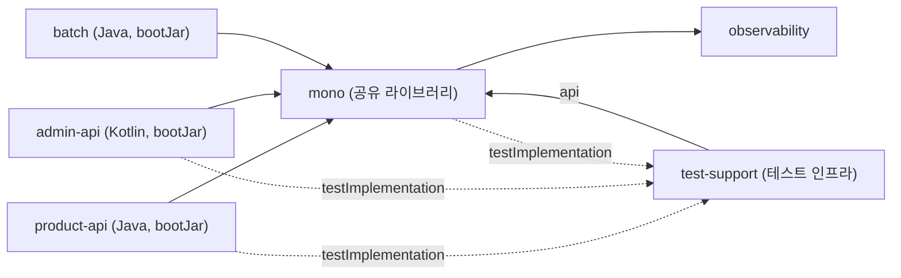

# CLAUDE.md

This file provides guidance to Claude Code when working with code in this repository.

> If a `CLAUDE.personal.md` file exists in the same directory, also refer to its contents.
> **Team instructions take priority over personal instructions when they conflict.**

## User Instructions

- Always respond in Korean regardless of question language.
- If the user asks in English and there are grammar errors, provide grammar feedback in the response.
- For complex or ambiguous questions, include a summary of your understanding in the response.
- Keep answers clear and concise (3-5 lines recommended).
- When code examples are needed, ask whether to show all at once or step by step.
- When writing code, keep comments to a single brief line.
- When modifying existing code, always follow the project's existing patterns and conventions.
- When multiple files need changes, list the files to be modified upfront.
- For error resolution, present a step-by-step approach.
- When multiple solutions exist, recommend the one most fitting the project context first.

## Project Overview

- **Stack**: Spring Boot 3.4.11, Java 21, MySQL, Redis, QueryDSL
- **Architecture**: DDD-based multi-module structure
- **Core Domains**: alcohols, user, review, rating, support, history, picks, like

## 모듈 구조

> [진행 중] 모듈 기술 부채 정리 작업 진행 중 (2026-06-10 시작). 모듈 구성은 아래가 확정 토폴로지이며(물리 3분할은 트리거 조건부로 강등), 남은 작업은 mono 내부 표준 위반 청소와 ArchUnit 룰 활성화다.
>
> 현재 모듈: `product-api`(Java) / `admin-api`(Kotlin) / `batch` / `mono`(공유 라이브러리) / `observability` / `test-support`(테스트 인프라·픽스처). test-support 분리는 PR #623으로 완료(2026-06-12), 각 모듈은 testImplementation으로 소비한다.
> 레이어 규칙은 아래 "레이어 표준 15"를 따른다.


```mermaid
graph LR
    P["product-api (Java, bootJar)"] --> M["mono (공유 라이브러리)"]
    A["admin-api (Kotlin, bootJar)"] --> M
    B["batch (Java, bootJar)"] --> M
    M --> O[observability]
    TS["test-support (테스트 인프라)"] -- api --> M
    P -. testImplementation .-> TS
    A -. testImplementation .-> TS
    M -. testImplementation .-> TS
```

## 빌드 및 실행

```bash
# 서브모듈 초기화 (최초 클론 후 필수)
git submodule update --init --recursive

./gradlew build                 # 전체 빌드
./gradlew test                  # 기본 테스트 (integration, data-jpa-test 제외)
./gradlew unit_test             # 단위 테스트 (@Tag("unit"))
./gradlew integration_test      # 통합 테스트 (@Tag("integration"))
./gradlew check_rule_test       # 아키텍처 규칙 테스트 (@Tag("rule"))
./gradlew asciidoctor           # API 문서 생성
./gradlew bootRun               # 애플리케이션 실행

# admin-api 모듈 전용
./gradlew :bottlenote-admin-api:build           # admin-api 빌드
./gradlew :bottlenote-admin-api:test            # admin-api 테스트 실행
./gradlew :bottlenote-admin-api:asciidoctor     # admin-api 문서 생성
./gradlew :bottlenote-admin-api:bootRun         # admin-api 실행
```

### 서브모듈

- **git.environment-variables**: 환경 설정과 DB 마이그레이션 SQL을 담은 비공개 서브모듈
  - `storage/db/migration/*.sql`: Flyway 마이그레이션 원본
  - `storage/mysql/sql/*.sql`: batch 전용 쿼리 리소스
  - 빌드와 통합 테스트 실행 전 서브모듈 초기화 필수

## 배포 및 실행 인프라

- 운영·개발 모두 Kubernetes에서 돌아가고 GitOps로 배포한다. k8s 매니페스트는 이 저장소가 아니라 별도 저장소에 있다.
- **애플리케이션 인스턴스는 다중이다.** 요청 카운팅, 분산 잠금, 중복 억제, 스케줄 단일 실행 같은 것을 JVM 로컬 상태(static 필드, 인메모리 캐시)로 구현하면 안 된다. Redis 등 공유 저장소를 쓴다.
- 앞단 게이트웨이가 클라이언트를 통해 들어온 `X-Forwarded-For`를 제거하고 실제 접속 주소로 다시 채운다. 따라서 앱이 받는 XFF는 신뢰할 수 있다.

### 배포 방법

배포는 모두 GitHub Actions로 수행한다. **로컬에서 이미지 빌드·푸시·매니페스트 수정을 직접 하지 않는다.**

| 대상 | 워크플로 | 트리거 |
|------|---------|--------|
| product-api / admin-api (운영) | `deploy_release_applications.yml` | `backend/vX.Y.Z` 릴리스 published |
| product-api / admin-api (개발) | `deploy_development_applications.yml` | main CI 성공 시 자동, 또는 수동 dispatch |
| batch | `deploy_batch.yml` | 수동 dispatch (`environment`, `version` 입력) |

```bash
# batch 배포 — version은 정확한 X.Y.Z, production은 main에서만 허용
gh workflow run deploy_batch.yml -f environment=production -f version=1.2.3

# 개발 환경 수동 배포
gh workflow run deploy_development_applications.yml
```

## Skills (Development Workflow)

Use these skills to follow the structured development lifecycle:

| Command | Purpose | When to Use |
|---------|---------|-------------|
| `/define` | Requirements clarification | Starting a new feature, vague requirements |
| `/plan` | Task breakdown | After /define, multi-file changes |
| `/implement` | Incremental implementation | Building features (product + admin) |
| `/test` | Test creation | Unit, integration, RestDocs tests |
| `/verify` | Local CI verification | Compile, unit test, integration test |
| `/debug` | Systematic debugging | Build/test failures, unexpected errors |
| `/self-review` | Pre-commit quality gate | Before every commit |

**Lifecycle:** `/define` -> `/plan` -> `/implement` (with `/self-review` per Task) -> `/test` -> `/verify full`

**Detailed patterns** for product-api and admin-api implementation are in skill reference files:
- `.claude/skills/implement/references/languages/java-spring.md` — Java/Spring 구현 패턴
- `.claude/skills/implement/references/languages/bottlenote-patterns.md` — 프로젝트 특화 패턴 (InMemory 갱신 체크리스트 등)
- `.claude/skills/test/references/testing/java.md` — Java 테스트 패턴

## 에이전트 설정 미러 규칙

이 저장소는 codex와 Claude Code용 설정을 이중으로 보관한다. **한쪽을 고치면 반드시 다른 쪽도 같이 고친다.**

| 대상 | codex | Claude Code |
|---|---|---|
| 지침 | `AGENTS.md` | `CLAUDE.md` |
| 스킬 | `.agents` 디렉터리 | `.claude` 디렉터리 |

- 두 지침 문서는 런타임 이름, 스킬 디렉터리 경로, personal 지침 파일명, 첫 줄 제목만 다르고 나머지 본문은 완전히 같아야 한다. 이 네 가지 외의 차이는 동기화 누락이다.
- 두 스킬 디렉터리는 바이트 단위로 같아야 한다. `diff -rq`로 확인하고, 스킬 파일 안에 특정 런타임의 디렉터리 경로를 하드코딩하지 않는다.
- Skills 표에 적은 슬래시 커맨드는 실제 스킬 디렉터리로 존재해야 한다. 스킬을 제거하면 표에서도 지운다.
- 훅을 다시 도입한다면 머신 고유 절대경로와 런타임 전용 환경변수를 넣지 않는다. 저장소 루트는 `$(git rev-parse --show-toplevel)`로 구한다.

## 코드 작성 규칙

### 아키텍처 패턴

- **계층 구조**: Controller → Facade <-> Service → Repository → Domain
- **도메인별 패키지**: constant, controller, domain, dto, repository, service, facade, exception, event

### 레이어 표준 15 (2026-06-10 확정)

모듈 기술 부채 정리의 기준이 되는 표준. ArchUnit `@Tag("rule")` 테스트로 강제하며, 위반 0이 된 룰부터 활성화한다.

1. 도메인 모델 != `@Entity`가 원칙이나, 구현 중복 제거를 위해 도메인 엔티티(JPA 엔티티)를 허용한다. 의도된 트레이드오프다.
2. 레포지토리는 2형으로 분리한다: 순수 자바 인터페이스인 도메인 레포지토리(포트) + 구현 레포지토리(JPA, QueryDSL, Redis).
3. 도메인 레포지토리 시그니처에 Spring Data 타입(`Page`, `Pageable`, `Slice`, `Sort`) 노출 금지. 페이징은 자체 타입(`PageResponse`, cursor criteria)을 쓴다.
4. 기술 세부사항(QueryDSL, EntityManager, Redis)은 구현 레포지토리 안에 격리하고 포트 밖으로 새지 않는다.
5. 코드는 자기 도메인 패키지에만 둔다. 타 도메인 파일을 자기 패키지에 두지 않는다.
6. 타 도메인 접근은 Facade 경유만 허용한다. 타 도메인의 repository는 물론 service도 직접 참조하지 않는다.
7. Facade는 인터페이스 + 별도 구현체로 구성한다. Service가 Facade를 겸직하지 않는다.
8. Controller는 인터페이스에만 의존한다. 구현체 직접 주입 금지, 도메인 VO 직접 생성 금지.
9. 트랜잭션 경계, 도메인 VO 생성/검증, cross-domain 조합은 Service가 소유한다.
10. 테스트 더블은 Mockito가 아니라 포트와 Facade의 Fake/InMemory 구현을 쓴다.
11. 공통 타입(`PageResponse`, cursor criteria, 공통 예외 베이스, 공통 어노테이션)은 `global`(공유 커널)에 둔다.
12. global은 어떤 도메인도 모른다. global → 도메인 import 금지.
13. 동기 호출은 Facade, 부수효과 전파(히스토리, 알림 등)는 도메인 이벤트로 한다.
14. 예외는 도메인이 소유한다. 도메인별 예외는 자기 exception 패키지에, 공통 베이스만 global에 둔다.
15. 운영 코드는 테스트 코드를 모른다. 테스트 인프라(컨테이너 설정, persistent factory, fake)는 test-support 모듈이 소유한다.

### 네이밍 컨벤션

- **클래스**: `{도메인명}Controller`, `Default{도메인명}Facade`, `Jpa{도메인명}Repository`, `{도메인명}Exception`
- **메서드**: get/find/search (조회), create/register (생성), update/modify/change (수정), delete/remove (삭제)

### 프로젝트 특화 어노테이션

#### 계층별 어노테이션

**@FacadeService**
- **역할**: 도메인 간 통신의 완충 계층 구현체 표시
- **위치**: 인터페이스는 `app.bottlenote.{domain}.facade`(타 도메인에 공개하는 계약), 구현체 `Default{도메인명}Facade`는 `app.bottlenote.{domain}.service`(도메인 내부 구현)
- **특징**: `@Service` 포함, 스프링 컴포넌트로 자동 등록
- **용도**: 도메인끼리는 서로의 Service를 직접 부르지 않고 상대 도메인의 Facade 인터페이스만 호출한다. user↔alcohols처럼 양방향 호출이 Service 상호 참조로 얽혀 부채가 되는 것을 막는 경계다

**@DomainRepository**
- **역할**: 순수 도메인 레포지토리 인터페이스 표시
- **위치**: `app.bottlenote.{domain}.domain`
- **특징**: 프레임워크 독립적, Spring/JPA에 의존하지 않음
- **용도**: 도메인이 할 수 있는 행위를 정의하는 순수 비즈니스 인터페이스

**@JpaRepositoryImpl**
- **역할**: JPA 레포지토리 구현체 표시
- **위치**: `app.bottlenote.{domain}.repository`
- **특징**: `@Repository` 포함, 영속성 예외 변환 제공
- **용도**: 도메인 레포지토리의 실제 데이터베이스 접근 구현

**@DomainEventListener**
- **역할**: 도메인 이벤트 리스너 표시
- **위치**: `app.bottlenote.{domain}.event`
- **특징**: `@Component` 포함, 동기/비동기 처리 방식 지정 가능 (`ProcessingType`)
- **용도**: 도메인 이벤트를 처리하는 리스너 구현

**@ThirdPartyService**
- **역할**: 외부 서비스 연동 계층 표시
- **위치**: `app.external` 또는 관련 패키지
- **특징**: `@Service` 포함, 트랜잭션 불필요
- **용도**: AWS, 외부 API 등 써드파티 시스템 통신

### 예외 처리

- 도메인별 예외: `{도메인명}Exception`, `{도메인명}ExceptionCode`
- 전역 예외 핸들러: `@RestControllerAdvice`
- 통일된 응답: `GlobalResponse`

### 코드 스타일

- Lombok: `@Getter`, `@Builder`, `@RequiredArgsConstructor`
- 불변성: `record` 사용 (DTO), `final` 필드 선호
- 페이징: `PageResponse`, `CursorPageable`

## 테스트 작성 규칙

### 테스트 분류 및 네이밍

- `@Tag("unit")`: 단위 테스트, `@Tag("integration")`: 통합 테스트, `@Tag("rule")`: 아키텍처 규칙
- 클래스명: `{기능명}ServiceTest`, 메서드명: `{기능명}할_수_있다`
- `@DisplayName`: 한글로 테스트 목적 명시 (형식: `~할 때 ~한다`)

### 테스트 구조

- Given-When-Then 패턴 사용
- Fixture 클래스를 통한 테스트 데이터 관리
- TestContainers 사용 (실제 DB 환경)
- 테스트 데이터: test-support 모듈의 `{도메인명}TestFactory` / `DataInitializer`로 생성

### 단위 테스트 패턴

- **Fake/Stub 패턴 선호**: Mock 대신 InMemory 구현체 사용
- **네이밍**: `InMemory{도메인명}Repository`, `Fake{서비스명}`
- **위치**: `bottlenote-test-support` 모듈의 `{도메인}.fixture` 패키지 (특정 모듈 전용 헬퍼는 그 모듈 test에 둔다)

### 통합 테스트 패턴

- **베이스 클래스**: `IntegrationTestSupport` 상속
- **API 테스트**: `MockMvcTester` 사용
- **테스트 데이터 생성**: `{도메인명}TestFactory` 사용

> Detailed code examples: see `/test` skill references (`test-infra.md`, `test-patterns.md`)

### 이벤트 기반 아키텍처

- **이벤트 발행**: `ApplicationEventPublisher.publishEvent()`
- **이벤트 수신**: `@TransactionalEventListener` + `@Async` 조합
- **트랜잭션 분리**: `@Transactional(propagation = Propagation.REQUIRES_NEW)`
- **이벤트 클래스**: `{도메인명}{동작}Event` record로 정의

## 데이터베이스 설계

### 스키마 마이그레이션 (Flyway)

스키마는 Flyway가 애플리케이션 기동 시점에 적용한다. `ddl-auto`는 `validate`이며 Hibernate가 스키마를 생성하거나 변경하지 않는다. 엔티티를 바꾸면 마이그레이션도 함께 작성해야 하고, 그러지 않으면 기동 시 validate에서 실패한다.

- 마이그레이션 원본은 `git.environment-variables/storage/db/migration/`에 두고, product-api와 admin-api의 `processResources`가 빌드 시 `classpath:db/migration`으로 복사한다. 저장소 소스 트리에는 `db/migration` 디렉터리가 없다.
- 설정은 `enabled: ${FLYWAY_ENABLED:true}`, `baseline-on-migrate: false`, `locations: classpath:db/migration`이다. 기존 스키마에 임의로 baseline을 잡지 않는다.
- batch 모듈은 `flyway.enabled=false`다. 마이그레이션 주체가 아니며, batch jar에 마이그레이션 SQL이 섞여 들어가면 빌드가 실패하는 가드가 있다. batch는 `storage/mysql/sql`의 지정된 쿼리 리소스만 패키징한다.
- 통합 테스트도 `flyway.enabled=true`로 동작한다. TestContainers 스키마 역시 Flyway가 만들며, 별도 init 스크립트를 쓰지 않는다.
- 새 마이그레이션은 서브모듈 저장소에 추가한 뒤 서브모듈 포인터를 갱신해야 반영된다.

### JPA 엔티티

- `BaseEntity` 상속 (공통 필드)
- 복합 키: `@Embeddable` 사용
- 엔티티 필터링: Hibernate `@Filter` 활용

### 레포지토리 계층 구조

#### 1. 도메인 레포지토리 (필수)
- **위치**: `app.bottlenote.{domain}.domain`
- **네이밍**: `{도메인명}Repository`
- **역할**: 해당 도메인이 할 수 있는 행위를 정의만 하는 순수 비즈니스 인터페이스
- **어노테이션**:
  - `@DomainRepository` (선택) - 도메인 레포지토리임을 명시적으로 표시
  - 어노테이션 없이 순수 인터페이스로만 작성 가능
- **원칙**:
  - Spring, JPA에 의존하지 않음
  - 도메인 계층에 위치
  - 서비스 계층은 이 인터페이스에만 의존

#### 2. JPA 레포지토리 (필수)
- **위치**: `app.bottlenote.{domain}.repository`
- **네이밍**: `Jpa{도메인명}Repository`
- **역할**: 도메인 레포지토리의 실제 데이터베이스 접근 구현체
- **어노테이션**:
  - `@JpaRepositoryImpl` (필수) - JPA 구현체임을 표시하고 `@Repository` 기능 제공
  - 영속성 예외를 Spring의 DataAccessException으로 자동 변환
- **원칙**:
  - `JpaRepository<T, ID>` 상속으로 기본 CRUD 제공
  - 도메인 레포지토리 인터페이스 구현
  - 단순 조회는 메서드 쿼리 또는 `@Query` JPQL 사용
  - QueryDSL Custom 레포지토리 통합 (필요 시)

#### 3. QueryDSL 레포지토리 (선택 - 복잡한 쿼리만)
- **역할**: 복잡한 동적 쿼리를 타입 세이프하게 작성하기 위한 확장 레포지토리
- **사용 시점**: 메서드 쿼리나 JPQL로 표현하기 어려운 복잡한 쿼리가 필요할 때만 사용

**구성 요소**:
- **Custom 인터페이스**: `Custom{도메인명}Repository` (위치: repository 패키지)
  - 어노테이션 불필요 (순수 인터페이스)
- **구현체**: `Custom{도메인명}RepositoryImpl` (위치: repository 패키지)
  - 어노테이션 불필요 (Spring Data JPA가 자동 감지)
- **쿼리 서포터**: `{도메인명}QuerySupporter` (위치: repository 패키지)
  - `@Component` (필수) - 재사용 로직을 제공하는 스프링 빈

**QueryDSL 사용 기준**:
- ✅ 복잡한 동적 조건 (여러 필터 조합)
- ✅ 다중 테이블 조인 및 집계
- ✅ 복잡한 Projection (DTO 변환)
- ❌ 단순 CRUD
- ❌ 단일 조건 조회 (메서드 쿼리 사용)

**성능 최적화**:
- 페치 조인, `@BatchSize` 활용 (N+1 방지)
- `@Cacheable` 적절히 사용
- 불필요한 컬럼 조회 방지 (Projection 활용)

## 보안 및 인증

- JWT 토큰: 액세스 토큰 24시간, 리프레시 토큰 30일
- 토큰 검증: `JwtTokenProvider`, 보안 설정: `SecurityConfig`
- API 보안: `@PreAuthorize` 또는 `@Secured`, CORS: `WebConfig`

## 외부 서비스 연동

- OpenFeign: `@FeignClient`, 설정 분리 `FeignConfig`, 에러 처리 `ErrorDecoder`
- AWS S3: PreSigned URL 생성 (SDK v2 `S3Client`/`S3Presigner`)

## 좋은 Spring Boot 개발 관습

### 응답 통일성

- API 응답 형식 통일: `GlobalResponse` 또는 `ResponseEntity` 일관성 유지
- 에러 응답 표준화: HTTP 상태 코드와 에러 메시지 일관성

### 성능 최적화

- N+1 문제 방지: 페치 조인, `@BatchSize`, 쿼리 최적화
- 캐싱 전략: `@Cacheable` 적절히 활용
- 비동기 처리: `@Async`, 이벤트 기반 처리

### 보안 기본 원칙

- 입력값 검증: `@Valid`, `@Validated` 사용
- 민감 정보 로깅 금지
- SQL 인젝션 방지: PreparedStatement 사용

### 테스트 품질

- 단위 테스트와 통합 테스트 분리
- 테스트 데이터 격리: 각 테스트 독립성 보장
- Mock 대신 Fake/InMemory 구현으로 외부 의존성 분리 (레이어 표준 10)

### 코드 품질

- 의존성 주입: 생성자 주입 우선
- 불변성 지향: `final` 필드, `record` 활용
- 단일 책임 원칙: 클래스와 메서드 역할 명확화

## GSL Runtime Boundary Rules

> [상태] 현재 GSL 스킬셋은 구형이다. 별도 세션에서 개편할 예정이며, 개편 전까지 아래 경계 규칙을 유지한다.

When using GSL skills from `.claude/skills/`, treat each `SKILL.md` as a single-turn procedure.

- Load only the one GSL skill that matches the user's current explicit request.
- Do not pre-load all 9 GSL skills unless the user explicitly asks for a read-only diagnosis of the skillset.
- A GSL skill boundary is a hard stop. When a skill reaches its Verification / Runtime Boundary section, end the assistant turn.
- `After this skill`, `Next: /...`, or `should invoke` means "suggest the next command", not "execute it now".
- Do not transition between GSL skills (`/define`->`/plan`, `/plan`->`/implement`, `/implement` Task N->N+1, `/implement`->`/test`, `/test`->`/verify`, etc.) in the same assistant turn unless the user explicitly named that next skill — or named multiple Tasks for continuous execution — in their message.
- `/implement` may write test code alongside a Task, but must NOT run the full `/test` / `/verify` / `/self-review` workflow inside itself. Those are separate skill boundaries.
- If the user says "continue" ambiguously, ask whether to run the next suggested GSL skill or only report the next command.
