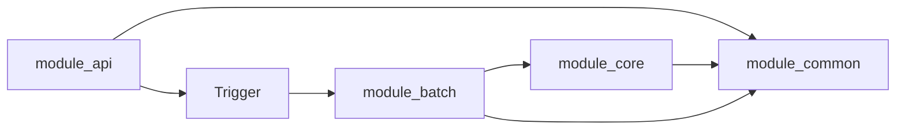

# Bottle Note Batch Server

## 개요(Overview)

> Bottle note 프로젝트의 Batch 서버입니다.

### module api

- 외부 클라이언트의 요청을 처리하고 응답을 반환합니다.
- 비즈니스 로직은 core 모듈에 위임하여 처리합니다.
- 배치의 트리거를 호출하고, 클라이언트에게 스케줄링 작업의 결과를 반환합니다.

### module batch

- 주기적인 배치 작업을 처리합니다.
- 트리거 발동 시 core 모듈에서 필요한 정보를 가져옵니다.
- 가져온 정보를 가공하고, 필요한 작업을 수행한 후 결과를 core에 전달합니다.

1. **job**
	- 배치 작업(Job)을 정의하고, 각 스텝을 연결하는 역할을 합니다. 배치 작업의 흐름을 관리합니다.

2. **listener**
	- 배치 작업이 시작되거나 완료될 때 실행되는 후속 작업을 정의한 리스너입니다.

3. **processor**
	- 읽어온 데이터를 가공하여 Writer로 넘기는 역할을 합니다.

4. **reader**
	- 데이터 소스(DB, 파일 등)에서 데이터를 읽어오는 역할을 담당합니다.

5. **scheduler**
	- 배치 작업의 실행 주기를 관리하며, 배치 작업을 주기적으로 실행합니다.

6. **step**
	- Reader, Processor, Writer로 구성된 배치 작업의 개별 스텝을 정의합니다.

7. **writer**
	- 처리된 데이터를 데이터베이스 등으로 저장하는 역할을 담당합니다.

- Job: 여러 Step을 연결하여 하나의 배치 작업을 구성합니다.
- Step: 각 Step은 Reader -> Processor -> Writer로 구성되며, 데이터를 처리하는 단위입니다.
- Listener: 배치 작업 전후에 실행되는 로직을 정의합니다.
- Scheduler: 배치 작업을 주기적으로 실행할 수 있도록 스케줄링합니다.

### module core

- 비즈니스 로직의 중심 모듈로, 데이터베이스와의 상호작용을 처리합니다.
- batch 모듈에서 가져온 데이터를 처리하고, 저장하거나 추가적인 분석을 수행합니다.
- 배치 작업이나 API 요청 시 필요한 데이터를 제공합니다.

### module common

- api, batch, core에서 공통으로 사용하는 유틸리티, 상수, 예외 처리 등을 정의합니다.
- 프로젝트 전반에서 재사용되는 로직과 설정을 제공합니다.

