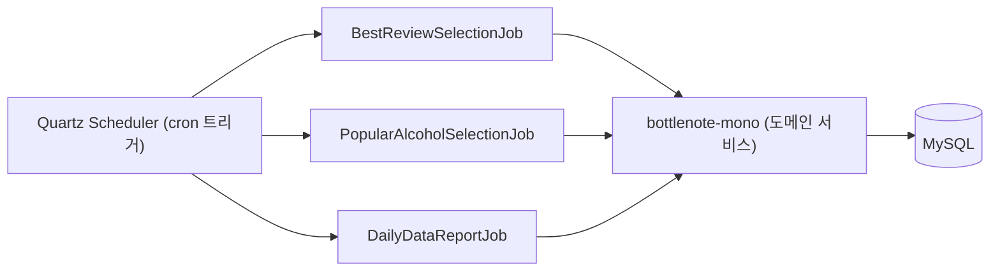

# Bottle Note Batch Server

## 개요(Overview)

> Bottle note 프로젝트의 Batch 서버입니다.

Quartz 스케줄러가 cron 트리거로 배치 Job을 실행하는 독립 실행 모듈입니다. 도메인 로직은 `bottlenote-mono`의 서비스를 소비하며, 자체 비즈니스 로직을 갖지 않습니다.

```mermaid
flowchart LR
    Q["Quartz Scheduler (cron 트리거)"] --> J1[BestReviewSelectionJob]
    Q --> J2[PopularAlcoholSelectionJob]
    Q --> J3[DailyDataReportJob]
    J1 --> M["bottlenote-mono (도메인 서비스)"]
    J2 --> M
    J3 --> M
    M --> DB[(MySQL)]
```

### 패키지 구조

- `config/` — Quartz 스케줄·JobDetail·Trigger 구성(`QuartzConfig`), Security, 배치 공통 설정
- `job/ranking/` — `BestReviewSelectionJobConfig`, `PopularAlcoholSelectionJobConfig` (랭킹 산출 배치)
- `job/report/` — `DailyDataReportJobConfig` (일일 데이터 리포트, Discord 웹훅 발송)
- `properties/` — 배치 전용 설정 프로퍼티 바인딩

### 모듈 의존

- `bottlenote-batch` → `bottlenote-mono` (도메인 서비스·레포지토리) → `bottlenote-observability`
- 테스트는 Testcontainers MySQL 기반 컨텍스트 배선 검증(`BatchApplicationContextTest`)이며, `bottlenote-test-support`에는 의존하지 않는다.

### 실행

- 각 Job은 `QuartzConfig`의 cron 표현식으로 스케줄된다 (예: 매일 자정 `0 0 0 * * ?`).
- 로컬 실행: `./gradlew :bottlenote-batch:bootRun`
- 테스트: `./gradlew batch_test`

