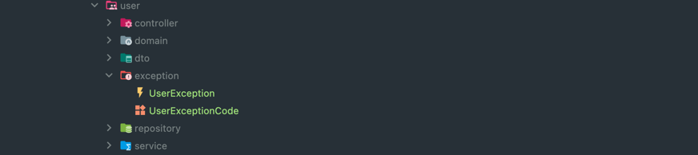

## 전역 예외 처리 방법에 대한 가이드 문서입니다.

### 1. 전역 예외 처리란?

전역 예외 처리는 프로그램 전체에서 발생하는 예외를 처리하는 방법입니다.
프로그램 전체에서 발생하는 예외는 다음과 같은 경우가 있습니다.

- 사용자의 입력에 대한 예외 처리
- 파일 입출력에 대한 예외 처리
- 네트워크 통신에 대한 예외 처리

발생하는 예외의 종류는 다양하며, 예외 처리 방법도 다양합니다.

각 에러에 대해 일관된 방식으로 처리하기 위해 전역 예외 처리를 사용합니다.

아래 가이드에서 사용되는 방식의

```@RestControllerAdvice``` 와```@ExceptionHandler``` 에 대한 설명은 생략합니다.

-----

## 예외 처리 패키지 구조

```
global
├── exception
    ├── custom
    │   ├── AbstractCustomException.java
    │   ├── CustomException.java
    │   └── code
    │       ├── CustomExceptionCode.java
    │       └── ExceptionCode.java
    ├── handler
    │   ├── ExceptionLoggingAspect.java
    │   └── GlobalExceptionHandler.java
    └── util
        └── ExceptionUtil.java
```

- **AbstractCustomException**
    - 사용자 정의 예외 클래스의 부모 클래스입니다.
    - **추가적으로 정의할 모든 사용자 정의 예외 클래스는 이 클래스를 상속받아야합니다**.
- **CustomException**
    - 사용자 정의 예외 클래스입니다.
    - **AbstractCustomException** 클래스를 상속받아 구현합니다.
    - `CustomExceptionCode`에 있는 일반적인 예외 등 해당 예외를 사용해서 예외를 발생시킵니다.
- code/**CustomExceptionCode**
    - 사용자 정의 예외 코드를 정의한 클래스입니다.
    - **ExceptionCode** 클래스를 상속받아 구현합니다.
    - 사용자 정의 예외 코드를 정의합니다.
        - 예) `INVALID_INPUT_VALUE`, `ENTITY_NOT_FOUND`, `METHOD_NOT_ALLOWED` 등
- code/**ExceptionCode**
    - 사용자 정의 예외 코드의 부모 클래스입니다.
    - **CustomExceptionCode** 클래스를 상속받아 구현합니다.
    - 사용자 정의 예외 코드의 부모 클래스입니다.
- **ExceptionLoggingAspect**
    - 예외 발생 시 로깅을 하는 Aspect입니다.
- **GlobalExceptionHandler**
    - 모든 전역 예외 처리를 하는 클래스입니다.
    - **@RestControllerAdvice** 어노테이션을 사용합니다.
    - **@ExceptionHandler** 어노테이션을 사용하여 예외를 처리합니다.

----

### 예외를 던지는 방법

- CustomException은 일반적인 예외를 처리하는 클래스입니다.

```java
class CustomService {
    public void throwCustomException() {
        if (조건) {
            throw new CustomException(CustomExceptionCode.INVALID_INPUT_VALUE);
        }
    }
}
```

----


여기서 CustomException은 일반적인 예외를 처리하는 클래스입니다.

만약 User에 관련된 예외를 처리하고 싶다면 UserException 클래스를 만들어서 AbstractCustomException를 상속받아 구현하면 됩니다.



```java
public enum UserExceptionCode implements ExceptionCode

public class UserException extends AbstractCustomException
```

**상시 예시**

- 사용자가 없을 경우 USER_NOT_FOUND 예외

```java
class UserService {
    public void find_user() {
        user = userRepository.findById(id).orElseThrow(() ->
                new UserException(UserExceptionCode.USER_NOT_FOUND));
    }
}
```

