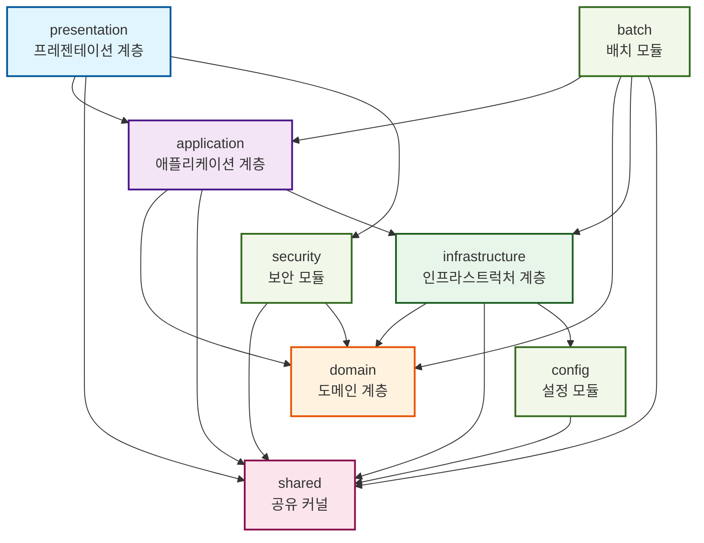
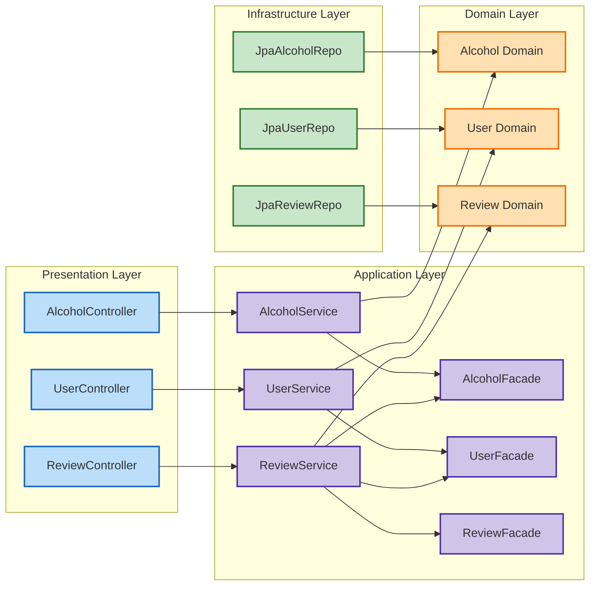
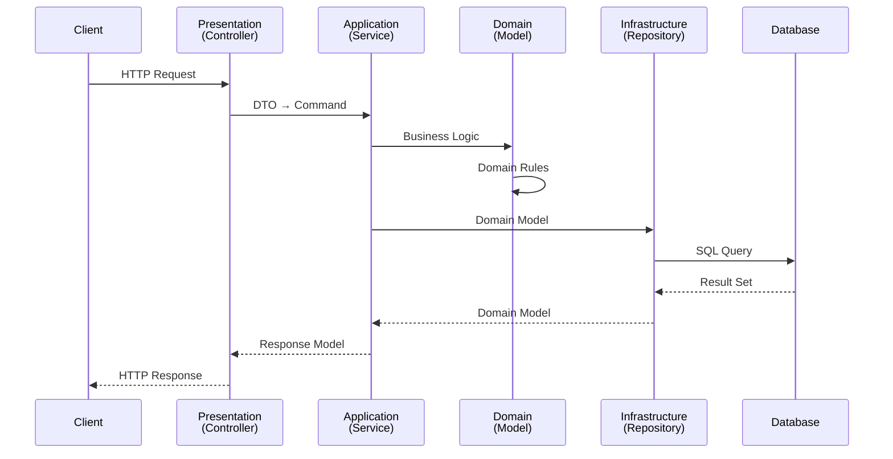
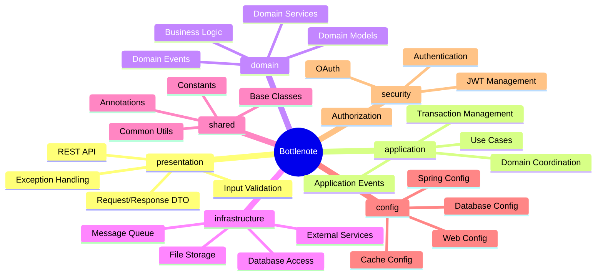
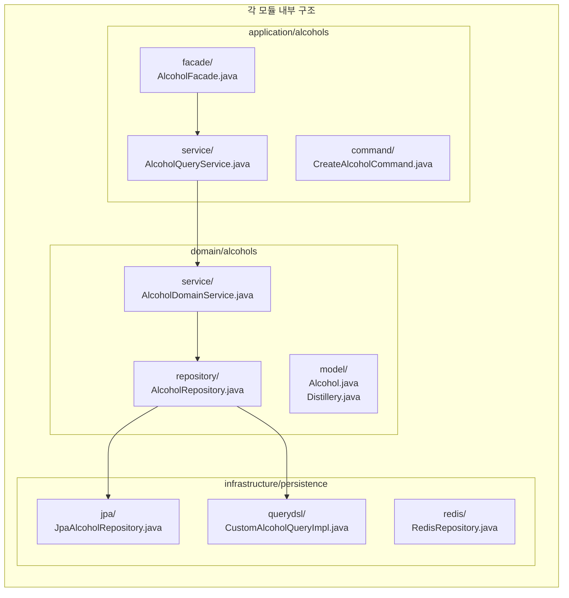

# 멀티모듈 마이그레이션 가이드

## 🎯 목표 아키텍처

### 클린 아키텍처 기반 모듈 구조

```
bottlenote/
├── presentation/        # 프레젠테이션 계층 (API 진입점)
├── application/        # 애플리케이션 계층 (유스케이스)
├── domain/            # 도메인 계층 (비즈니스 로직)
├── infrastructure/    # 인프라스트럭처 계층 (외부 시스템)
├── shared/           # 공유 커널
├── config/           # 전역 설정
├── security/         # 보안 모듈
└── batch/            # 배치 작업
```

## 📁 각 모듈별 상세 구조

### presentation (프레젠테이션 계층)

```
presentation/src/main/java/app/bottlenote/presentation/
├── controller/         # REST 컨트롤러
│   ├── alcohols/
│   │   ├── AlcoholQueryController.java
│   │   ├── AlcoholExploreController.java
│   │   └── AlcoholPopularQueryController.java
│   ├── user/
│   │   ├── UserBasicController.java
│   │   ├── UserMyPageController.java
│   │   └── AuthV2Controller.java
│   ├── review/
│   │   ├── ReviewController.java
│   │   └── ReviewReplyController.java
│   └── ...
├── dto/               # Request/Response DTO
│   ├── request/
│   └── response/
├── filter/            # 서블릿 필터
├── interceptor/       # HTTP 인터셉터
└── advice/            # 전역 예외 처리
    └── GlobalExceptionHandler.java
```

### domain (도메인 계층)

```
domain/src/main/java/app/bottlenote/domain/
├── alcohols/
│   ├── model/         # 엔티티, 값 객체
│   │   ├── Alcohol.java
│   │   ├── Distillery.java
│   │   └── Region.java
│   ├── service/       # 도메인 서비스
│   │   └── AlcoholDomainService.java
│   └── repository/    # 레포지토리 인터페이스
│       └── AlcoholRepository.java
├── user/
│   ├── model/
│   │   ├── User.java
│   │   └── Follow.java
│   ├── service/
│   └── repository/
├── review/
├── rating/
├── picks/
├── like/
├── history/
└── support/
```

### application (애플리케이션 계층)

```
application/src/main/java/app/bottlenote/application/
├── service/           # 애플리케이션 서비스 (유스케이스)
│   ├── alcohols/
│   │   ├── AlcoholQueryService.java
│   │   └── AlcoholPopularService.java
│   ├── user/
│   │   ├── UserBasicService.java
│   │   └── AuthService.java
│   └── review/
│       └── ReviewService.java
├── facade/            # 도메인 간 조율
│   ├── AlcoholFacade.java
│   ├── UserFacade.java
│   └── ReviewFacade.java
├── command/           # 커맨드 객체
└── query/             # 쿼리 객체
```

### infrastructure (인프라스트럭처 계층)

```
infrastructure/src/main/java/app/bottlenote/infrastructure/
├── persistence/       # 영속성 구현
│   ├── jpa/
│   │   ├── repository/
│   │   │   ├── JpaAlcoholRepository.java
│   │   │   └── JpaUserRepository.java
│   │   └── entity/    # JPA 엔티티
│   ├── querydsl/
│   │   └── CustomAlcoholQueryRepositoryImpl.java
│   └── redis/
│       └── RedisAlcoholViewHistoryRepository.java
├── external/          # 외부 시스템 연동
│   ├── aws/
│   │   └── S3Service.java
│   ├── firebase/
│   │   └── FCMService.java
│   └── feign/
│       └── ProfanityClient.java
└── event/            # 이벤트 발행/구독
    ├── publisher/
    └── listener/
```

### config (설정 모듈)

```
config/src/main/java/app/bottlenote/config/
├── database/         # 데이터베이스 설정
│   ├── JpaConfig.java
│   ├── QueryDslConfig.java
│   └── RedisConfig.java
├── web/             # 웹 설정
│   ├── WebConfig.java
│   └── CorsConfig.java
├── async/           # 비동기 설정
│   └── AsyncConfig.java
└── cache/           # 캐시 설정
    └── CacheConfig.java
```

### security (보안 모듈)

```
security/src/main/java/app/bottlenote/security/
├── jwt/              # JWT 관련
│   ├── JwtTokenProvider.java
│   ├── JwtAuthenticationFilter.java
│   └── JwtProperties.java
├── oauth/            # OAuth 관련
│   ├── OauthService.java
│   └── AppleTokenValidator.java
└── config/
    └── SecurityConfig.java
```

### shared (공유 커널)

```
shared/src/main/java/app/bottlenote/shared/
├── annotation/       # 커스텀 어노테이션
│   ├── @FacadeService
│   ├── @DomainRepository
│   └── @ThirdPartyService
├── base/            # 기본 클래스
│   ├── BaseEntity.java
│   └── BaseTimeEntity.java
├── exception/       # 공통 예외
│   ├── AbstractCustomException.java
│   └── ExceptionCode.java
├── util/           # 유틸리티
│   └── ImageUtil.java
└── constant/       # 공통 상수
```

## 🔄 현재 구조 → 목표 구조 매핑

### 매핑 테이블

| 현재 위치                    | 목표 모듈                        | 설명            |
|--------------------------|------------------------------|---------------|
| `*/controller/*`         | `presentation/controller`    | REST API 컨트롤러 |
| `*/dto/request/*`        | `presentation/dto/request`   | API 요청 DTO    |
| `*/dto/response/*`       | `presentation/dto/response`  | API 응답 DTO    |
| `*/service/*`            | `application/service`        | 애플리케이션 서비스    |
| `*/facade/*`             | `application/facade`         | 도메인 조율자       |
| `*/domain/*`             | `domain/*/model`             | 도메인 모델        |
| `*/repository/*` (인터페이스) | `domain/*/repository`        | 레포지토리 계약      |
| `*/repository/*Impl`     | `infrastructure/persistence` | 레포지토리 구현      |
| `global/config/*`        | `config/*`                   | 각종 설정         |
| `global/security/*`      | `security/*`                 | 보안 관련         |
| `global/exception/*`     | `shared/exception`           | 공통 예외         |
| `common/*`               | `shared/*`                   | 공통 기능         |
| `external/*`             | `infrastructure/external`    | 외부 연동         |

## 🚀 단계별 마이그레이션 계획

### Phase 1: shared 모듈 생성 (1주)

```gradle
// shared/build.gradle
dependencies {
    implementation 'org.springframework.boot:spring-boot-starter'
    implementation 'org.projectlombok:lombok'
    implementation 'jakarta.persistence:jakarta.persistence-api'
}
```

**이동 대상:**

- BaseEntity, BaseTimeEntity
- 커스텀 어노테이션
- 공통 예외 클래스
- 유틸리티 클래스

### Phase 2: domain 모듈 분리 (2-3주)

```gradle
// domain/build.gradle
dependencies {
    api project(':shared')
    implementation 'org.springframework.boot:spring-boot-starter-validation'
    compileOnly 'jakarta.persistence:jakarta.persistence-api'
}
```

**이동 대상:**

- 도메인 모델 (엔티티, VO)
- 도메인 서비스
- 레포지토리 인터페이스
- 도메인 이벤트

### Phase 3: infrastructure 모듈 구축 (2-3주)

```gradle
// infrastructure/build.gradle
dependencies {
    implementation project(':domain')
    implementation project(':shared')
    implementation 'org.springframework.boot:spring-boot-starter-data-jpa'
    implementation 'org.springframework.boot:spring-boot-starter-data-redis'
    implementation "io.github.openfeign.querydsl:querydsl-jpa:${queryDslVersion}"
    implementation 'org.springframework.cloud:spring-cloud-starter-openfeign'
}
```

**이동 대상:**

- JPA 레포지토리 구현체
- QueryDSL 구현
- Redis 구현
- 외부 서비스 클라이언트

### Phase 4: config & security 모듈 분리 (1-2주)

```gradle
// config/build.gradle
dependencies {
    implementation project(':shared')
    implementation 'org.springframework.boot:spring-boot-starter'
}

// security/build.gradle
dependencies {
    implementation project(':shared')
    implementation project(':domain')
    implementation 'org.springframework.boot:spring-boot-starter-security'
    implementation 'io.jsonwebtoken:jjwt-api'
}
```

**이동 대상:**

- 각종 Configuration 클래스
- JWT 관련 클래스
- OAuth 관련 클래스
- Security 설정

### Phase 5: application 모듈 생성 (2주)

```gradle
// application/build.gradle
dependencies {
    implementation project(':domain')
    implementation project(':shared')
    implementation project(':infrastructure')
    implementation 'org.springframework.boot:spring-boot-starter'
    implementation 'org.springframework.transaction:spring-tx'
}
```

**이동 대상:**

- 애플리케이션 서비스
- Facade 클래스
- 커맨드/쿼리 객체
- 트랜잭션 처리 로직

### Phase 6: presentation 모듈 정리 (1-2주)

```gradle
// presentation/build.gradle
dependencies {
    implementation project(':application')
    implementation project(':shared')
    implementation project(':security')
    implementation 'org.springframework.boot:spring-boot-starter-web'
    implementation 'org.springframework.boot:spring-boot-starter-validation'
}
```

**이동 대상:**

- Controller 클래스
- Request/Response DTO
- 전역 예외 핸들러
- 필터, 인터셉터

### Phase 7: 루트 모듈 정리 (1주)

```gradle
// build.gradle (root)
dependencies {
    implementation project(':presentation')
    implementation project(':application')
    implementation project(':domain')
    implementation project(':infrastructure')
    implementation project(':config')
    implementation project(':security')
    implementation project(':shared')
    runtimeOnly project(':batch')
}

// BottleNoteApplication.java는 루트에 유지
```

## 📊 의존성 방향

```
presentation → application → domain ← infrastructure
     ↓            ↓           ↓            ↓
                shared (공통 사용)
     ↓            ↓                        ↓
   security    config                    external
```

### 의존성 규칙

1. **presentation**은 application만 의존
2. **application**은 domain만 의존
3. **domain**은 아무것도 의존하지 않음 (순수 비즈니스)
4. **infrastructure**는 domain을 구현
5. **shared**는 모든 모듈에서 사용 가능
6. **config/security**는 필요한 모듈만 의존

## ✅ 검증 항목

### ArchUnit 테스트 추가

```java

@Test
void domainShouldNotDependOnInfrastructure() {
	noClasses()
			.that().resideInAPackage("..domain..")
			.should().dependOnClassesThat()
			.resideInAPackage("..infrastructure..")
			.check(importedClasses);
}

@Test
void presentationShouldOnlyDependOnApplication() {
	classes()
			.that().resideInAPackage("..presentation..")
			.should().onlyDependOnClassesThat()
			.resideInAnyPackage("..application..", "..shared..", "java..", "org.springframework..")
			.check(importedClasses);
}
```

## 🎯 최종 목표

1. **명확한 계층 분리**: 각 계층의 책임이 명확
2. **의존성 역전**: 비즈니스 로직이 인프라에 의존하지 않음
3. **테스트 용이성**: 각 모듈 독립적 테스트 가능
4. **유지보수성**: 변경 영향 범위 최소화
5. **확장성**: 새로운 기능 추가 용이

## 📊 모듈 의존성 다이어그램

### 전체 모듈 의존성 구조



### 도메인별 세부 구조



### 의존성 흐름과 데이터 플로우



### 모듈별 주요 책임



### 패키지 구조 상세



---

*이 문서는 지속적으로 업데이트됩니다.*
*최종 수정: 2025-08-19*
