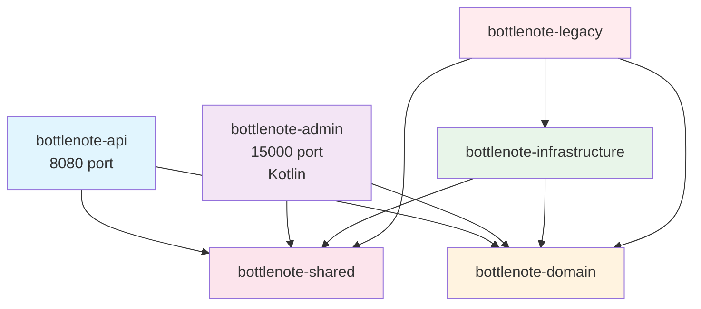

# 멀티모듈 마이그레이션 가이드 v2

## 🎯 목표

**기존 모노리스 구조를 점진적으로 멀티모듈로 전환하여 확장성과 유지보수성을 확보**

- 기존 비즈니스 로직 안정성 유지
- 독립 배포 가능한 API/Admin 애플리케이션 구축
- 코틀린 기반 Admin 모듈 도입
- 테스트 코드 안정성 보장

## 🏗️ 최종 모듈 구조

```
bottlenote/
├── bottlenote-legacy/         # 현재 모든 코드 (마이그레이션 출발점)
├── bottlenote-shared/         # 순수 공통 컴포넌트 (JWT Provider, DTO, 유틸)
├── bottlenote-domain/         # 엔티티 객체, 비즈니스 로직
├── bottlenote-infrastructure/ # JPA 구현체, 외부 API 연동
├── bottlenote-api/           # 사용자 API (8080 포트)
└── bottlenote-admin/         # 관리자 API (코틀린, 15000 포트)
```

## 📋 각 모듈 상세 역할

### bottlenote-legacy
- **목적**: 마이그레이션 과정의 안전망
- **포함**: 현재 모든 코드를 그대로 보관
- **전략**: 점진적으로 다른 모듈로 이동 후 최종 제거

### bottlenote-shared  
- **목적**: 순수 공통 컴포넌트 (의존성 없음)
- **포함**: 
  - JWT Provider, TokenValidator (시큐리티 필터 제외)
  - Request/Response DTO
  - 유틸리티 클래스
  - 상수 관리

### bottlenote-domain
- **목적**: 순수 비즈니스 로직 관리
- **포함**:
  - 엔티티 객체 (User, Alcohol, Review 등)
  - BaseEntity, 공통 어노테이션
  - 도메인 서비스
  - Repository 인터페이스
  - 도메인 이벤트

### bottlenote-infrastructure  
- **목적**: 외부 시스템과의 연동
- **포함**:
  - JPA Repository 구현체
  - QueryDSL 구현
  - Redis 구현체
  - 외부 API 클라이언트 (Feign)
  - AWS/Firebase 연동

### bottlenote-api
- **목적**: 사용자용 REST API 애플리케이션
- **포함**:
  - Controller 클래스
  - JWT 필터, SecurityConfig
  - 사용자 권한 관리
- **배포**: 8080 포트

### bottlenote-admin
- **목적**: 관리자용 API 애플리케이션 (코틀린)
- **포함**: 관리 기능 API
- **배포**: 15000 포트

## 🔗 의존성 구조



### 의존성 규칙

1. **bottlenote-api/admin**: domain, shared만 의존
2. **bottlenote-domain**: shared만 의존 (순수 비즈니스)
3. **bottlenote-infrastructure**: domain, shared 의존
4. **bottlenote-shared**: 아무것도 의존하지 않음
5. **bottlenote-legacy**: 마이그레이션 과정에서만 모든 모듈 의존 허용

## 🚀 단계별 마이그레이션 계획 (4주)

### Week 1: 기반 모듈 구축

**목표**: shared, domain 모듈 생성 및 핵심 컴포넌트 이동

#### 1.1 bottlenote-shared 모듈 생성
**이동 대상:**
- JWT Provider, TokenValidator (필터 제외)
- `*/dto/request/*`, `*/dto/response/*` → 통합 DTO
- `common/*` → 유틸리티 클래스
- 상수 관리

#### 1.2 bottlenote-domain 모듈 생성
**이동 대상:**
- `*/domain/*` → 엔티티 객체
- BaseEntity, 커스텀 어노테이션
- `*/repository/*` (인터페이스만) → Repository 계약
- 도메인 서비스, 도메인 이벤트

### Week 2: Infrastructure 모듈 구축

#### 2.1 bottlenote-infrastructure 모듈 생성
**이동 대상:**
- `*/repository/*Impl` → JPA Repository 구현체
- QueryDSL 커스텀 구현체
- `external/*` → Feign 클라이언트, AWS/Firebase 연동
- Redis 구현체

### Week 3: API 모듈 생성 및 정리

#### 3.1 bottlenote-api 모듈 생성
**이동 대상:**
- `*/controller/*` → REST API Controller
- `*/service/*`, `*/facade/*` → 애플리케이션 서비스
- JWT 필터, SecurityConfig 각각 구현

### Week 4: Admin 모듈 생성 (코틀린)

#### 4.1 bottlenote-admin 모듈 생성 (코틀린)
**목표:**
- 15000 포트에서 동작하는 관리자용 API
- 코틀린 기반 독립 애플리케이션
- 기존 도메인/인프라 모듈 재사용

## 🔧 시큐리티 전략

**공통 컴포넌트**: JWT Provider는 shared 모듈에서 제공  
**필터 로직**: 각 API 모듈에서 독립적으로 구현  
**SecurityConfig**: 각 애플리케이션별로 독립 설정

## 📊 배포 구조

각 모듈별로 독립적인 빌드 및 배포 가능

## ✅ 마이그레이션 검증 항목

### 기능 검증
- [ ] 기존 API 모든 엔드포인트 정상 동작
- [ ] JWT 인증/인가 정상 동작
- [ ] 데이터베이스 연동 정상 동작
- [ ] 외부 API 연동 정상 동작

### 테스트 검증
- [ ] 기존 테스트 코드 모두 통과
- [ ] 새로운 모듈별 단위 테스트 작성
- [ ] 통합 테스트 정상 동작

## 🧪 테스트 전략

### 현재 테스트 구조
- **IntegrationTestSupport**: TestContainers(MySQL + Redis) 기반 통합 테스트
- **도메인별 fixture/fake**: 단위 테스트용 In-Memory 구현체
- **DataInitializer**: 테스트 간 데이터 초기화
- **@Tag("integration")**: 통합/단위 테스트 분리

### 마이그레이션 후 테스트 전략
1. **Legacy 모듈**: 기존 테스트 그대로 유지 (안정성 보장)
2. **새 모듈**: 각 모듈별 독립적 단위 테스트 
3. **통합 테스트**: 공통 TestContainers 환경에서 전체 시나리오 검증
4. **고민 사항**: 모듈별 독립 테스트 환경 vs 통합 테스트 환경


## ⚠️ 주의사항 및 리스크

### 마이그레이션 리스크
1. **테스트 깨짐**: 패키지 이동 시 import 경로 변경
2. **순환 의존성**: 모듈 간 잘못된 참조
3. **설정 누락**: 각 모듈별 필요한 설정 누락

### 완화 전략
1. **점진적 이동**: 한 번에 하나씩 이동하여 영향 범위 최소화
2. **legacy 모듈 유지**: 문제 발생 시 즉시 롤백 가능
3. **충분한 테스트**: 각 단계마다 전체 테스트 실행

## 🎯 마이그레이션 완료 후 기대 효과

### 기술적 효과
- **독립 배포**: API/Admin 서버 개별 배포 및 스케일링
- **기술 스택 다양화**: Java + Kotlin 하이브리드 구조
- **모듈별 책임 분리**: 명확한 의존성 구조

### 개발 경험
- **모노리스 → 멀티모듈 마이그레이션** 경험
- **점진적 아키텍처 전환** 노하우
- **Java/Kotlin 하이브리드 시스템** 구축 경험

---

*이 문서는 실제 마이그레이션 과정에서 지속적으로 업데이트됩니다.*  
*최종 수정: 2025-08-22*