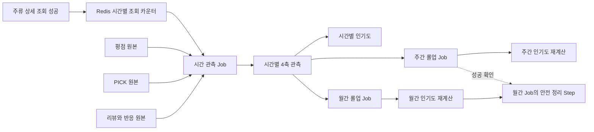

# ADR: 인기도 관측을 시간·주·월 롤업 구조로 관리한다

- 상태: 승인됨
- 결정일: 2026.08.23
- 대상: `bottlenote-product-api`, `bottlenote-batch`, `bottlenote-mono`, `git.environment-variables`
- 관련 PR: `bottle-note/environment-variables#15`, `bottle-note/bottle-note-api-server#722`

## 1. 결정 요약

주류별 인기도 관측을 `시간(HOUR)`, `주(WEEK)`, `월(MONTH)` 세 단위로 관리한다.

```text
사용자의 주류 상세 조회
  → Redis 시간 버킷 조회수 증가
  → 시간 관측 Job: 4축 관측 및 시간 인기도 계산
       ├─ 주간 롤업 Job: 시간 원본 → 주간 관측 및 주간 인기도
       └─ 월간 롤업 Job: 시간 원본 → 월간 관측 및 월간 인기도 → 안전 정리
  → 45일이 지난 시간 원본은 주간·월간 롤업 성공 확인 후 삭제
```

일간 롤업은 만들지 않는다. 월간 롤업은 주간 데이터의 합이 아니라 해당 달의 시간 원본에서 직접 계산한다. 한 주가 두 달에 걸칠 수 있어 주간 데이터만으로 달력 기준 월간 값을 정확히 만들 수 없기 때문이다.

관심도는 사용자별 마지막 조회 시각이 아니라 모든 성공한 상세 조회 요청의 횟수를 센다. 회원과 비회원 조회를 모두 포함하고, Redis의 공유 시간 버킷을 사용해 다중 Product API 인스턴스에서도 하나의 값으로 집계한다. Redis Sentinel 전환과 무관하게 동일한 Spring Data Redis 추상화를 사용한다.

스케줄 진입점은 시간 관측, 주간 롤업, 월간 롤업의 세 Job으로 고정한다. 시간 원본 정리는 네 번째 Job을 추가하지 않고 월간 롤업 Job의 마지막 단계에서 안전 조건을 확인한 뒤 수행한다.

## 2. 배경

현재 설계는 네 축을 매시간 관측하고 최종 인기도 Snapshot을 매시간 적재한다. 관측 축은 다음과 같다.

1. 관심도: 주류 상세 조회
2. 평가도: 평점 수와 평점 합
3. 선호도: PICK과 UNPICK 상태
4. 참여도: 공개 리뷰, 좋아요, 싫어요, 정상 댓글
5. 최종 인기도: 네 축을 정규화하고 가중 합산한 결과

현재 관심도는 `alcohols_view_histories`의 `view_at`을 시간 범위로 조회한다. 이 테이블은 `(user_id, alcohol_id)`를 기본 키로 사용하고 마지막 조회 시각 한 건만 남긴다. 같은 사용자가 같은 주류를 다시 조회하면 이전 시간대의 조회가 덮이므로 정확한 시간별 조회 흐름을 복원할 수 없다.

현재 Product API의 조회 기록 코드는 게스트 요청을 먼저 제외한 뒤 회원 조회만 Redis 통계 키에 증가시킨다. 따라서 개인 최근 조회 저장과 전체 관심도 카운팅을 분리해야 한다. 또한 공통 `RedisConfig`는 `sentinel` 모드를 명시적으로 거부하고 Sentinel connection factory도 구현하지 않은 상태다. Sentinel 전환은 이 ADR이 완료된 것으로 가정하는 기능이 아니라, 별도 작업에서 충족되어야 하는 선행 의존성이다.

또한 시간 관측과 Snapshot을 무기한 보관하면 주류 5,000종 기준 Snapshot만으로도 매월 약 360만 행이 추가된다. 장기 추세에는 시간 단위 정밀도가 필요하지 않으므로 오래된 원본은 주간·월간으로 압축해야 한다.

### 2.1 현재 코드 근거

- `AlcoholQueryService`: 회원일 때만 조회 기록 서비스를 호출한다.
- `AlcoholViewHistoryService`: 개인 조회 이력 저장과 Redis 통계 증가가 한 메서드 안에 묶여 있다.
- `RedisConfig`: `sentinel` 모드를 시작 시 거부하고 Sentinel connection factory가 구현되지 않았다.
- `PopularityObservationJobConfig`: 네 관측 축을 병렬 실행한 뒤 Snapshot을 계산한다.
- `PopularityQuartzConfig`: 현재 시간 관측 Job 하나만 매시 등록한다.
- `BatchQuartzJob`: `JobExecution` 반환 상태를 확인하지 않아 실패가 Quartz 성공으로 보일 수 있다.

## 3. 목표

1. 주류 하나의 최근 인기도 변화를 시간 단위로 확인할 수 있다.
2. 장기 변화는 주간·월간 단위로 조회할 수 있다.
3. 조회 이벤트를 MySQL에 한 건씩 영구 저장하지 않고도 요청 기반 총조회수를 얻는다.
4. 관심도·평가도·선호도·참여도·최종 인기도에 같은 기간 체계를 적용한다.
5. 롤업과 재실행이 같은 결과를 만들고 중복 행을 생성하지 않는다.
6. 상위 롤업이 만들어지지 않은 시간 원본은 삭제하지 않는다.
7. 기존 `popular_alcohols`와 `/popular/*` API는 변경하지 않는다.

## 4. 기간 체계

### 4.1 시간

- 기준 시간대: Asia/Seoul
- 범위: 정시부터 다음 정시 직전까지의 반개구간 `[시작, 종료)`
- 예: `2026-08-23 10:00:00`은 `10:00:00 이상, 11:00:00 미만`
- 보관 기간: 최소 45일. 월간 Job의 정리 시점까지 더 길게 남을 수 있다.
- 목적: 최근 변화와 장애·산식 검증

### 4.2 주

- 기준 시간대: Asia/Seoul
- 범위: 월요일 00:00부터 다음 월요일 00:00 직전까지
- 원본: 해당 범위의 시간 관측
- 보관 기간: 장기 보관
- 목적: 주간 추세 비교

### 4.3 월

- 기준 시간대: Asia/Seoul
- 범위: 매월 1일 00:00부터 다음 달 1일 00:00 직전까지
- 원본: 해당 범위의 시간 관측
- 보관 기간: 장기 보관
- 목적: 장기 성장과 계절성 비교

월간 데이터는 주간 데이터에서 계산하지 않는다. 월 경계를 걸친 주의 값을 두 달로 정확히 나눌 수 없기 때문이다.

### 4.4 배치 프로세스

Quartz 스케줄 진입점과 Spring Batch Job은 다음 세 개만 둔다.

1. 시간 관측 Job
   - 종료된 직전 시간 버킷을 대상으로 관심도·평가도·선호도·참여도를 관측한다.
   - 네 축이 모두 성공한 뒤 시간 인기도 Snapshot을 계산한다.
2. 주간 롤업 Job
   - 종료된 직전 월요일 00:00부터 월요일 00:00 직전까지의 시간 원본을 롤업한다.
   - 네 축의 주간 행이 모두 성공한 뒤 주간 인기도 Snapshot을 계산한다.
3. 월간 롤업 Job
   - 종료된 직전 달력 월의 시간 원본을 직접 롤업한다.
   - 네 축의 월간 행이 모두 성공한 뒤 월간 인기도 Snapshot을 계산한다.
   - 마지막 단계에서 주간·월간 롤업이 모두 보장된 45일 이전 시간 원본만 정리한다.

각 Quartz Job은 동시 실행을 막고, Spring Batch의 영속 Job/Step 상태로 재실행 여부를 판단한다. 정확한 cron 표현식은 구현 plan에서 정하되, 닫히지 않은 시간·주·월 버킷은 실행 대상에 포함하지 않는다.

## 5. 공통 저장 계약

네 관측 테이블과 최종 Snapshot 테이블은 동일한 기간 식별 방식을 사용한다.

- `bucket_granularity`: `HOUR`, `WEEK`, `MONTH`
- `bucket_at`: 기간 시작 시각
- `observed_at`: 실제 계산 완료 시각
- `prev_bucket_at`: 같은 단위에서 직전 관측값의 기간 시작 시각
- 유일성: `(alcohol_id, bucket_granularity, bucket_at)`

시간 관측은 저장량을 줄이기 위해 현재의 희소 저장 원칙을 유지한다.

- 관심도: 해당 시간에 조회가 발생한 주류만 저장한다.
- 평가도·선호도·참여도: 직전 값과 달라진 주류 및 0으로 내려간 주류만 저장한다.
- 최종 인기도 Snapshot: 관측 이력이 있는 삭제되지 않은 주류를 시간마다 저장한다.

주간·월간 롤업은 시간 원본 삭제 이후에도 독립적으로 조회할 수 있어야 하므로 삭제되지 않은 관측 대상 주류마다 한 행을 저장한다. 해당 기간에 관심도 사건이 없으면 0을 저장하고, 상태형 축은 기간 종료 시점의 값을 저장한다.

시간 관측이 희소하므로 주간·월간의 상태값과 누적값은 기간 안의 행만 보아서는 안 된다. 각 기간 종료 시각 이전의 가장 최근 시간값을 조회해 그대로 이어받고, 기간 중 사건이 없더라도 종료 시점 상태를 조밀하게 저장한다.

## 6. 관심도 결정

### 6.1 무엇을 세는가

관심도는 고유 사용자 수가 아니라 성공한 주류 상세 조회 요청 수를 센다.

- 회원 조회 포함
- 비회원 조회 포함
- 같은 사용자의 반복 조회 포함
- 실패한 요청 제외
- Admin 및 Batch 내부 호출 제외

사용자별 최근 조회 이력을 제공하는 기존 `alcohols_view_histories`는 개인화 기능을 위해 그대로 유지한다. 인기도 관심도의 원본으로는 사용하지 않는다.

### 6.2 어디에 모으는가

Product API는 상세 조회가 성공할 때 Redis의 시간·주류별 공유 카운터를 원자적으로 증가시킨다.

```text
시간 버킷 키: popularity:view:{yyyyMMddHH}
필드: alcoholId
값: 해당 시간 총조회수
```

한 시간에 실제 조회가 발생한 주류만 필드가 만들어진다. 주류 5,000종 전체에 0을 미리 기록하지 않는다. Redis 키는 시간 관측의 재실행 여유를 위해 최소 72시간 유지한다.

Batch는 종료된 시간 버킷의 값을 읽어 MySQL 관심도 관측에 절대값으로 upsert한다. 재실행 시 기존 값에 다시 더하지 않는다.

### 6.3 관심도 필드 의미

- 구간 조회수: 해당 시간·주·월에 발생한 총조회수
- 누적 조회수: 관측 시작 이후 해당 기간 종료 시점까지의 총조회수

기존의 고유 사용자 의미가 담긴 이름은 총조회수 의미가 드러나는 이름으로 변경한다.

### 6.4 Redis Sentinel과 정합성

인기도 기능은 자체 `RedisConnectionFactory`, host, port, topology 설정을 만들지 않는다. mono가 제공하는 공통 `RedisTemplate` 또는 `StringRedisTemplate`만 주입받는다. 따라서 별도 Sentinel 전환 작업이 공통 연결 계층을 완성하면 인기도 코드는 topology를 알지 않고 그대로 동작해야 한다.

Sentinel은 장애 가용성을 높이지만 조회 이벤트의 무손실 원장을 보장하지 않는다. Redis master에서 replica로 비동기 복제되는 사이 failover가 발생하면 이미 응답된 일부 증가분이 유실될 수 있다. 따라서 관심도 조회수는 추천·추세 분석용 best-effort 지표로 정의하며, 결제·정산·감사처럼 정확히 한 번을 요구하는 근거로 사용하지 않는다.

- Redis 증가 실패만으로 주류 상세 응답을 실패시키지 않는다.
- 증가 실패는 구조화 로그와 실패 지표로 남겨 운영자가 유실 가능 구간을 알 수 있게 한다.
- 멱등성 키가 없는 요청 경로에서는 자동 재시도하지 않는다. 재시도는 같은 조회를 두 번 셀 수 있다.
- Redis의 단일 master에서 실행되는 hash increment의 원자성을 사용한다.
- Batch는 증가분을 다시 더하지 않고 종료된 버킷의 절대값을 MySQL에 upsert한다.
- 최소 72시간 TTL로 시간 Job의 장애와 재실행 여유를 둔다.

## 7. 축별 롤업 규칙

필드는 성격에 따라 다르게 롤업한다.

| 성격 | 의미 | 주간·월간 계산 |
|---|---|---|
| 흐름값 | 기간 중 발생한 양 | 시간값 합계 |
| 상태값 | 기간 종료 시점의 현재 상태 | 종료 시점의 마지막 값 |
| 증감값 | 기간 중 순변화 | 시간별 증감 합계 |
| 평균 | 합과 개수로 유도되는 값 | 롤업된 합 ÷ 롤업된 개수 |
| 점수 | 정책이 적용된 결과 | 롤업 원시값으로 다시 계산 |

### 7.1 관심도

- 구간 조회수: 시간 조회수의 합
- 누적 조회수: 기간 종료 시각 이전의 가장 최근 누적값. 기간 중 조회가 없어도 직전 누적값을 이어받는다.

### 7.2 평가도

- 평점 수: 기간 종료 시점의 누적 평점 수
- 평점 합: 기간 종료 시점의 누적 평점 합
- 평점 수 증감: 기간 안의 시간별 증감 합
- 평점 합 증감: 기간 안의 시간별 증감 합
- 평균 평점: 기간 종료 시점의 평점 합을 평점 수로 나누어 계산

시간별 평균을 다시 평균 내지 않는다.

### 7.3 선호도

- PICK 수: 기간 종료 시점의 현재 PICK 수
- UNPICK 수: 기간 종료 시점의 현재 UNPICK 수
- PICK 증감: 기간 안의 시간별 순증감 합

### 7.4 참여도

- 공개 리뷰 수: 기간 종료 시점 값
- 좋아요 수: 기간 종료 시점 값
- 싫어요 수: 기간 종료 시점 값
- 정상 댓글 수: 기간 종료 시점 값
- 각 항목의 증감: 기간 안의 시간별 증감 합

### 7.5 최종 인기도

- 관심도 대표값: 해당 기간 총조회수
- 평가도 대표값: 기간 종료 시점 평점 수
- 선호도 대표값: 기간 종료 시점 PICK 수
- 참여도 대표값: 기간 종료 시점의 리뷰 수 + 좋아요 수 + 댓글 수
- 축별 점수: 해당 단위의 원시값과 정규화 기준으로 재계산
- 최종 점수: 다시 계산한 축별 점수의 가중합

시간별 점수를 더하거나 평균 내서 주간·월간 점수를 만들지 않는다. `HOUR`, `WEEK`, `MONTH`는 조회수 규모가 다르므로 정규화 기준도 단위별로 분리한다. 정확한 기준값과 가중치는 실제 개발 환경 분포를 관측한 뒤 정한다.

## 8. 롤업과 삭제 안전성

### 8.1 롤업

- 종료된 기간만 롤업한다.
- 동일 주류·단위·기간에 대해 upsert하여 재실행 결과가 같아야 한다.
- 주간 롤업은 시간 원본을 읽는다.
- 월간 롤업도 시간 원본을 읽는다.
- 한 축이라도 실패하면 해당 기간의 최종 인기도 롤업은 만들지 않는다.
- 성공한 축의 결과는 남겨 재실행에 사용한다.

### 8.2 시간 원본 삭제

45일이 지났다는 이유만으로 바로 삭제하지 않는다. 다음 조건을 모두 만족한 시간 범위만 삭제한다.

1. 해당 시간을 포함하는 주간 롤업이 성공했다.
2. 해당 시간을 포함하는 월간 롤업이 성공했다.
3. 다섯 데이터 영역의 롤업이 모두 존재한다.
4. 삭제 대상의 시작·종료 범위가 닫힌 기간과 정확히 일치한다.

삭제는 롤업과 같은 트랜잭션에서 수행하지 않는다. 월간 롤업 Job의 마지막 정리 Step이 앞선 롤업 성공 기록을 확인한 뒤 별도 트랜잭션으로 수행한다. 정리 Step이 실패하면 월간 Job은 실패로 기록하되, 저장 공간만 늘고 데이터는 보존되어야 한다.

## 9. 실패와 재실행 계약

- Redis 시간 카운터를 읽은 뒤 MySQL 적재가 실패해도 Redis 원본은 TTL 동안 남는다.
- Redis 증가 실패는 상세 조회의 성공 응답과 분리하고 실패 지표를 남긴다.
- Sentinel failover 중 일부 증가분 유실 가능성은 허용하되 유실이 조용히 숨겨지지 않도록 관측한다.
- 시간 관측 재실행은 Redis 절대값으로 같은 버킷을 덮어쓴다.
- 상태형 축이 같은 버킷 재실행에서 0으로 내려간 경우 기존 값을 0으로 정정한다.
- Rollup 재실행은 기존 주간·월간 행을 같은 계산 결과로 덮어쓴다.
- Spring Batch `JobExecution`이 `COMPLETED`가 아니면 Quartz 실행도 실패로 기록한다.
- Pod health와 Argo health는 관측 성공 판정으로 사용하지 않는다.
- 성공 판정은 Spring Batch Job/Step 상태와 DB 결과를 함께 사용한다.

## 10. 데이터 흐름



## 11. 스키마 방향

V14는 다음 방향으로 수정한다.

1. 네 관측 테이블과 최종 Snapshot에 기간 단위를 추가한다.
2. 각 유니크 키와 조회 인덱스에 기간 단위를 포함한다.
3. 관심도 컬럼을 고유 사용자 의미에서 총조회수 의미로 변경한다.
4. 시간·주·월별 최신 버킷과 기간 범위 조회를 지원하는 인덱스를 둔다.
5. 주간·월간 정규화 기준을 분리할 수 있도록 애플리케이션 설정 계약을 둔다.

V14는 아직 merge되지 않았으므로 기존 V14에 대한 후속 ALTER migration을 만들지 않고 원본 V14 정의를 수정한다.

## 12. 모듈 책임

```text
product-api
  └─ 성공한 상세 조회의 Redis 시간 카운터 증가

batch
  ├─ 시간 관측 Job: 4축 시간 관측 → 시간 Snapshot
  ├─ 주간 롤업 Job: 4축 주간 롤업 → 주간 Snapshot
  └─ 월간 롤업 Job: 4축 월간 롤업 → 월간 Snapshot → 안전 정리

mono
  ├─ 관측 및 Snapshot 도메인 모델
  ├─ 기간 단위별 조회 계약과 영속성 구현
  └─ 공통 Redis 연결 추상화

environment submodule
  └─ V14 스키마 정의
```

Batch는 Flyway migration을 실행하지 않는다. Product/Admin이 V14를 포함해 Flyway를 수행하는 현재 모듈 책임을 유지한다.

Sentinel topology와 접속 정보는 공통 Redis 연결 계층만 소유한다. Product와 Batch의 인기도 코드는 standalone, cluster, sentinel을 조건문으로 분기하지 않는다.

## 13. 선택하지 않은 대안

### 13.1 모든 조회 이벤트를 MySQL에 저장

조회 트래픽만큼 행이 증가하고 장기 보존 비용이 크다. 현재 목적은 이벤트 재생이 아니라 시간별 총조회수이므로 선택하지 않는다.

### 13.2 사용자별 마지막 조회 이력에서 관심도 계산

같은 사용자의 다음 조회가 이전 조회 시각을 덮으므로 시간별 조회 흐름을 정확히 복원할 수 없다. 개인화 최근 조회 기능에만 사용한다.

### 13.3 일간 롤업 추가

시간·일·주·월 네 단계를 모두 유지하면 Job, 스키마, 조회 분기가 늘어난다. 최근 상세 분석은 시간, 장기 추세는 주·월로 충족되므로 일간은 만들지 않는다.

### 13.4 월간을 주간 데이터에서 계산

주가 월 경계를 넘을 수 있어 달력 기준 월간 값이 부정확해진다. 월간은 시간 원본에서 직접 계산한다.

### 13.5 단위별 물리 테이블 분리

같은 필드와 계산 규칙이 여러 테이블에 반복되고 조회 계약이 늘어난다. 동일 테이블 안에서 기간 단위로 구분한다.

### 13.6 시간 원본 무기한 보관

주류 5,000종의 조밀한 Snapshot은 매월 약 360만 행이 추가된다. 장기 추세에 불필요한 정밀도를 계속 보관하게 되므로 선택하지 않는다.

### 13.7 정리 전용 네 번째 Job

스케줄 진입점과 운영 감시 대상을 불필요하게 늘린다. 월간 롤업이 성공해야 해당 달의 시간 원본을 안전하게 지울 수 있으므로, 정리는 월간 롤업 Job의 마지막 Step이 맡는다.

### 13.8 조회 이벤트 무손실 영속화

Redis Stream 또는 MySQL 이벤트 테이블로 모든 조회를 영속화하면 failover에서도 재생 가능한 정확한 원장을 만들 수 있다. 그러나 저장량과 처리 복잡도가 커지고 현재 추천·추세 분석 목적에는 과도하므로 선택하지 않는다. 향후 조회수가 정산이나 보상 근거가 되면 이 결정을 재검토한다.

## 14. 결과와 비용

### 긍정적 결과

- 개인 최근 조회 이력의 덮어쓰기와 분리해 요청 기반 총조회수를 시간 단위로 관측한다.
- 최근 변화와 장기 추세를 같은 데이터 모델에서 조회한다.
- 조회 이벤트 전체를 MySQL에 영구 저장하지 않는다.
- 주간·월간 데이터가 남으므로 시간 원본을 안전하게 정리할 수 있다.
- 원시 사실과 점수 정책이 분리되어 산식을 다시 계산할 수 있다.

### 비용과 제약

- Product API의 조회 경로에 Redis 카운터 쓰기가 추가된다.
- 세 Batch Job과 각 Job 내부 Step의 재실행 테스트가 필요하다.
- 기간 단위별 정규화 기준을 별도로 관리해야 한다.
- 시간 원본 삭제 전에 다섯 영역의 롤업 완료를 확인해야 한다.
- Redis 장애나 Sentinel failover 시 해당 시간의 관심도 일부를 잃을 수 있으므로 실패 지표와 경보가 필요하다.
- 정리를 월간 Job에서 수행하므로 시간 원본은 최소 45일보다 길게 보관될 수 있다.

## 15. 검증 가능한 수용 기준

1. 회원·비회원의 성공한 상세 조회가 같은 시간·주류 Redis 카운터를 증가시킨다.
2. 조회가 없던 주류에는 Redis 시간 필드가 만들어지지 않는다.
3. 같은 시간 관측을 재실행해도 MySQL 조회수가 중복 증가하지 않는다.
4. 네 관측 테이블과 Snapshot이 `HOUR`, `WEEK`, `MONTH`를 구분한다.
5. 주간 관심도는 범위 안 시간 조회수의 합과 같다.
6. 월간 관심도는 달력 월 범위의 시간 조회수 합과 같다.
7. 상태값은 기간 종료 시점 값, 증감값은 기간 안 합으로 저장된다.
8. 평균과 점수는 하위 결과를 평균·합산하지 않고 롤업 원시값으로 다시 계산된다.
9. 주간·월간 롤업을 반복 실행해도 결과와 행 수가 같다.
10. 같은 시간 버킷에서 원본이 0으로 내려가면 기존 관측값도 0으로 정정된다.
11. 한 축 실패 시 해당 단위의 최종 인기도가 만들어지지 않는다.
12. 실패한 Spring Batch 실행은 Quartz에도 실패로 전달된다.
13. 주간 또는 월간 롤업이 누락된 범위의 시간 원본은 삭제되지 않는다.
14. 45일 이전이며 주간·월간 롤업이 모두 완료된 시간 원본만 정리된다.
15. 기존 인기 주류 Batch와 `/popular/*` API 동작은 변경되지 않는다.
16. Quartz와 Spring Batch에는 시간·주간·월간 세 Job만 등록되고 정리 전용 네 번째 Job은 없다.
17. 월간 Job은 월간 Snapshot 성공 후에만 안전 정리 Step을 실행한다.
18. 인기도 코드는 공통 Redis template만 사용하고 Sentinel 전용 연결 설정을 만들지 않는다.
19. Redis 카운터 증가 실패가 상세 조회 응답을 실패시키지 않으며 실패 로그와 지표가 남는다.
20. 멱등성 없는 카운터 증가에는 자동 재시도가 적용되지 않는다.
21. Sentinel 지원이 반영된 뒤 standalone과 sentinel 설정에서 동일한 카운터 계약을 통합 검증한다.

## 16. 전달 단위

변경은 PR 두 개로 관리한다.

1. 스키마 PR: `bottle-note/environment-variables#15`
   - V14 스키마와 인덱스
2. Backend PR: 기존 `#722`, `#723`, `#724`를 하나로 통합
   - Product API 조회 카운터
   - mono 모델과 영속성
   - Batch 시간 관측, 주간 롤업, 월간 롤업의 세 Job과 Snapshot, 정리 Step
   - 테스트와 CI

두 PR은 리뷰 경계만 분리한다. 배포 순서 충돌은 이 ADR의 검토 범위가 아니다.

## 17. 후속 작업

이 ADR은 무엇을 선택했는지 고정한다. 구체적인 파일 변경, Task 분해, 일정과 커밋 구성은 저장소 문서로 추가하지 않고 Orchestration 작업 트리에서 관리한다.

구현 plan은 Sentinel 전환 작업의 공통 연결 계약을 먼저 확인해야 한다. 현재처럼 `sentinel` 모드를 거부하는 상태에서는 인기도 기능 자체를 구현하고 standalone으로 검증할 수는 있지만, Sentinel 통합 검증 완료를 주장할 수 없다. Sentinel 작업이 공통 template 계약을 바꾸면 이 ADR을 재개봉한다.
