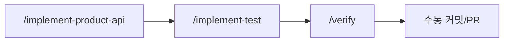
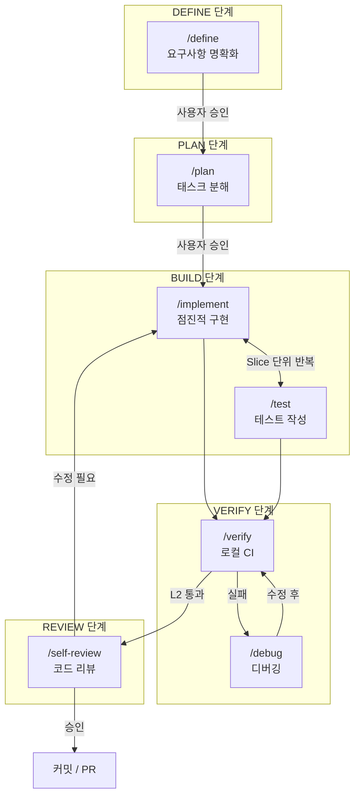
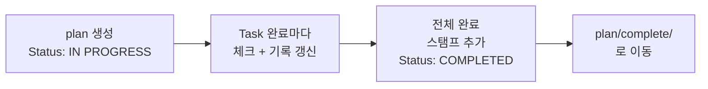
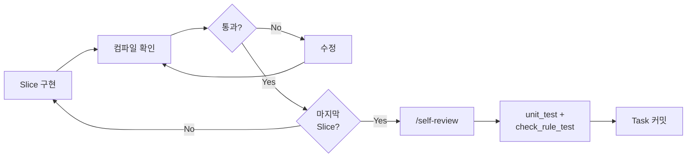
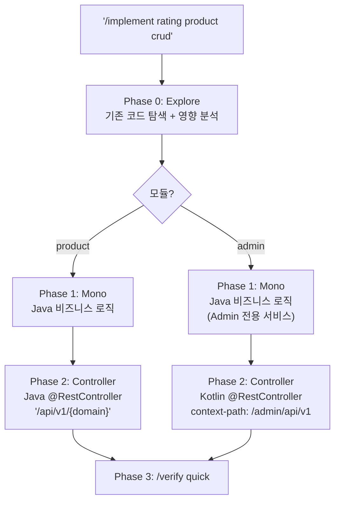
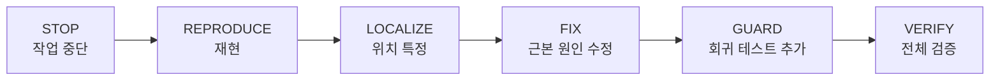
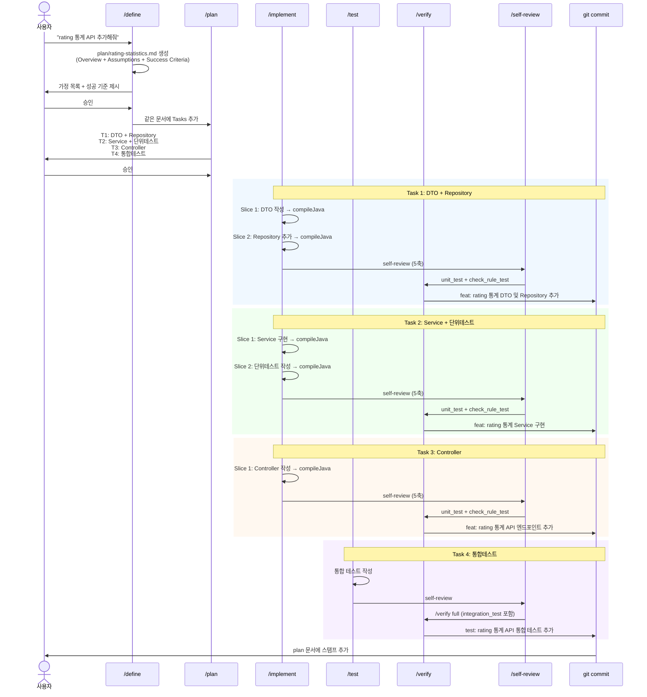
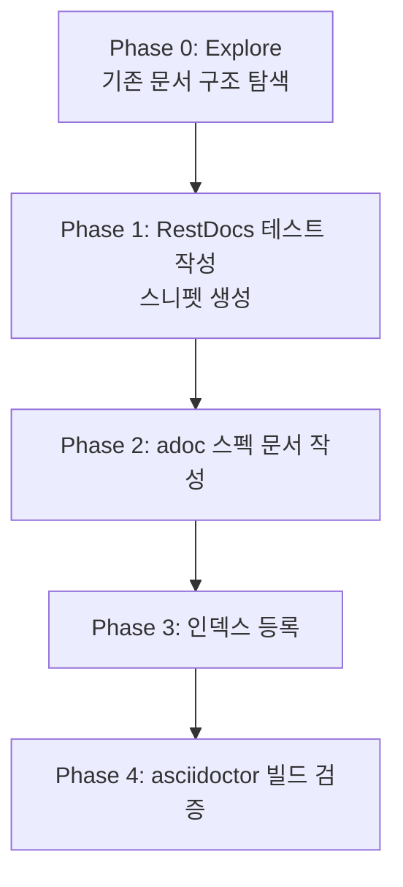

# Claude AI Harness 개선 설계서

> 작성일: 2026-04-08
> 참고: [agent-skills](https://github.com/addyosmani/agent-skills) (Addy Osmani)
> 상태: 구현 완료
> 완료일: 2026-04-08

---

## 1. 현재 구조 진단

### 현재 스킬 목록

| 스킬 | 대상 | 역할 |
|------|------|------|
| `/implement-product-api` | product-api (Java) | 기능 구현 가이드 |
| `/implement-test` | product + admin | 테스트 작성 가이드 |
| `/verify` | 전체 | 로컬 CI 검증 (L1/L2/L3) |

### 현재 워크플로우



### 문제점

1. **모듈별 분산**: product-api와 admin-api 구현 스킬이 분리되어야 할 이유가 없음
   - 둘 다 결국 "mono에 비즈니스 로직 → API 모듈에 컨트롤러" 패턴
   - `/implement-test`는 이미 `[product|admin]` 인자로 통합되어 있음
2. **라이프사이클 누락**: 요구사항 정의, 계획, 디버깅, 리뷰 단계가 없음
3. **방어 장치 부족**: 핑계 차단(Rationalizations), 경고 신호(Red Flags), 종료 검증(Verification)이 없음
4. **스킬 간 연계 불명확**: 어떤 순서로 어떤 스킬을 써야 하는지 가이드가 없음

---

## 2. 개선 방향: 에이전틱 스킬 체계

### 핵심 아이디어

**"프로젝트 특화 지식"은 references에, "워크플로우"는 스킬에 분리한다.**

현재 `/implement-product-api`는 두 가지가 섞여 있음:
- **워크플로우**: Phase 0 → Phase 1 → Phase 2 → Phase 3 (이건 범용적)
- **프로젝트 패턴**: Repository 3-Tier, Facade, DTO 패턴 (이건 프로젝트 고유)

개선 후에는:
- 스킬 = **"무엇을 어떤 순서로 할 것인가"** (워크플로우, 게이트, 검증)
- references = **"이 프로젝트에서는 어떻게 하는가"** (코드 패턴, 컨벤션)

### 통합 원칙

| 원칙 | 설명 |
|------|------|
| **모듈 통합** | product/admin을 하나의 `/implement` 스킬로 통합, 인자로 모듈 선택 |
| **라이프사이클 완성** | DEFINE → PLAN → BUILD → TEST → VERIFY → REVIEW |
| **방어 장치 내장** | 모든 스킬에 Rationalizations + Red Flags + Verification |
| **게이트 워크플로우** | 각 단계 사이에 사용자 승인 게이트 |

---

## 3. 새로운 스킬 체계

### 전체 라이프사이클



### 스킬 매핑 (현재 → 개선)

| 현재 | 개선 후 | 변화 |
|------|---------|------|
| `/implement-product-api` | `/implement [domain] [product\|admin]` | product/admin 통합, 에이전틱 워크플로우 |
| `/implement-test` | `/test [domain] [product\|admin]` | 이름 간소화, 구조 보강 |
| `/verify` | `/verify [quick\|standard\|full]` | 유지 (이미 잘 되어 있음) |
| (없음) | `/define` | **신규** - 요구사항 정의 |
| (없음) | `/plan` | **신규** - 태스크 분해 |
| (없음) | `/debug` | **신규** - 체계적 디버깅 |
| (없음) | `/self-review` | **신규** - 코드 리뷰 |

---

## 4. 각 스킬 상세 설계

### 4.1 `/define` - 요구사항 명확화 (신규)

**트리거**: "이거 구현해줘", "기능 추가", 모호한 요청

**역할**: 코드 작성 전에 무엇을 만드는지 합의


**핵심 요소**:
- 가정(Assumptions) 목록을 먼저 나열
- 성공 기준을 구체적/테스트 가능하게 정의
- 영향받는 모듈과 파일 목록 제시
- 사용자 승인 없이 다음 단계로 넘어가지 않음

**산출물**: `plan/{feature-name}.md` 파일의 Overview 섹션에 기록
- `/define` 시점에 plan 문서를 생성하고 Overview에 가정, 성공 기준, 영향 범위를 작성
- `/plan` 시점에 같은 문서에 Tasks 섹션을 추가
- 하나의 문서가 define → plan → implement → complete 전체를 추적

**Rationalizations 예시**:

| 핑계 | 현실 |
|------|------|
| "이건 간단해서 스펙 필요 없다" | 간단한 작업에도 수용 기준은 필요하다. 2줄짜리 스펙이면 충분. |
| "코드 짜면서 파악할게" | 그게 바로 삽질의 시작. 15분 스펙이 3시간 재작업을 막는다. |
| "요구사항이 바뀔 텐데" | 그래서 스펙은 살아있는 문서. 없는 것보다 바뀌는 게 낫다. |

---

### 4.2 `/plan` - 태스크 분해 (신규)

**트리거**: "계획 세워줘", 3개 이상 파일 변경 예상 시, `/define` 완료 후

**역할**: 작업을 검증 가능한 작은 단위로 분해

**핵심 요소**:
- 의존성 그래프 기반 순서 결정
- 각 태스크에 수용 기준 + 검증 방법 명시
- Phase 사이에 체크포인트 배치
- 수직 슬라이스(Vertical Slice) 선호

**산출물**: `plan/{feature-name}.md` 파일 1개

**플랜 문서 규칙**:
- 하나의 기능 = 하나의 문서 (분할 금지)
- 진행하면서 같은 문서에 상태를 갱신 (Task 완료 시 체크)
- 작업 완료 시 문서 최상단에 `stamp-template.st` 기반 스탬프 추가

**플랜 문서 라이프사이클**:


**플랜 문서 구조**:
```markdown
# Plan: [기능명]

## Overview  ← /define 시점에 작성
[무엇을 왜 만드는지]

### Assumptions
- [가정 1]
- [가정 2]

### Success Criteria
- [성공 기준 1 - 구체적, 테스트 가능]
- [성공 기준 2]

### Impact Scope
- [영향받는 모듈/파일 목록]

## Tasks  ← /plan 시점에 추가

### Task 1: [제목]
- 수용 기준: [구체적, 테스트 가능한 조건]
- 검증: [명령어 또는 확인 방법]
- 파일: [변경 예상 파일 목록]
- 크기: [S | M | L → 분할 필요]
- 상태: [ ] 미완료 / [x] 완료

### Task 2: [제목]
...

## Progress Log  ← /implement 진행하면서 갱신
- [날짜] Task 1 완료 - [커밋 해시 또는 요약]
- [날짜] Task 2 완료 - [커밋 해시 또는 요약]
```

---

### 4.3 `/implement` - 점진적 구현 (implement-product-api + admin 통합)

**트리거**: "API 추가", "엔드포인트 구현", "기능 구현"
**인자**: `[domain] [product|admin] [crud|search|action]`

**현재 `/implement-product-api`와의 차이점**:

| 항목 | 현재 | 개선 후 |
|------|------|---------|
| 대상 모듈 | product-api만 | product + admin 통합 |
| 구현 단위 | Phase 단위 (대규모) | Slice 단위 (소규모, 반복) |
| 중간 검증 | Phase 끝에만 verify | 매 Slice마다 테스트 실행 |
| 커밋 타이밍 | 전체 완료 후 | Task 완료마다 커밋 (필수) |
| 방어 장치 | 없음 | Rationalizations + Red Flags |

**Task-Slice-Commit 관계**:

```
Task  = 커밋 단위 (사용자와 합의한 논리적 목표)
Slice = 실행 단위 (AI가 100줄 넘기 전에 컴파일 확인하는 규율)
Commit = Task 완료 시 반드시 생성 (Slice마다 커밋하지 않음)
```

**검증 수준 구분**:

| 시점 | 검증 수준 | 실행 내용 |
|------|-----------|-----------|
| **Slice 완료** | 컴파일만 | `compileJava`, `compileKotlin` |
| **Task 완료** | self-review + 단위 테스트 + 커밋 | `/self-review` → `unit_test` + `check_rule_test` → 커밋 |
| **전체 기능 완료** | 통합 테스트 | `integration_test`, `admin_integration_test` |

**커밋 메시지 형식** (Task = 제목, Slice = 불릿):
```
feat: rating 통계 API Service 구현

- RatingStatisticsResponse DTO 작성
- RatingRepository에 통계 조회 메서드 추가
- RatingService.getStatistics() 구현
- AlcoholFacade 연동
```

**Task 내부 사이클**:


**모듈별 분기**:


**references 분리 (프로젝트 패턴은 별도 파일)**:
- `references/mono-patterns.md` - Repository 3-Tier, Facade, DTO 패턴 (기존 유지)
- `references/product-api-patterns.md` - Product 컨트롤러 패턴 (기존에서 분리)
- `references/admin-api-patterns.md` - Admin 컨트롤러 패턴 (ADMIN-API-GUIDE.md 흡수)

---

### 4.4 `/test` - 테스트 작성 (기존 implement-test 보강)

**트리거**: "테스트 작성", "테스트 추가", `/implement` 완료 후
**인자**: `[domain] [product|admin] [unit|integration|restdocs|all]`

**변경사항**: 이름 간소화 + 에이전틱 구조 추가 + 테스트 실행 시점 명확화

기존 Phase 구조는 유지하되 추가:
- Rationalizations 테이블
- Red Flags 섹션
- Verification 체크리스트

**테스트 종류별 역할과 실행 시점**:

| 테스트 종류 | 태그 | 작성 시점 | 실행 시점 | 실행 명령 |
|------------|------|-----------|-----------|-----------|
| **단위 테스트** | `@Tag("unit")` | `/implement` Task와 함께 | Task 커밋 전 | `./gradlew unit_test` |
| **아키텍처 규칙** | `@Tag("rule")` | 이미 존재 (ArchUnit) | Task 커밋 전 | `./gradlew check_rule_test` |
| **통합 테스트** | `@Tag("integration")` | 전체 기능 완료 후 | `/verify full` | `./gradlew integration_test` |
| **Admin 통합** | `@Tag("admin_integration")` | 전체 기능 완료 후 | `/verify full` | `./gradlew admin_integration_test` |
| **RestDocs** | (없음) | 사용자 요청 시만 | 문서화 필요 시 | `./gradlew restDocsTest` |

**테스트 작성 패턴 선택 기준**:

```
새 테스트 작성 시:
├── 서비스 로직 테스트?
│   ├── Fake/InMemory 구현체가 있는가?
│   │   ├── Yes → Fake 패턴 사용 (기존 InMemory 활용)
│   │   └── No → InMemory 구현체 먼저 생성 → Fake 패턴
│   └── Mockito는 최후의 수단 (사용자 확인 필수)
├── API 엔드포인트 테스트?
│   ├── product → IntegrationTestSupport + mockMvcTester
│   └── admin → IntegrationTestSupport + mockMvcTester (Kotlin)
└── API 문서화?
    └── RestDocs (사용자 명시적 요청 시만)
```

**`/implement`와의 관계**:
- `/implement` 안에서 Slice 단위로 **기존 테스트를 실행**하는 것 = 컴파일 확인
- `/test`를 별도 호출하는 것 = **새로운 테스트 코드를 작성**하는 것
- 단위 테스트는 `/implement` Task와 함께 작성하는 것이 이상적
- 통합 테스트는 전체 기능 완료 후 `/test`로 별도 작성

---

### 4.5 `/debug` - 체계적 디버깅 (신규)

**트리거**: "에러 났어", "테스트 실패", "빌드 안 돼", "왜 안 되지"

**5단계 프로세스**:


**프로젝트 특화 분기**:
```
빌드 실패:
├── Java 컴파일 에러 → mono/product-api 소스 확인
├── Kotlin 컴파일 에러 → admin-api 소스 확인
├── Spotless 포맷 에러 → ./gradlew spotlessApply
├── 테스트 실패
│   ├── @Tag("unit") → Fake/InMemory 구현체 확인
│   ├── @Tag("integration") → TestContainers/Docker 상태 확인
│   ├── @Tag("rule") → ArchUnit 아키텍처 규칙 위반 확인
│   └── @Tag("admin_integration") → Admin 인증 설정 확인
└── 의존성 에러 → libs.versions.toml 확인
```

---

### 4.6 `/self-review` - 코드 리뷰 (신규)

**트리거**: "리뷰해줘", 각 Task 커밋 전, 기능 완료 후

**5축 리뷰 (프로젝트 맞춤화)**:

| 축 | 이 프로젝트에서의 체크 포인트 |
|----|---------------------------|
| **정확성** | 스펙 일치, 에지 케이스, 예외 처리 |
| **가독성** | 네이밍 컨벤션, 한글 DisplayName, 주석 간결성 |
| **아키텍처** | Facade 경계, Repository 3-Tier, 도메인 분리 |
| **보안** | SecurityContextUtil 인증, 입력 검증, SQL 파라미터화 |
| **성능** | N+1 쿼리, 페이징 누락, 캐시 전략 |

**심각도 레이블**:
- **Critical**: 머지 차단 (보안 취약점, 데이터 손실, 기능 장애)
- **Important**: 머지 전 수정 권장 (누락 테스트, 잘못된 추상화)
- **Nit**: 선택 사항 (네이밍, 스타일)

---

## 5. 통합 파일 구조 (개선 후)

```
.claude/
├── settings.json                    # 훅 설정 (기존 유지)
├── settings.local.json              # 로컬 권한 (기존 유지)
├── hooks/
│   └── session-start.sh             # Docker 설정 (기존 유지)
├── docs/
│   └── ADMIN-API-GUIDE.md           # → references로 이동 예정
├── skills/
│   ├── define/                      # [신규] 요구사항 명확화
│   │   └── SKILL.md
│   ├── plan/                        # [신규] 태스크 분해
│   │   └── SKILL.md
│   ├── implement/                   # [통합] product + admin 구현
│   │   ├── SKILL.md
│   │   └── references/
│   │       ├── mono-patterns.md     # 기존 유지
│   │       ├── product-patterns.md  # 기존에서 분리
│   │       └── admin-patterns.md    # ADMIN-API-GUIDE.md 흡수
│   ├── test/                        # [보강] 이름 간소화
│   │   ├── SKILL.md
│   │   └── references/
│   │       ├── test-infra.md        # 기존 유지
│   │       └── test-patterns.md     # 기존 유지
│   ├── verify/                      # 기존 유지
│   │   └── SKILL.md
│   ├── debug/                       # [신규] 체계적 디버깅
│   │   └── SKILL.md
│   └── self-review/                 # [신규] 커밋 전 self-review
│       └── SKILL.md
└── ...
```

---

## 6. 모든 스킬의 공통 뼈대

agent-skills에서 차용하는 일관된 SKILL.md 구조:

### 언어 규칙

**SKILL.md, references 등 스킬 정의 문서는 영어로 작성한다.**

한국어를 사용하는 경우는 다음으로 제한:
- 커밋 메시지 (타입 접두사는 영어, 제목/본문은 한국어)
- `plan/*.md` 플랜 문서
- 사용자와의 대화 응답
- `@DisplayName` 등 한국어가 관례인 코드 요소
- description의 트리거 키워드 (한국어 트리거는 한국어로 표기)

### SKILL.md 구조

```markdown
---
name: skill-name
description: |
  One-line description. Trigger conditions.
  Trigger: "/command", or when the user says "한국어 트리거", "English trigger".
argument-hint: "[arg description]"
---

# Skill Title

## Overview
Why this skill exists and what it does.

## When to Use
- Condition 1
- Condition 2

## When NOT to Use
- Condition 1

## Process
Step-by-step workflow (the core of the skill).

## Common Rationalizations
| Rationalization | Reality |
|-----------------|---------|
| "..." | "..." |

## Red Flags
- Signal that something is going wrong

## Verification
- [ ] Exit criteria checklist
```

---

## 7. 전체 워크플로우 시나리오 예시

### 시나리오: "rating 도메인에 평점 통계 API 추가"



---

## 8. 구현 순서 (실제 진행 순서)

| 순서 | 작업 | 커밋 |
|------|------|------|
| **1** | `/self-review` 스킬 작성 | `1db651a8` |
| **2** | `/implement` 스킬 작성 + references 3개 | `1db651a8` |
| **3** | `/test` 스킬 보강 + references 복사 | `1db651a8` |
| **4** | `/debug` 스킬 작성 | `1db651a8` |
| **5** | `/define` 스킬 작성 | `1db651a8` |
| **6** | `/plan` 스킬 작성 | `1db651a8` |
| **7** | CLAUDE.md 재구성 (프로젝트 개요 + Skills 섹션) | `1db651a8` |
| **8** | 기존 스킬 제거 (`implement-product-api`, `implement-test`) | `a2945e59` |

---

## 9. 결정 사항

- [x] `/implement`에서 batch 모듈은 **제외** (product + admin만)
- [x] `/self-review`는 **커밋 전 self-review 전용** (PR 리뷰는 범위 밖)
- [x] 기존 스킬(`implement-product-api`, `implement-test`)은 **제거 완료** (`a2945e59`)
- [x] CLAUDE.md의 Admin/Product 구현 규칙은 `references/`로 **이동**, CLAUDE.md는 프로젝트 개요 중심으로 재구성
- [x] 스킬 문서(SKILL.md, references)는 **영어**로 작성. 한국어는 커밋 메시지, plan 문서, 대화 응답, @DisplayName 등으로 제한

---

## 10. 동작 검증 및 피드백 (2026-04-08)

### 검증 대상

"어드민 유저 목록 조회 API" 기능을 `/define` -> `/plan` -> `/implement` -> `/self-review` -> `/test` -> `/verify full` 풀 사이클로 구현하며 스킬 체계를 실전 검증함.

### 검증 결과 요약

| Skill | 동작 여부 | 비고 |
|-------|----------|------|
| `/define` | O | 가정 7개, 성공 기준 7개 도출. 사용자 승인 게이트 정상 작동 |
| `/plan` | O | 4개 Task 분해 (S x 3, M x 1). 의존 순서 정확 |
| `/implement` | O | 9개 파일 생성/수정, Slice 단위 컴파일 체크 정상 |
| `/self-review` | O | InMemory 구현체 누락 3건 발견 (Critical). 5축 리뷰 유효 |
| `/test` | O | 통합 테스트 8개 작성, 시나리오 정의 -> 구현 흐름 정상 |
| `/verify full` | O | L3 전체 통과. local record QueryDSL Projection 버그 발견 및 수정 |

### 발견된 문제점

#### [P1] 스킬 간 자동 연결 부재

**현상**: `/implement` 완료 후 `/test`, `/verify full`로 자동 이어지지 않고, 사용자가 직접 "진행하자"라고 말해야 다음 스킬이 실행됨.

**원인**: 각 스킬이 독립적으로 설계되어 있고, 다음 스킬을 자동 호출하라는 지시가 없음. CLAUDE.md에 라이프사이클 순서(`/define` -> `/plan` -> `/implement` -> `/test` -> `/verify full`)가 명시되어 있지만, 개별 스킬의 종료 시점에서 다음 스킬로의 전환을 안내하지 않음.

**개선안**:
- `/implement` 스킬 마지막에 "모든 Task 완료 시 `/test` -> `/verify full`까지 연속 실행" 지시 추가
- 또는 각 스킬 Verification 섹션에 "Next: `/xxx`" 안내 추가

#### [P2] plan 문서 마무리 프로세스 누락

**현상**: 풀 사이클 완료 후 stamp-template.st 기반 스탬프 추가 및 `plan/complete/` 이동이 수행되지 않음.

**원인**: `/plan` 스킬의 Plan Document Lifecycle에 "전체 완료 -> 스탬프 추가 -> complete로 이동"이 정의되어 있지만, 이 마무리를 담당하는 스킬이 없음. `/implement`도 `/verify`도 이 책임을 갖고 있지 않음.

**개선안**:
- `/verify full` 통과 후 또는 최종 커밋 후 stamp + complete 이동을 수행하는 마무리 단계를 `/implement` 또는 별도 스킬에 명시
- 가장 간단한 방법: `/implement` 스킬의 Phase 4 (Final Verification) 이후에 plan 문서 마무리 절차 추가

#### [P3] API 문서화 스킬 부재

**현상**: 현재 스킬 체계에 RestDocs 테스트 작성 후 API 스펙 문서(adoc)를 생성하는 스킬이 없음.

**원인**: `/test` 스킬에서 RestDocs 테스트 작성은 "사용자 요청 시만" 옵션으로 존재하지만, RestDocs 테스트 후 각 모듈의 `docs/` 디렉토리에 adoc 스펙 문서를 추가하는 워크플로우가 정의되어 있지 않음.

**기대 흐름**: `/implement` -> `/test` (RestDocs 포함) -> adoc 스펙 생성 -> `./gradlew asciidoctor` 검증

**개선안**:
- `/test` 스킬에 RestDocs 작성 시 adoc 스펙 문서 생성까지 포함하는 Phase 추가
- 또는 별도 `/docs` 스킬 신설: RestDocs 테스트 기반 API 문서화 전담
- 문서 생성 후 `./gradlew asciidoctor` 검증을 `/verify` L2 이상에 포함

#### [P4] self-review에서 발견한 패턴: InMemory 구현체 갱신 누락

**현상**: `UserRepository` 인터페이스에 메서드 추가 시 3개의 InMemory 구현체(mono 1개, product-api 2개) 갱신을 누락하여 컴파일 에러 발생.

**원인**: `/implement` 스킬에 "Repository 인터페이스 변경 시 InMemory 구현체도 갱신하라"는 Red Flag은 있지만, 구체적으로 어떤 모듈의 어떤 파일을 확인해야 하는지 가이드가 부족함.

**개선안**: `/implement` 스킬의 Phase 1 (Mono Module) 또는 Red Flags에 구체적 체크 항목 추가:
```
Repository 인터페이스 변경 시 확인 대상:
- mono/src/test/.../fixture/InMemory{Domain}*.java
- product-api/src/test/.../fixture/InMemory{Domain}*.java
```

#### [P5] verify L3에서 발견한 패턴: local record와 QueryDSL Projection 비호환

**현상**: 메서드 내부 local record를 `Projections.constructor()`에 사용하면 런타임에 생성자를 찾지 못함. 컴파일은 통과하지만 실행 시 실패.

**원인**: local record는 컴파일 시 외부 클래스 참조 파라미터가 숨겨져 추가되어, QueryDSL 리플렉션 기반 생성자 매칭이 실패함.

**개선안**: `/implement` 스킬의 references 또는 Red Flags에 추가:
```
QueryDSL Projections.constructor()에 사용하는 record는 반드시 
클래스/인터페이스 레벨에 정의할 것. 메서드 내 local record는 리플렉션 실패.
```

### 우선순위

| 우선순위 | 항목 | 난이도 |
|---------|------|--------|
| 높음 | P1: 스킬 간 자동 연결 | 각 스킬 SKILL.md에 Next 안내 추가 (S) |
| 높음 | P2: plan 문서 마무리 프로세스 | `/implement` Phase 4에 절차 추가 (S) |
| 중간 | P3: API 문서화 스킬 | `/docs` 스킬 신설 또는 `/test` 확장 (M) |
| 낮음 | P4: InMemory 갱신 가이드 강화 | Red Flags에 구체적 경로 추가 (S) |
| 낮음 | P5: local record 주의사항 | references에 한 줄 추가 (S) |

---

## 11. `/docs` 스킬 설계 (API 문서화)

### 배경

현재 스킬 체계에서 RestDocs 테스트 작성과 adoc 스펙 문서 생성을 담당하는 스킬이 없다.
`/test` 스킬에서 RestDocs는 "사용자 요청 시만" 옵션으로 존재하지만, 스니펫 생성 후 adoc 파일 작성 -> 인덱스 등록 -> asciidoctor 빌드 검증까지의 워크플로우가 정의되어 있지 않다.

### 위치

라이프사이클에서 `/test` 이후, `/verify` 이전에 위치한다.

```
/define -> /plan -> /implement (+ /self-review) -> /test -> /docs -> /verify full
```

### 트리거

- "문서 작성해줘", "API 문서화", "RestDocs 추가", "adoc 작성"
- `/test` 완료 후 자동 연결 (사용자가 문서화를 요청한 경우)

### 전체 흐름



### Phase 0: Explore

기존 문서 구조를 탐색하여 컨벤션을 파악한다.

```
확인 대상:
├── 대상 모듈 확인 (product-api / admin-api)
├── 기존 RestDocs 테스트 패턴
│   ├── product: AbstractRestDocs 상속, Java, mockMvc.perform()
│   └── admin: @WebMvcTest + @AutoConfigureRestDocs, Kotlin, MockMvcTester.apply()
├── 기존 adoc 디렉토리 구조
│   ├── product: src/docs/asciidoc/api/{domain}/{feature}.adoc
│   └── admin: src/docs/asciidoc/api/admin-{domain}/{feature}.adoc
└── 인덱스 파일 위치
    ├── product: product-api.adoc
    └── admin: admin-api.adoc
```

### Phase 1: RestDocs 테스트 작성

모듈별로 다른 패턴을 따른다.

**product-api (Java)**:
```
위치: product-api/src/test/java/app/docs/{domain}/RestDocs{Domain}ControllerTest.java
베이스: AbstractRestDocs 상속
서비스: mock(XxxService.class) 필드 선언
인증: mockStatic(SecurityContextUtil.class)
문서 ID: "{domain}/{operation}" (예: "rating/register")
```

**admin-api (Kotlin)**:
```
위치: admin-api/src/test/kotlin/app/docs/{domain}/Admin{Domain}ControllerDocsTest.kt
어노테이션: @WebMvcTest + @AutoConfigureRestDocs
서비스: @MockitoBean
인증: excludeAutoConfiguration = [SecurityAutoConfiguration::class]
문서 ID: "admin/{domain}/{operation}" (예: "admin/users/list")
```

**공통 규칙**:
- 각 엔드포인트별 1개 테스트 메서드
- queryParameters / pathParameters / requestFields / responseFields 모두 문서화
- meta 필드(serverVersion 등)는 `.ignored()` 처리
- `preprocessRequest(prettyPrint())`, `preprocessResponse(prettyPrint())` 필수

**스니펫 생성 확인**:
```bash
# 테스트 실행 후 스니펫 디렉토리 확인
ls build/generated-snippets/admin/{domain}/{operation}/
# 예상 파일: curl-request.adoc, http-request.adoc, http-response.adoc,
#           query-parameters.adoc, response-fields.adoc 등
```

### Phase 2: adoc 스펙 문서 작성

스니펫을 include하는 adoc 파일을 생성한다.

**위치**:
- product: `src/docs/asciidoc/api/{domain}/{feature}.adoc`
- admin: `src/docs/asciidoc/api/admin-{domain}/{feature}.adoc`

**구조 템플릿**:
```asciidoc
=== {API 제목} ===

- {API 설명}
- {필터/검색 조건 안내}

[source]
----
{HTTP_METHOD} {context-path}/{endpoint}
----

[discrete]
==== 요청 파라미터 ====

[discrete]
include::{snippets}/{document-id}/query-parameters.adoc[]
include::{snippets}/{document-id}/curl-request.adoc[]
include::{snippets}/{document-id}/http-request.adoc[]

[discrete]
==== 응답 파라미터 ====

[discrete]
include::{snippets}/{document-id}/response-fields.adoc[]
include::{snippets}/{document-id}/http-response.adoc[]
```

**엔드포인트별 스니펫 include 분기**:
- GET (목록): query-parameters + response-fields
- GET (상세): path-parameters + response-fields
- POST/PUT: request-fields + response-fields (+ path-parameters if applicable)
- DELETE: path-parameters + response-fields

### Phase 3: 인덱스 등록

메인 인덱스 adoc 파일에 새 섹션을 추가한다.

```asciidoc
== {Domain} API

include::api/{admin-}{domain}/{feature}.adoc[]

'''
```

**배치 순서**: 기존 섹션들의 알파벳/논리 순서에 맞춰 삽입한다.

### Phase 4: asciidoctor 빌드 검증

```bash
# admin-api
./gradlew :bottlenote-admin-api:asciidoctor

# product-api
./gradlew :bottlenote-product-api:asciidoctor
```

**검증 기준**:
- BUILD SUCCESSFUL
- `build/asciidoc/html5/` 아래 HTML 파일 생성 확인
- 새로 추가한 섹션이 HTML에 포함되어 있는지 확인

### 인자

```
/docs [domain] [product|admin]
```

**예시**:
- `/docs user admin` - admin-api 유저 API 문서화
- `/docs rating product` - product-api 평점 API 문서화

### Rationalizations

| 핑계 | 현실 |
|------|------|
| "문서는 나중에 쓸게" | API가 배포되면 문서 없이 프론트엔드가 개발할 수 없다. 구현과 함께 작성해야 한다. |
| "Swagger로 충분하다" | RestDocs는 테스트 기반이라 실제 동작하는 API만 문서화된다. Swagger는 어노테이션 기반이라 코드와 괴리가 생긴다. |
| "adoc 파일은 그냥 복사하면 된다" | 스니펫 경로, 문서 ID, include 구조가 모듈/엔드포인트마다 다르다. 패턴을 따라야 빌드가 통과한다. |

### Red Flags

- RestDocs 테스트 없이 adoc 파일만 작성 (스니펫이 없으면 빌드 실패)
- 문서 ID와 adoc include 경로 불일치
- 인덱스 파일에 include 누락 (HTML에 섹션이 빠짐)
- `asciidoctor` 빌드 검증 생략
- product/admin 패턴 혼용 (product에서 @WebMvcTest 사용, admin에서 AbstractRestDocs 사용)

### Verification

- [ ] RestDocs 테스트가 통과하고 스니펫이 생성됨
- [ ] adoc 파일이 올바른 위치에 생성됨
- [ ] 인덱스 adoc에 새 섹션이 등록됨
- [ ] `./gradlew asciidoctor` 빌드 성공
- [ ] 생성된 HTML에 새 API 섹션이 포함됨
