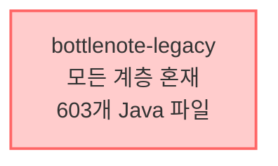
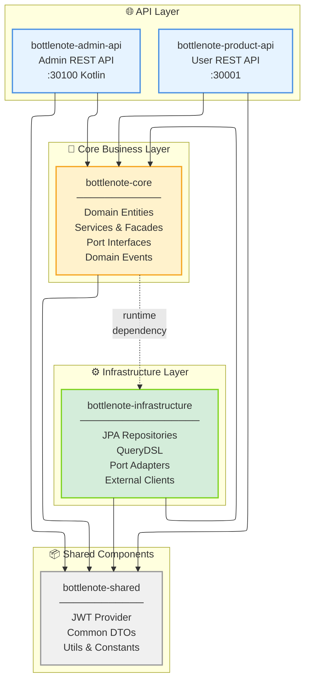

```
================================================================================
                          PROJECT COMPLETION STAMP
================================================================================
Status: **DEPRECATED**
Deprecated Date: 2025-09-28

** Reason **
- v2.0.0에서 전략 변경: Bottom-up → Top-down 최소 분리 전략
- 순환 의존성 문제로 shared/core/infrastructure 분리 방식 포기

** Superseded By **
- migration.v2.0.0.md (최소 웹 계층 분리 전략)
================================================================================
```

# 멀티모듈 마이그레이션 가이드 v3

## 🎯 목표

- 기존 모노리스를 멀티모듈로 전환
- Product API와 Admin API 분리
- 단계적이고 안전한 마이그레이션

## 📁 모듈 구조

```
bottlenote/
├── bottlenote-shared/         # 공통 컴포넌트 (JWT, DTO, Utils)
├── bottlenote-core/            # 엔티티, 서비스, 파사드 (도메인+애플리케이션)
├── bottlenote-infrastructure/ # JPA 구현체, 외부 연동
├── bottlenote-product-api/    # 사용자 API (30001)
├── bottlenote-admin-api/      # 관리자 API (30100, Kotlin)
└── bottlenote-legacy/         # 임시 보관용 (최종 제거 예정)
```

## 🔗 의존성 구조

### AS-IS: 현재 모노리스 구조



### TO-BE: 목표 멀티모듈 구조



### 의존성 규칙

- **product-api/admin-api** → core, shared 의존
- **core** → shared 의존 (infrastructure는 런타임 의존)
- **infrastructure** → core, shared 의존
- **shared** → 독립 (의존성 없음)

## 📋 각 모듈 역할

### bottlenote-shared

- 스프링 의존성이 아닌 순수 공유 컴포넌트
- JWT Provider, Token Validator
- Request/Response DTO
- 유틸리티 클래스
- 공통 상수

### bottlenote-core

- core 이름 선택 이유:
	- ✅ 핵심 비즈니스 + 로직 모두 포함하는 중립적 이름
	- ✅ 도메인과 애플리케이션 구분 없이 핵심이라는 의미
	- ✅ 추후 필요시 domain/application으로 분리 가능
- JPA 엔티티
- Repository 인터페이스
- **Port 인터페이스** (외부 연동 추상화)
- Service / Facade 클래스
	- **Service**: 단일 도메인의 비즈니스 로직, Controller와 직접 통신
	- **Facade**: 도메인 간 격벽 연결, 다른 도메인 접근 인터페이스
	- 예: ReviewService가 UserFacade를 통해 User 도메인 정보 획득
- 도메인 이벤트
	- 추후 SpringEventPublisher, KafkaEventPublisher 등 다양한 구현체로 확장 가능
- BaseEntity
- 비즈니스 로직

### bottlenote-infrastructure

- JPA Repository 구현체
- QueryDSL 구현
- **Port 구현체 (Adapter)**
	- FeignClient Adapter
	- Redis Adapter
	- AWS S3 Adapter
- 외부 API 클라이언트
- Redis, AWS, Firebase 연동

### bottlenote-product-api

- 사용자용 REST Controller
- SecurityConfig
- 30001 포트
- 추후 Legacy 모듈의 이름을 변경해서 통합 예정.

### bottlenote-admin-api

- 관리자용 REST Controller (Kotlin)
- 별도 SecurityConfig
- 30100 포트
- 별도 파이프라인 구축

## 🔧 순환 의존성 해결 전략

### 문제 상황

- Core 모듈의 Service가 외부 API 호출 필요 (예: KakaoFeignClient)
- FeignClient는 Infrastructure 계층에 위치
- Core → Infrastructure 의존 시 순환 참조 발생

### 해결 방안: 포트/어댑터 패턴

#### 1. Core 모듈에 Port 인터페이스 정의

```java
// bottlenote-core/domain/user/port/ExternalUserPort.java
public interface ExternalUserPort {
	ExternalUserInfo fetchUserInfo(String token);
}

// bottlenote-core/domain/notification/port/NotificationPort.java
public interface NotificationPort {
	void sendPushNotification(String userId, String message);
}
```

#### 2. Infrastructure 모듈에서 Adapter 구현

```java
// bottlenote-infrastructure/adapter/KakaoAdapter.java
@Component
public class KakaoAdapter implements ExternalUserPort {
	private final KakaoFeignClient feignClient;

	@Override
	public ExternalUserInfo fetchUserInfo(String token) {
		return feignClient.getUserInfo("Bearer " + token);
	}
}

// bottlenote-infrastructure/adapter/FirebaseAdapter.java
@Component
public class FirebaseAdapter implements NotificationPort {
	private final FirebaseMessaging firebaseMessaging;

	@Override
	public void sendPushNotification(String userId, String message) {
		// Firebase 구현
	}
}
```

#### 3. Core Service에서 Port 사용

```java
// bottlenote-core/service/UserService.java
@Service
@RequiredArgsConstructor
public class UserService {
	private final ExternalUserPort externalUserPort; // 인터페이스 주입

	public User createUser(String token) {
		var userInfo = externalUserPort.fetchUserInfo(token);
		// 비즈니스 로직
	}
}
```

### 장점

- ✅ 의존성 역전 원칙(DIP) 준수
- ✅ Core는 추상화에만 의존
- ✅ 테스트 용이성 (Mock 가능)
- ✅ 외부 서비스 교체 용이

## 📝 마이그레이션 체크리스트

### Phase 1: 기반 구축 (2주)

- [ ] Infrastructure 모듈 생성
- [ ] 기본 Port 인터페이스 정의
- [ ] JPA Repository 구현체 이관
- [ ] QueryDSL 설정 이관

### Phase 2: 도메인 이관 (4주)

- [ ] User 도메인 이관 (인증 포함)
- [ ] Review 도메인 이관
- [ ] Rating 도메인 이관
- [ ] Alcohol 도메인 이관

### Phase 3: API 분리 (2주)

- [ ] Product API 모듈 생성
- [ ] Controller 이관
- [ ] Security 설정 분리
- [ ] Admin API 모듈 생성 (Kotlin)

### Phase 4: 정리 및 최적화 (1주)

- [ ] Legacy 모듈 제거
- [ ] 통합 테스트 완료
- [ ] 성능 테스트
- [ ] 문서화

## ⚠️ 주의사항

1. **단계적 접근 필수**
	- 한 번에 모든 도메인 이관 금지
	- 각 단계마다 테스트 및 검증

2. **Facade 패턴 일관성**
	- 도메인 간 통신은 반드시 Facade 통해서만
	- 직접 Service 호출 금지

3. **테스트 우선**
	- 이관 전 테스트 커버리지 확보
	- 아키텍처 테스트 규칙 추가

4. **롤백 계획**
	- 각 단계별 롤백 시나리오 준비
	- Legacy 모듈은 완전 검증 후 제거

---

*최종 수정: 2025-09-02*
