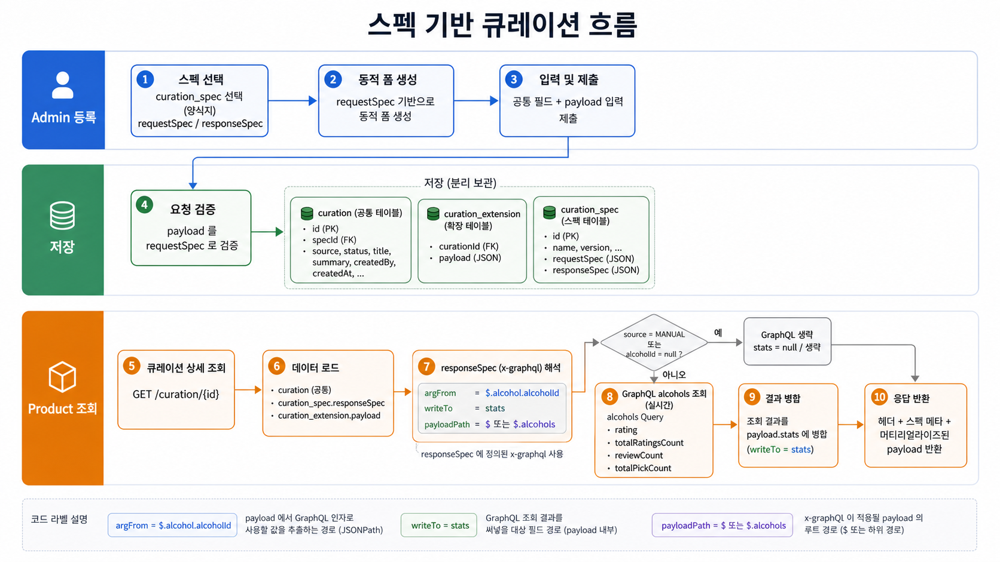

# Plan: Spec-Based Curation V2 - GraphQL SDL Foundation

## Overview

`curation_demo`에서 검증한 spec 기반 큐레이션을 `bottle-note-api-server`에 이식한다.

전체 기능은 신규 도메인, DB schema, Admin/Product endpoint, payload validation, GraphQL hydration까지 포함하므로 한 번에 끝내지 않는다. 이번 기능은 검증 범위를 3개 phase로 나눈 뒤, Phase 1에서 GraphQL 도메인 SDL과 서버 내 실행 기반만 먼저 만든다.

기존 `curation_keyword`와 `curation_keyword_alcohol_ids`는 유연한 이관을 위해 그대로 둔다. 기존 Admin/Product endpoint도 변경하지 않는다. 신규 외부 API는 이후 phase에서 v2 endpoint로 추가한다.

### Flow Diagram

### Phase Roadmap

1. **GraphQL SDL Foundation**
   - Spring GraphQL 의존성, SDL, resolver, 내부 실행 검증 기반을 추가한다.
   - Alcohol 도메인 조회와 stats hydration에 필요한 최소 field만 다룬다.
   - 외부 curation v2 endpoint와 신규 curation DB table은 만들지 않는다.
2. **Curation V2 Persistence + Admin Command**
   - `git.environment-variables/storage/mysql/changelog/`에 `curation_spec`, `curation`, `curation_extension` schema changeset을 추가하고, mono domain/repository/service를 추가한다.
   - Admin v2 등록/수정/상세/목록 API에서 spec 기반 payload 저장과 검증을 처리한다.
3. **Product V2 Query + Hydration**
   - Product v2 목록/상세 API를 추가한다.
   - 저장 payload를 response spec과 GraphQL hydration 결과로 앱 응답 형태로 조립한다.
   - `BOTTLE_NOTE` 항목만 stats를 보강하고 `MANUAL` 항목은 stats를 생략한다.

## Assumptions

- 신규 기능은 기존 `app.bottlenote.alcohols.domain.CurationKeyword`를 개조하지 않고 별도 `app.bottlenote.curation` 도메인으로 진행한다.
- 기존 테이블 `curation_keyword`, `curation_keyword_alcohol_ids`는 이번 전체 이식 기간 동안 drop 또는 data migration하지 않는다.
- DB schema 변경이 필요한 phase에서는 반드시 서브모듈 `git.environment-variables/storage/mysql/changelog/` 아래 changelog를 사용한다.
- 기존 endpoint는 유지하고, 신규 endpoint는 후속 phase에서 v2로 추가한다.
- Phase 1은 GraphQL 기반만 다루며, curation v2 DB table과 Admin/Product curation endpoint는 만들지 않는다.
- GraphQL은 외부 공개 API로 먼저 설계하지 않고, 서버 내부 hydration 실행 기반으로 도입한다. `/graphql` HTTP 노출 여부는 구현 단계에서 Spring GraphQL 기본 동작과 보안 설정 영향을 확인한 뒤 필요한 경우 제한한다.
- OpenAPI curation spec seed는 Liquibase insert changeset이 아니라 `bottlenote-mono/src/main/resources/openapi/curation/*.json` 리소스를 admin-api 기동 시 `curation_spec`으로 동기화하는 방식으로 관리한다.
- 도메인 SDL은 `Alcohol`을 시작점으로 하며, Phase 1의 선택 field는 stats hydration에 필요한 평균 별점, 평점 수, 리뷰 수, 찜 수와 기본 alcohol 식별/표시 field로 제한한다.
- 사용자별 picks/reviews/ratings 원본 목록은 curation v2 응답에 노출하지 않는다.
- `reviewCount`는 데모처럼 rating count를 재사용하지 않고 실제 review 도메인 집계 기준으로 정의한다.

## Success Criteria

- `bottlenote-mono` 또는 GraphQL 설정을 소유할 적절한 모듈에 Spring GraphQL 의존성과 SDL 리소스가 추가된다.
- SDL에 `Query.alcohols(ids: [ID!]!)` 또는 동등한 batch 조회 진입점이 정의된다.
- SDL의 `Alcohol` 타입에 curation stats hydration에 필요한 필드가 정의된다:
  - `alcoholId`
  - `korName`
  - `engName`
  - `imageUrl`
  - `regionName`
  - `korCategory`
  - `cask`
  - `abv`
  - `volume`
  - `rating`
  - `totalRatingsCount`
  - `reviewCount`
  - `totalPickCount`
- GraphQL resolver는 기존 alcohol/rating/review/picks 도메인의 repository 또는 service를 사용해 위 필드를 해석한다.
- `reviewCount`는 실제 review count를 반환한다.
- 없는 alcohol id는 전체 요청을 실패시키지 않고 누락 또는 null 정책을 명확히 따른다.
- `source = MANUAL` 같은 `alcoholId = null` 입력은 후속 payload hydration 단계에서 GraphQL 조회 대상이 되지 않는 정책으로 문서화된다.
- Phase 1 완료 시 기존 `curation_keyword` API 동작 표면은 변경되지 않는다.
- Phase 1 완료 시 다음 검증이 통과해야 한다:
  - `./gradlew :bottlenote-mono:compileJava`
  - GraphQL resolver 또는 builder 대상 단위 테스트
  - `./gradlew check_rule_test`

## Impact Scope

- **Modules**
  - `bottlenote-mono`: GraphQL SDL, resolver, stats 조회 조립, 테스트가 들어갈 가능성이 높다.
  - `bottlenote-product-api`: Phase 1에서는 외부 curation endpoint를 추가하지 않는다. Spring GraphQL runtime wiring이 executable app 쪽 설정을 요구하는지는 `/plan`에서 확인한다.
  - `bottlenote-admin-api`: Phase 1 영향 없음.
  - `git.environment-variables`: Phase 1 schema 변경 없음.
- **Persistence**
  - Phase 1에서는 신규 테이블을 만들지 않는다.
  - 기존 `curation_keyword`, `curation_keyword_alcohol_ids`는 읽기 확인 대상일 뿐 수정 대상이 아니다.
  - Phase 2 이후 DB schema 변경은 `/Users/hgkim/workspace/etc/bottlenote/bottle-note-api-server/git.environment-variables/storage/mysql/changelog/`의 Liquibase changelog에 append한다.
  - 이미 적용된 기존 changeset은 수정하지 않는다.
- **API Contract**
  - Phase 1에서는 신규 public REST endpoint를 만들지 않는다.
  - `/graphql` HTTP endpoint가 자동 노출되는 경우 보안/운영 노출 정책을 별도 결정해야 한다.
- **Cross-Domain Coupling**
  - GraphQL resolver가 alcohol, rating, review, picks 집계를 한 지점에서 묶는다.
  - curation 도메인에서 직접 각 도메인을 호출하는 대신, 후속 phase에서 GraphQL hydration boundary를 재사용한다.
- **Validation**
  - Phase 1은 payload JSON Schema validation을 구현하지 않는다.
  - payload validation은 Phase 2 범위다.
- **Tests**
  - SDL schema loading 또는 GraphQL query execution 테스트가 필요하다.
  - resolver 단위 테스트는 Fake/InMemory 우선 원칙을 따른다.
  - 기존 curation keyword endpoint regression은 최소 smoke 수준으로 범위를 정한다.
- **Docs**
  - 이번 plan 문서는 전체 phase boundary와 Phase 1 정의의 source of truth다.
  - `/plan` 단계에서 Phase 1 task breakdown과 검증 명령을 추가한다.

## Phase 1 Out of Scope

- `curation_spec`, `curation`, `curation_extension` table 추가
- Admin curation v2 등록/수정/목록/상세 endpoint
- Product curation v2 목록/상세 endpoint
- 기존 `curation_keyword` 제거, drop, data migration
- 기존 curation keyword endpoint path 변경
- FE/Admin 화면 구현

## Tasks

### Task 1: Spring GraphQL module wiring

- Acceptance:
  - Spring GraphQL 의존성이 version catalog 또는 기존 Gradle 패턴에 맞게 추가된다.
  - SDL 리소스 경로는 `bottlenote-mono/src/main/resources/graphql/schema.graphqls`로 확정한다.
  - Phase 1에서 `git.environment-variables/storage/mysql/changelog/`는 수정하지 않는다.
- Verification:
  - `./gradlew :bottlenote-mono:compileJava`
  - `./gradlew :bottlenote-product-api:compileJava`
  - `git diff -- git.environment-variables/storage/mysql/changelog/` 결과가 비어 있어야 한다.
- Files:
  - `gradle/libs.versions.toml`
  - `bottlenote-mono/build.gradle`
  - `bottlenote-mono/src/main/resources/graphql/schema.graphqls` path decision
- Size: S
- Status: [x] done

### Task 2: Alcohol GraphQL SDL contract

- Acceptance:
  - `Alcohol` 타입과 `Query.alcohols(ids: [ID!]!)` 또는 동등한 batch 조회 진입점이 SDL에 정의된다.
  - SDL field는 Phase 1 성공 기준의 stats hydration 필드로 제한된다.
  - 사용자별 picks/reviews/ratings 목록 field는 SDL에 포함하지 않는다.
- Verification:
  - SDL 파일에서 `type Alcohol`, `type Query`, `alcohols` 진입점이 확인된다.
  - GraphQL schema loading 테스트 또는 application context 테스트가 SDL을 로딩한다.
- Files:
  - `bottlenote-mono/src/main/resources/graphql/schema.graphqls`
  - GraphQL schema loading test
- Size: S
- Status: [x] done

### Task 3: Alcohol stats resolver foundation

- Acceptance:
  - resolver는 기존 alcohol/rating/review/picks 도메인의 repository 또는 service를 사용한다.
  - `reviewCount`는 rating count가 아니라 실제 review count 기준으로 계산한다.
  - 존재하지 않는 alcohol id는 전체 GraphQL 실행을 실패시키지 않는 정책으로 처리된다.
- Verification:
  - resolver unit test 또는 in-process GraphQL execution test가 `rating`, `totalRatingsCount`, `reviewCount`, `totalPickCount`를 검증한다.
  - `MANUAL` 항목처럼 `alcoholId = null`인 케이스는 GraphQL 조회 대상에서 제외해야 한다는 정책이 테스트명 또는 문서에 남는다.
- Files:
  - GraphQL resolver package under the selected module
  - Existing domain repository/service additions only if needed
  - Resolver or execution test
- Size: M
- Status: [x] done

### Checkpoint: after Tasks 1-3

- [x] `./gradlew :bottlenote-mono:compileJava`
- [x] `./gradlew :bottlenote-product-api:compileJava`
- [x] GraphQL schema/resolver focused tests pass
- [x] `git diff -- git.environment-variables/storage/mysql/changelog/` is empty

### Task 4: Product bootRun smoke with .env

- Acceptance:
  - `.env`를 로드한 상태로 product API를 `bootRun` 기동할 수 있다.
  - 기동 검증은 secret 값을 로그나 문서에 노출하지 않는다.
  - Phase 1이 기존 REST curation keyword endpoint path를 변경하지 않았음을 확인한다.
- Verification:
  - `set -a; source .env; set +a; ./gradlew :bottlenote-product-api:bootRun`
  - 서버 기동 후 GraphQL wiring 또는 application startup log 확인
  - 필요 시 별도 터미널에서 기존 reference endpoint smoke 확인
- Files:
  - No required source file unless startup wiring needs a config adjustment
- Size: S
- Status: [x] done

### Task 5: Phase 1 final verification

- Acceptance:
  - Phase 1 성공 기준이 모두 충족된다.
  - 다음 phase에서 사용할 GraphQL hydration boundary가 문서상 명확하다.
  - 신규 DB schema, Admin spec 기반 endpoint, Product curation v2 endpoint가 아직 추가되지 않았음이 확인된다.
- Verification:
  - `./gradlew :bottlenote-mono:compileJava`
  - `./gradlew :bottlenote-product-api:compileJava`
  - `./gradlew check_rule_test`
  - `rg -n "curation_spec|curation_extension" git.environment-variables/storage/mysql/changelog/schema.mysql.sql` 결과가 기존 파일 기준으로 신규 추가되지 않았는지 diff로 확인
- Files:
  - `plan/spec-based-curation-v2-graphql-sdl.md`
  - Optional focused docs update only if implementation decisions diverge from this plan
- Size: S
- Status: [x] done

### Phase 2 Task 1: Curation V2 schema changelog apply

- Acceptance:
  - `git.environment-variables/storage/mysql/changelog/schema.mysql.sql`에 `curation_spec`, `curation`, `curation_extension` changeset을 append한다.
  - 기존 `curation_keyword`, `curation_keyword_alcohol_ids`는 변경하지 않는다.
  - SOPS 기반 Liquibase 설정을 사용하되 secret 값을 출력하거나 문서화하지 않는다.
  - 개발 DB와 운영 DB 모두 pending changeset이 이번 3개뿐인지 확인한 뒤 적용한다.
- Verification:
  - `liquibase validate`
  - `liquibase status --verbose`
  - `liquibase update`
  - `information_schema.tables`에서 `curation_spec`, `curation`, `curation_extension` 생성 확인
  - `liquibase status --verbose` 결과가 up to date
- Files:
  - `git.environment-variables/storage/mysql/changelog/schema.mysql.sql`
- Size: S
- Status: [x] done

### Phase 2 Task 2: Mono curation v2 persistence model

- Acceptance:
  - `bottlenote-mono`에 `curation_spec`, `curation`, `curation_extension`에 대응되는 Entity를 추가한다.
  - Repository는 domain interface + JPA implementation 패턴을 따른다.
  - JSON 컬럼은 기존 Hypersistence `JsonType` 기반 매핑을 사용한다.
  - ~~Admin command가 재사용할 persistence service를 추가하되, REST endpoint는 아직 만들지 않는다.~~
  - 정정: Admin command 저장 경로는 `AdminSpecBasedCurationService`로 단일화하고, mono에는 Entity + Repository + 테스트 fixture만 유지한다.
- Verification:
  - `./gradlew :bottlenote-mono:compileJava`
  - ~~`./gradlew :bottlenote-mono:test --tests 'app.bottlenote.curation.service.CurationV2ServiceTest'`~~
  - `./gradlew :bottlenote-mono:test --tests 'app.bottlenote.curation.service.AdminSpecBasedCurationServiceTest' --tests 'app.bottlenote.curation.service.ProductSpecBasedCurationServiceTest' --tests 'app.bottlenote.curation.service.CurationResponseMaterializerTest'`
  - `./gradlew check_rule_test`
- Files:
  - `bottlenote-mono/src/main/java/app/bottlenote/curation/domain/*`
  - `bottlenote-mono/src/main/java/app/bottlenote/curation/dto/request/*`
  - `bottlenote-mono/src/main/java/app/bottlenote/curation/repository/*`
  - ~~`bottlenote-mono/src/main/java/app/bottlenote/curation/service/CurationV2Service.java`~~
  - `bottlenote-mono/src/test/java/app/bottlenote/curation/fixture/CurationFixtureFactory.java`
  - `bottlenote-mono/src/test/java/app/bottlenote/curation/**`
- Size: M
- Status: [x] done

### Phase 2 Task 3: Admin spec-based curation command/query API

- Acceptance:
  - Admin spec 기반 등록/수정/상세/목록 API를 추가한다.
  - ~~Admin context-path가 이미 `/admin/api/v1`이므로 컨트롤러 path에 `/v2` prefix를 중복으로 붙이지 않는다.~~
  - 정정: 2026-05-18에 admin-api context-path를 `/admin/api`로 낮추고 legacy Admin controller는 중앙 `/v1` prefix로 보존했다. spec 기반 신규 Admin API는 `/v2` controller mapping을 명시한다.
  - ~~스펙 API는 `/curation-specs`, spec 기반 큐레이션 API는 기존 `/curations`와 충돌하지 않도록 `/spec-based-curations`를 사용한다.~~
  - 정정: 최종 Admin spec API는 `/admin/api/v2/curation-specs`, spec 기반 큐레이션 API는 `/admin/api/v2/curations`를 사용한다. 기존 legacy Admin curation API는 `/admin/api/v1/curations`로 유지한다.
  - 스펙 목록과 스펙 상세 API를 제공한다.
  - request payload는 저장 전 OpenAPI spec resource 기준 검증 경계로 연결한다.
  - admin-api 기동 시 `openapi/curation/*.json` 리소스를 읽어 `curation_spec`을 생성 또는 갱신한다.
  - 리소스 동기화는 `curation.spec-sync.enabled` 설정으로 비활성화할 수 있다.
  - 기존 Admin curation keyword API와 path는 변경하지 않는다.
  - Product v2 hydration API는 아직 만들지 않는다.
- Verification:
  - Admin API compile
  - Admin controller/docs focused test
  - Resource sync focused test
  - `./gradlew check_rule_test`
- Files:
  - `bottlenote-admin-api/src/main/kotlin/app/bottlenote/curation/**`
  - 필요한 mono DTO/service 확장
- Size: L
- Status: [x] done

### Phase 3 Task 1: Product v2 query + response materialization

- Acceptance:
  - Product v2 목록/상세 API를 `/api/v2/curations`, `/api/v2/curations/{curationId}`로 추가한다.
  - 기존 Product `/api/v1/curations` keyword endpoint는 변경하지 않는다.
  - 상세 응답은 header + spec meta + materialized payload 구조로 반환한다.
  - `responseSpec.x-graphql` 메타를 읽어 GraphQL query를 생성하고 서버 내부 GraphQL executor로 실행한다.
  - `BOTTLE_NOTE` 항목은 `alcohol.alcoholId`로 stats를 보강하고, `MANUAL` 또는 `alcoholId = null` 항목은 GraphQL 조회 대상으로 넘기지 않는다.
  - root array 스펙과 `payloadPath = $.alcohols` object 스펙을 모두 지원한다.
  - Admin 저장 시점 request payload는 requestSpec 기준으로 required, enum, type, string length, array min/max items, numeric min/max를 검증한다.
  - Product 조회 시점 materialized payload는 responseSpec 기준으로 다시 검증한다.
- Verification:
  - `./gradlew :bottlenote-mono:test --tests 'app.bottlenote.curation.service.CurationPayloadValidatorTest' --tests 'app.bottlenote.curation.service.CurationResponseMaterializerTest' --tests 'app.bottlenote.curation.service.ProductSpecBasedCurationServiceTest'`
  - `./gradlew :bottlenote-product-api:compileJava`
  - `./gradlew check_rule_test`
- Files:
  - `bottlenote-mono/src/main/java/app/bottlenote/curation/service/CurationPayloadValidator.java`
  - `bottlenote-mono/src/main/java/app/bottlenote/curation/service/GraphQLCurationQueryBuilder.java`
  - `bottlenote-mono/src/main/java/app/bottlenote/curation/service/CurationResponseMaterializer.java`
  - `bottlenote-mono/src/main/java/app/bottlenote/curation/service/ProductSpecBasedCurationService.java`
  - `bottlenote-product-api/src/main/java/app/bottlenote/curation/controller/ProductSpecBasedCurationController.java`
- Size: L
- Status: [x] done

### Phase 3 Task 2: Product v2 API docs + runtime smoke

- Acceptance:
  - Product v2 목록/상세 API RestDocs 테스트를 추가한다.
  - `/api/v2/curations` 문서에는 spec 기반 큐레이션 목록 응답 구조를 남긴다.
  - `/api/v2/curations/{curationId}` 문서에는 header, spec meta, materialized payload 구조를 남긴다.
  - `.env` 기반 product-api 기동 후 `/api/v2/curations` runtime smoke를 수행한다.
  - 실제 DB에 smoke row가 없으면 임시 row를 생성해 상세 조회까지 검증하고, 검증 후 삭제한다.
  - smoke는 `BOTTLE_NOTE` stats 병합과 `MANUAL` stats null 처리를 확인한다.
- Verification:
  - `./gradlew :bottlenote-product-api:test --tests 'app.docs.curation.RestProductSpecBasedCurationControllerTest'`
  - `./gradlew :bottlenote-product-api:asciidoctor`
  - `./gradlew check_rule_test`
  - `.env` 기반 `./gradlew :bottlenote-product-api:bootRun`
  - `GET /api/v2/curations` HTTP 200
  - `GET /api/v2/curations/{curationId}` HTTP 200
- Files:
  - `bottlenote-product-api/src/test/java/app/docs/curation/RestProductSpecBasedCurationControllerTest.java`
  - `plan/spec-based-curation-v2-graphql-sdl.md`
- Size: M
- Status: [x] done

## Progress Log

- 2026-05-15 Task 1 완료: Spring GraphQL starter alias를 version catalog에 추가하고, `bottlenote-mono`에 GraphQL runtime dependency를 연결했다. SDL 경로는 `bottlenote-mono/src/main/resources/graphql/schema.graphqls`로 확정했다. 검증: `./gradlew :bottlenote-mono:compileJava` 성공, `./gradlew :bottlenote-product-api:compileJava` 성공, `git diff -- git.environment-variables/storage/mysql/changelog/` 변경 없음.
- 2026-05-15 Task 2 완료: `bottlenote-mono/src/main/resources/graphql/schema.graphqls`에 `Query.alcohols(ids: [ID!]!)`와 stats hydration용 `Alcohol` SDL을 추가했다. 사용자별 `picks`, `ratings`, `reviews` 목록 field는 포함하지 않았다. 검증: `rg -n "type Alcohol|type Query|alcohols|picks\\(|ratings\\(|reviews\\(" ...` 확인, `./gradlew :bottlenote-mono:test --tests 'app.bottlenote.graphql.GraphQLCurationSchemaTest'` 성공, changelog diff 변경 없음.
- 2026-05-15 Task 3 완료: `bottlenote-mono`에 `GraphQLCurationAlcoholResolver`와 `GraphQLCurationAlcoholService`를 추가해 `Alcohol` field resolver를 연결했다. `rating`/`totalRatingsCount`는 rating repository 집계, `reviewCount`는 `ACTIVE` + `PUBLIC` review count, `totalPickCount`는 `PICK` 상태 count로 계산한다. `alcoholId = null`인 `MANUAL` 항목과 존재하지 않는 alcohol id는 GraphQL 조회 결과에서 제외하는 정책을 resolver 테스트명과 검증에 남겼다. 검증: `./gradlew :bottlenote-mono:compileJava` 성공, `./gradlew :bottlenote-mono:test --tests 'app.bottlenote.graphql.GraphQLCurationSchemaTest' --tests 'app.bottlenote.curation.graphql.GraphQLCurationAlcoholResolverTest'` 성공, `./gradlew :bottlenote-product-api:compileJava` 성공, `git diff -- git.environment-variables/storage/mysql/changelog/` 변경 없음.
- 2026-05-15 추가 반영: `curation_demo/spec`의 OpenAPI 3.0 JSON 스펙 3종을 `bottlenote-mono/src/main/resources/openapi/curation/`에 그대로 추가했다. 대상은 `RECOMMENDED_WHISKY`, `WHISKY_PAIRING`, `WHISKY_TASTING_EVENT`이며 `x-curation`, `x-form-style`, `x-field-style`, `x-graphql` 메타를 포함한다. 검증: 원본 파일과 `cmp -s` 3건 일치, `./gradlew :bottlenote-mono:test --tests 'app.bottlenote.curation.CurationOpenApiSpecResourceTest'` 성공.
- 2026-05-15 Task 4 완료: `.env`에 `SPRING_PROFILES_ACTIVE=local`을 추가하고 Redis를 로컬 `bottle-note-redis` 컨테이너(`localhost:26379`, no auth)로 연결하도록 수정했다. `set -a; source .env; set +a; ./gradlew :bottlenote-product-api:bootRun`으로 product API가 8080에서 기동했고, 로그에서 GraphQL schema 1개 로드, unmapped field 없음, `POST /graphql` 매핑, Redis connection success를 확인했다. smoke 결과: `GET /actuator/health` HTTP 200 및 Redis UP, `POST /graphql { __typename }` HTTP 200, 기존 `GET /api/v1/curations?cursor=0&pageSize=1` HTTP 200, changelog diff 변경 없음.
- 2026-05-15 GraphiQL 운영 확인: `spring.graphql.graphiql.enabled=true`, `spring.graphql.graphiql.path=/graphiql`를 local/default profile에 추가해 브라우저 기반 GraphQL query console을 열 수 있게 했다. `GET /graphql`은 HTTP 405가 맞고, query 실행은 `POST /graphql` 또는 `/graphiql` UI를 사용한다. 2026-05-17 운영 하드닝에서 이 결정은 철회했다. 현재는 GraphQL을 내부 hydration boundary로만 유지하기 위해 GraphiQL을 비활성화하고 `/graphql`, `/graphiql`, `/graphiql/**` 외부 HTTP 접근을 403으로 차단한다.
- 2026-05-15 GraphQL browser smoke: Chrome에서 `/graphiql?path=/graphql`로 직접 쿼리를 실행했다. `[1, 999999]`는 존재하는 `1`만 반환했고, `[1, 1, 2]`는 중복 제거 후 `1, 2`만 반환했다. `[]`는 빈 배열을 반환했다. `[3, 1, 999999, 1, 2]`는 요청 순서 기준으로 `3, 1, 2`를 반환했고 없는 id와 중복 id를 제외했다.
- 2026-05-15 GraphQL boundary smoke: Chrome에서 `picks` field 요청 시 `Field 'picks' in type 'Alcohol' is undefined` validation error가 발생했다. `[1, null]` 입력은 `[ID!]!` 제약에 의해 `ids[1] ... must not be null` validation error가 발생했다. `engName`, `imageUrl`, `regionName`, `korCategory`, `cask`, `abv`, `volume`, `rating`, `totalRatingsCount`, `reviewCount`, `totalPickCount` 전체 field hydration도 정상 확인했다.
- 2026-05-15 Task 5 완료: final verification 중 `check_rule_test`가 먼저 product-api 테스트 fake repository compile error로 실패했다. 원인은 `PicksRepository`, `RatingRepository`, `ReviewRepository`에 Phase 1 stats count 메서드를 추가하면서 product-api 테스트 fake 3곳이 새 인터페이스 시그니처를 구현하지 않은 것이었다. `FakePicksRepository`, `InMemoryRatingRepository`, `InMemoryReviewRepository`에 count/average 메서드를 추가했다.
- 2026-05-15 Task 5 완료: 두 번째 `check_rule_test` 실패는 GraphQL resolver의 `@Controller`가 REST controller ArchUnit 규칙에 포함된 것이 원인이었다. GraphQL handler는 HTTP mapping 기반 REST controller가 아니므로 `ControllerLayerRules`에서 `..graphql..` 패키지를 REST controller naming/mapping/method naming rule 대상에서 제외했다. 또한 `GraphQLCurationAlcoholService` public 메서드에는 프로젝트 rule에 맞춰 `@Transactional(readOnly = true)`를 메서드 레벨로 명시했다.
- 2026-05-15 Task 5 검증 결과: `./gradlew :bottlenote-mono:compileJava` 성공, `./gradlew :bottlenote-product-api:compileJava` 성공, focused tests 3종 성공, `./gradlew check_rule_test` 성공, `git diff -- git.environment-variables/storage/mysql/changelog/` 변경 없음. Phase 1은 종료 가능한 상태로 확인했다.
- 2026-05-15 Phase 2 Task 1 완료: `git.environment-variables/storage/mysql/changelog/schema.mysql.sql`에 `curation_spec`, `curation`, `curation_extension` changeset 3개를 추가했다. SOPS 기반 Liquibase 설정은 임시 파일로만 사용했고 secret 값은 출력하지 않았다. 개발 DB와 운영 DB 모두 `validate` 성공, pending 3건 확인 후 `update` 3건 실행, 세 테이블 생성 확인, 최종 `status --verbose` up to date를 확인했다.
- 2026-05-15 Phase 2 Task 3 추가 완료: Liquibase insert seed 대신 admin-api startup resource sync를 추가했다. `CurationSpecResourceReader`가 `bottlenote-mono/src/main/resources/openapi/curation/*.json` 3종을 읽고, `CurationSpecResourceSyncService`가 `code` 기준으로 `curation_spec`을 생성 또는 갱신한다. admin-api runner는 `curation.spec-sync.enabled=${CURATION_SPEC_SYNC_ENABLED:true}`로 제어된다. 검증: `./gradlew :bottlenote-mono:compileJava :bottlenote-admin-api:compileKotlin :bottlenote-mono:test --tests 'app.bottlenote.curation.service.CurationSpecResourceSyncServiceTest'` 성공, `./gradlew check_rule_test` 성공.
- 2026-05-15 Phase 2 Task 2 완료: `bottlenote-mono`에 curation v2 Entity, domain repository interface, JPA repository, `CurationV2Service`, focused fake repository와 unit test를 추가했다. `request_spec`, `response_spec`, `payload` JSON 컬럼은 기존 의존성인 Hypersistence `JsonType`으로 매핑했다. `check_rule_test`에서 서비스 메서드 파라미터 5개 제한과 DTO 패키지/네이밍 규칙이 먼저 실패해 service 입력을 `dto.request`의 `*Request` record로 묶었다. 검증: `./gradlew :bottlenote-mono:compileJava :bottlenote-mono:test --tests 'app.bottlenote.curation.service.CurationV2ServiceTest' check_rule_test` 성공, focused 테스트 4개 통과.
- 2026-05-15 Phase 2 Task 3 완료: 기존 Admin `/curations` endpoint는 유지하고, 신규 spec 기반 Admin surface를 ~~`/spec-based-curations`와 `/curation-specs`~~ `/v2/curations`와 `/v2/curation-specs`로 추가했다. ~~admin-api의 context-path가 이미 `/admin/api/v1`이므로 컨트롤러 path에 `/v2` prefix를 붙이지 않는다.~~ 2026-05-18 정정: admin-api context-path는 `/admin/api`로 낮추고 legacy Admin API만 `/v1` prefix를 중앙 적용한다. 스펙 API는 목록/상세를 제공한다. 등록/수정은 `specId`로 `curation_spec`을 조회하고, `imageUrls` 1~3장을 정규화해 첫 번째 이미지를 `cover_image_url`에 저장하며, payload는 `curation_extension.payload`에 저장한다. 새 의존성 없이 requestSpec의 required field와 payload 크기를 검증하는 `CurationPayloadValidator`를 추가했다. 검증: `./gradlew :bottlenote-mono:test --tests 'app.bottlenote.curation.service.AdminSpecBasedCurationServiceTest' :bottlenote-admin-api:test --tests 'app.docs.curation.AdminSpecBasedCurationControllerDocsTest'` 성공, service 테스트 5개와 RestDocs 테스트 6개 통과. `./gradlew check_rule_test` 성공.
- 2026-05-15 Phase 3 Task 1 완료: Product v2 조회 API `/api/v2/curations`, `/api/v2/curations/{curationId}`를 추가하고, `responseSpec.x-graphql` 기반 materializer를 도입했다. materializer는 GraphQL query/variables를 responseSpec에서 만들고, Spring GraphQL executor를 통해 내부 실행한 뒤 payload의 `stats` 위치에 병합한다. root array와 `payloadPath = $.alcohols` object payload를 모두 지원하며, `MANUAL` 또는 `alcoholId = null` 항목은 stats를 null로 둔다. `CurationPayloadValidator`는 requestSpec/responseSpec 공통 검증기로 확장해 required, enum, type, minLength/maxLength, minItems/maxItems, minimum/maximum을 검증한다. 검증: focused 테스트 13개 통과, `./gradlew :bottlenote-product-api:compileJava` 성공, `./gradlew check_rule_test` 성공.
- 2026-05-15 Phase 3 Task 2 완료: Product v2 목록/상세 RestDocs 테스트를 추가했고, `curation/v2/list`, `curation/v2/detail` 스니펫이 생성되는 것을 확인했다. `./gradlew :bottlenote-product-api:asciidoctor check_rule_test` 성공으로 `product-api.html` 생성과 rule test 통과를 확인했다. runtime smoke는 `.env` 기반 product-api를 8080에서 기동해 `GET /api/v2/curations` HTTP 200을 확인했다. 개발 DB에 active spec 기반 큐레이션이 0건이어서 `CODEX_RUNTIME_SMOKE_20260515` 임시 row를 생성한 뒤 `GET /api/v2/curations` HTTP 200, `GET /api/v2/curations/1` HTTP 200, list count=1, detail spec=`RECOMMENDED_WHISKY`, payload_count=2, BOTTLE_NOTE stats keys=`rating,reviewCount,totalPickCount,totalRatingsCount`, MANUAL stats null을 확인했다. 검증 후 임시 row는 삭제했고 삭제 확인 count=0, bootRun 프로세스도 종료했다.
- 2026-05-17 Copilot review 대응 완료: GraphiQL default/local 비활성화, `/graphql`/`/graphiql`/`/graphiql/**` denyAll 차단, GraphQL stats field N+1 제거를 위한 `@BatchMapping` + `IN ... GROUP BY` 집계, Curation create/update Bean Validation enum message 수정을 반영했다. Copilot review thread 4건은 코드 확인 후 GitHub에서 resolved 처리했다. 검증: `/verify full` 범위로 compile, rule, unit, build, integration, admin integration 모두 성공.
- 2026-05-17 Product V2 Runtime Hardening 완료: Product v2 목록/상세에 `isActive = true`와 `exposureStartDate <= today <= exposureEndDate` 정책을 적용했다. `exposureStartDate` 또는 `exposureEndDate`가 null이면 열린 구간으로 처리한다. GraphQL executor가 null response 또는 execution errors를 반환하면 부분 응답을 만들지 않고 `CURATION_GRAPHQL_EXECUTION_FAILED`로 fail-closed 처리한다. responseSpec 검증 실패 시 내부 로그에 `curationId`, `specCode`, validator error path를 남긴다. 검증: `./gradlew :bottlenote-mono:compileJava :bottlenote-product-api:compileJava :bottlenote-mono:compileTestJava :bottlenote-product-api:compileTestJava` 성공, focused unit/integration + `check_rule_test` 성공.
- 2026-05-18 리팩토링 완료: `CurationV2Service`와 `CurationSpecCreateRequest`를 제거해 검증 없는 운영 저장 경로를 닫았다. 단위 테스트의 spec/curation 생성은 `CurationFixtureFactory`로 이동했고, 실제 Admin 저장 경로는 `AdminSpecBasedCurationService`로 단일화했다. 검증: `./gradlew :bottlenote-mono:compileJava :bottlenote-mono:compileTestJava` 성공, focused curation unit 13개 성공, `./gradlew check_rule_test` 성공, `./gradlew unit_test` 성공.
- 2026-05-18 GraphQL prefix 리팩토링 완료: GraphQL 관련 클래스명을 `GraphQL*` prefix로 통일하고, annotation 없는 단건 Alcohol field resolver/service 메서드 4개를 제거해 batch mapping 경로만 남겼다. 검증: `./gradlew :bottlenote-mono:compileJava :bottlenote-mono:compileTestJava` 성공, focused GraphQL/curation unit 9개 성공, `./gradlew check_rule_test` 성공.

## Current Decision Summary

- Phase 1의 GraphQL boundary는 외부 공개 curation endpoint가 아니라 서버 내부 hydration 기반으로 둔다.
- 현재 SDL은 `Query.alcohols(ids: [ID!]!)`와 `Alcohol` 표시/stats field만 노출한다.
- GraphQL 관련 구현 클래스명은 화면 정렬과 검색 일관성을 위해 `GraphQL*` prefix를 사용한다.
- 사용자별 원본 목록 field(`picks`, `reviews`, `ratings`)는 SDL에 노출하지 않는다.
- 없는 alcohol id는 전체 요청 실패가 아니라 결과에서 제외한다.
- 중복 alcohol id는 resolver service에서 제거하며, 반환 순서는 최초 요청 순서를 따른다.
- `MANUAL` 항목처럼 `alcoholId = null`인 payload는 후속 Product hydration 단계에서 GraphQL 조회 대상으로 넘기지 않는다.
- 기존 `curation_keyword`, `curation_keyword_alcohol_ids`, 기존 curation endpoint는 유지한다.
- 신규 schema 변경은 Phase 2 Task 1에서 `git.environment-variables/storage/mysql/changelog/` 아래 changelog로 추가했고, 개발 DB와 운영 DB에 Liquibase CLI로 적용했다.
- Phase 2 Task 3에서 Admin spec 기반 endpoint를 추가했다. ~~최종 URL은 admin-api context-path를 포함해 `/admin/api/v1/curation-specs`, `/admin/api/v1/spec-based-curations`다.~~ 정정: 2026-05-18 기준 최종 URL은 `/admin/api/v2/curation-specs`, `/admin/api/v2/curations`다.
- Phase 3 Task 1에서 Product spec 기반 endpoint를 추가했다. 최종 URL은 `/api/v2/curations`, `/api/v2/curations/{curationId}`다.
- 2026-05-17 기준 Product v2 endpoint는 노출 기간 필터를 적용한다. `isActive = true`이고 오늘 날짜가 노출 시작/종료일 사이에 있는 큐레이션만 목록/상세에서 조회된다. null 노출일은 열린 구간으로 본다.
- GraphQL hydration 실패는 Product v2 상세 응답에서 부분 성공으로 처리하지 않는다. 내부 로그를 남기고 500 계열 `CURATION_GRAPHQL_EXECUTION_FAILED`로 닫는다.

## Next Work

### Next: Release Verification

Product V2 Runtime Hardening까지 이번 브랜치에 반영했다. 다음 작업은 배포 전 검증과 PR 상태 확인이다.

- CI 결과를 확인한다.
- 필요하면 `.env` 기반 product-api runtime smoke를 한 번 더 수행한다.
- 기존 curation keyword endpoint는 계속 유지한다.
